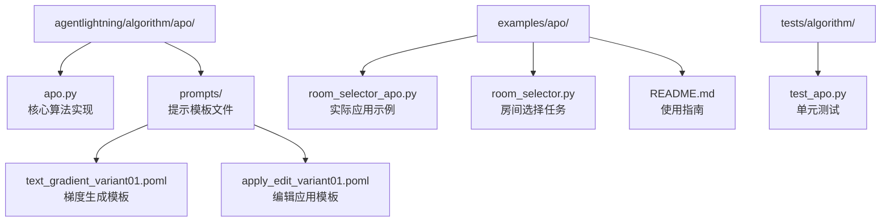
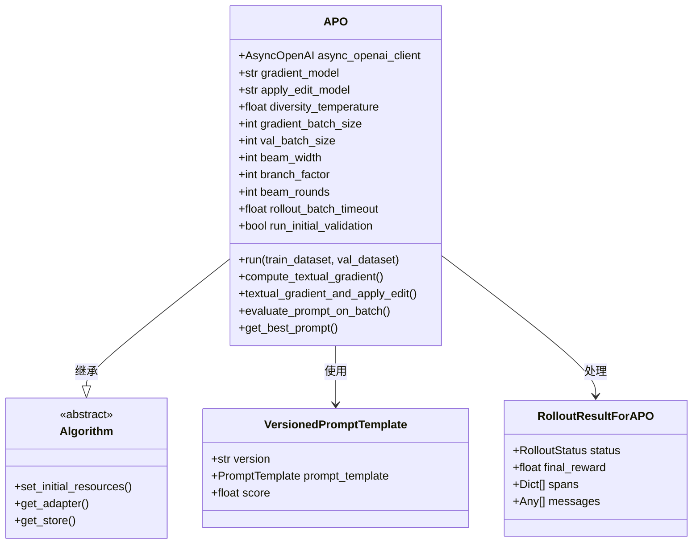
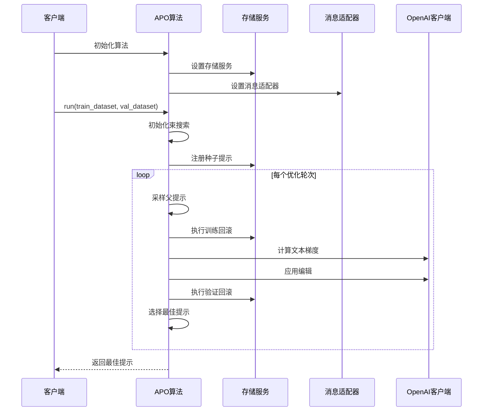
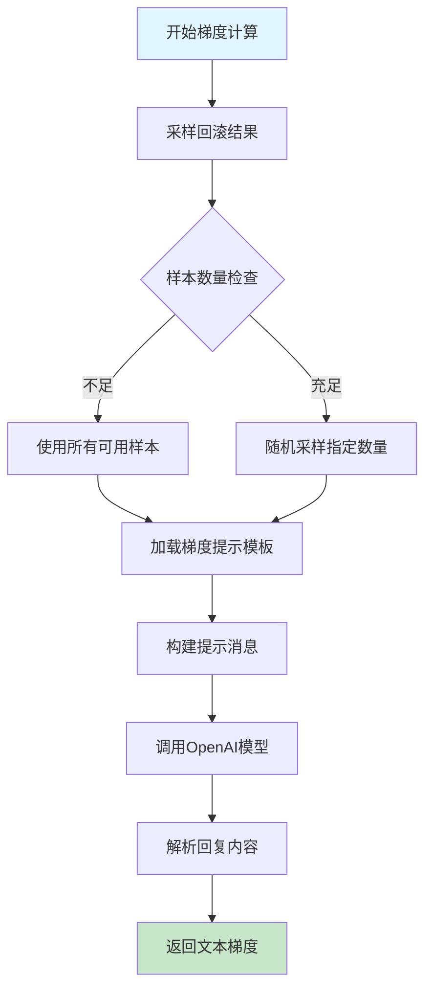
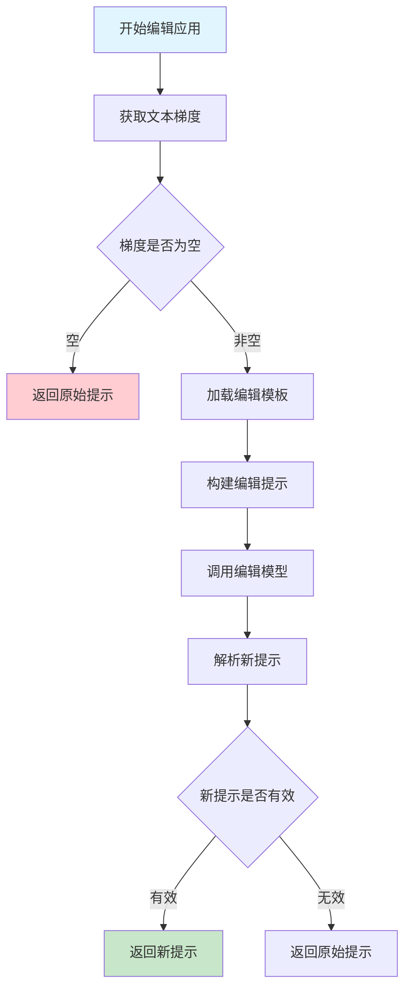
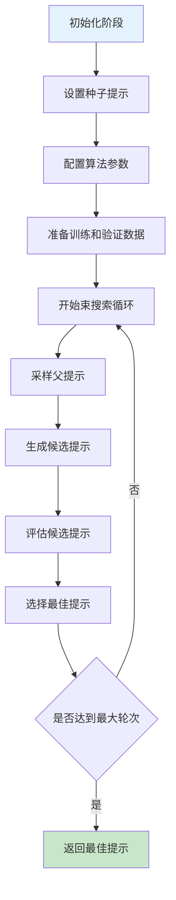
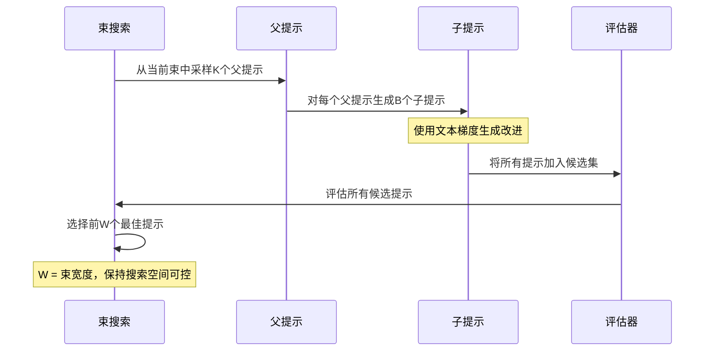
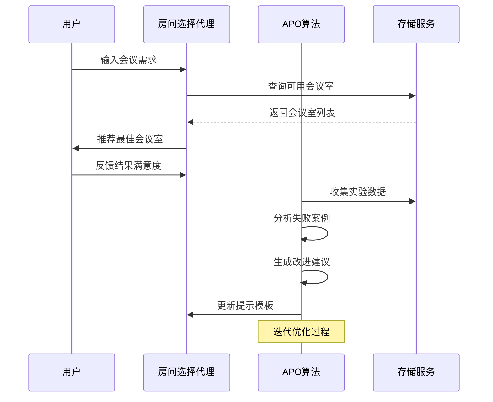
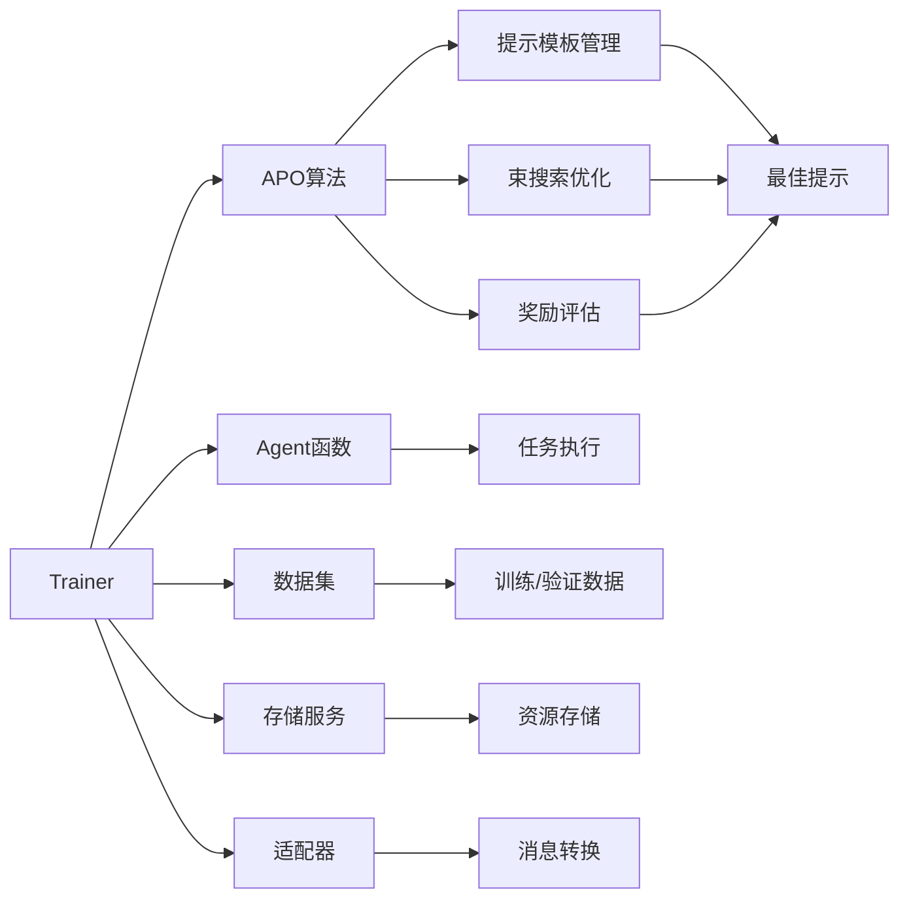
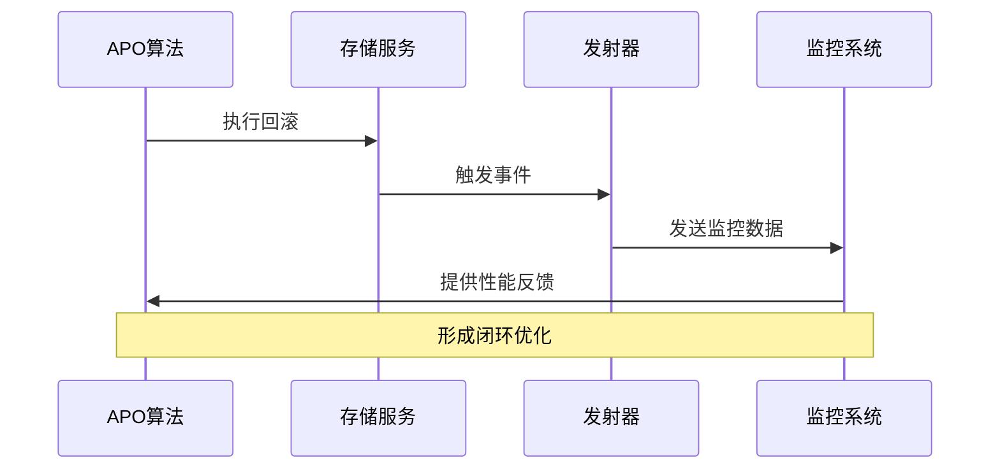

# 自动提示优化（APO）算法深度技术文档

<cite>
**本文档引用的文件**
- [apo.py](file://agentlightning/algorithm/apo/apo.py)
- [room_selector_apo.py](file://examples/apo/room_selector_apo.py)
- [room_selector.py](file://examples/apo/room_selector.py)
- [README.md](file://examples/apo/README.md)
- [test_apo.py](file://tests/algorithm/test_apo.py)
- [text_gradient_variant01.poml](file://agentlightning/algorithm/apo/prompts/text_gradient_variant01.poml)
- [apply_edit_variant01.poml](file://agentlightning/algorithm/apo/prompts/apply_edit_variant01.poml)
</cite>

## 目录
1. [简介](#简介)
2. [项目结构概览](#项目结构概览)
3. [核心算法架构](#核心算法架构)
4. [详细组件分析](#详细组件分析)
5. [工作流程详解](#工作流程详解)
6. [参数配置与调优](#参数配置与调优)
7. [实际应用案例](#实际应用案例)
8. [性能优化建议](#性能优化建议)
9. [故障排除指南](#故障排除指南)
10. [与其他模块的集成](#与其他模块的集成)
11. [扩展开发指南](#扩展开发指南)
12. [总结](#总结)

## 简介

自动提示优化（Automatic Prompt Optimization, APO）是Agent-Lightning框架中的一个强大算法，它利用强化学习和文本梯度技术来自动优化提示模板。APO算法通过迭代式的束搜索过程，结合LLM生成的文本梯度，不断改进提示模板以提高任务性能。

### 核心特性

- **基于强化学习的优化策略**：使用奖励信号指导提示优化过程
- **文本梯度生成**：通过LLM分析实验结果生成具体的改进建议
- **束搜索算法**：在搜索空间中高效探索最优提示
- **多轮迭代优化**：通过多个训练轮次逐步提升提示质量
- **灵活的配置系统**：支持多种参数调节以适应不同场景

## 项目结构概览

APO算法的核心实现位于以下目录结构中：



**图表来源**
- [apo.py](file://agentlightning/algorithm/apo/apo.py#L1-L50)
- [room_selector_apo.py](file://examples/apo/room_selector_apo.py#L1-L30)

**章节来源**
- [apo.py](file://agentlightning/algorithm/apo/apo.py#L1-L100)
- [README.md](file://examples/apo/README.md#L1-L50)

## 核心算法架构

APO算法采用分层架构设计，主要包含以下几个核心层次：



**图表来源**
- [apo.py](file://agentlightning/algorithm/apo/apo.py#L80-L150)
- [apo.py](file://agentlightning/algorithm/apo/apo.py#L40-L50)

### 关键数据结构

| 数据结构 | 类型 | 描述 | 用途 |
|---------|------|------|------|
| `VersionedPromptTemplate` | 数据类 | 带版本标识的提示模板 | 跟踪提示历史和版本控制 |
| `RolloutResultForAPO` | 类型定义 | APO兼容的回滚结果格式 | 存储实验结果和评估信息 |
| `NamedResources` | 字典类型 | 命名资源集合 | 在存储中注册和管理资源 |
| `Dataset[T_task]` | 泛型序列 | 任务数据集 | 提供训练和验证数据 |

**章节来源**
- [apo.py](file://agentlightning/algorithm/apo/apo.py#L40-L60)
- [apo.py](file://agentlightning/algorithm/apo/apo.py#L80-L120)

## 详细组件分析

### APO算法核心类

APO算法的核心实现是一个泛型类，支持不同类型的任务数据：



**图表来源**
- [apo.py](file://agentlightning/algorithm/apo/apo.py#L820-L898)
- [room_selector_apo.py](file://examples/apo/room_selector_apo.py#L40-L60)

### 文本梯度计算组件

文本梯度计算是APO算法的核心创新之一，它通过分析实验结果生成具体的改进建议：



**图表来源**
- [apo.py](file://agentlightning/algorithm/apo/apo.py#L280-L320)
- [text_gradient_variant01.poml](file://agentlightning/algorithm/apo/prompts/text_gradient_variant01.poml#L1-L19)

### 编辑应用组件

编辑应用组件负责将文本梯度转化为具体的提示模板修改：



**图表来源**
- [apo.py](file://agentlightning/algorithm/apo/apo.py#L322-L380)
- [apply_edit_variant01.poml](file://agentlightning/algorithm/apo/prompts/apply_edit_variant01.poml#L1-L23)

**章节来源**
- [apo.py](file://agentlightning/algorithm/apo/apo.py#L280-L400)
- [apo.py](file://agentlightning/algorithm/apo/apo.py#L322-L380)

## 工作流程详解

APO算法的工作流程遵循强化学习的基本范式，通过迭代式的优化过程不断提升提示质量：

### 主要工作流程



**图表来源**
- [apo.py](file://agentlightning/algorithm/apo/apo.py#L820-L898)

### 束搜索算法详解

束搜索是APO算法的核心优化策略，它在搜索空间中平衡探索和利用：



**图表来源**
- [apo.py](file://agentlightning/algorithm/apo/apo.py#L650-L720)

### 数据批处理机制

APO算法实现了智能的数据批处理机制，确保训练和验证过程的效率：

| 批处理类型 | 参数 | 功能 | 默认值 |
|-----------|------|------|--------|
| 梯度批处理 | `gradient_batch_size` | 控制梯度计算时使用的样本数量 | 4 |
| 验证批处理 | `val_batch_size` | 控制验证评估时使用的样本数量 | 16 |
| 束宽度 | `beam_width` | 束搜索过程中保留的最佳提示数量 | 4 |
| 分支因子 | `branch_factor` | 每个父提示生成的子提示数量 | 4 |

**章节来源**
- [apo.py](file://agentlightning/algorithm/apo/apo.py#L120-L180)
- [apo.py](file://agentlightning/algorithm/apo/apo.py#L650-L750)

## 参数配置与调优

### 核心参数详解

APO算法提供了丰富的配置选项，可以根据具体任务需求进行调优：

| 参数类别 | 参数名称 | 类型 | 默认值 | 调优建议 |
|---------|----------|------|--------|----------|
| **模型配置** | `gradient_model` | str | "gpt-5-mini" | 用于梯度计算的模型精度 |
| | `apply_edit_model` | str | "gpt-4.1-mini" | 用于编辑应用的模型精度 |
| **搜索控制** | `beam_width` | int | 4 | 束搜索宽度，影响搜索质量和计算成本 |
| | `branch_factor` | int | 4 | 分支因子，控制每轮生成的候选数量 |
| | `beam_rounds` | int | 3 | 优化轮数，增加轮数可获得更好结果但耗时更长 |
| **批处理配置** | `gradient_batch_size` | int | 4 | 梯度计算批次大小，影响梯度质量 |
| | `val_batch_size` | int | 16 | 验证评估批次大小，影响评估稳定性 |
| **多样性控制** | `diversity_temperature` | float | 1.0 | 控制提示生成的创造性，范围0.0-2.0 |
| **超时控制** | `rollout_batch_timeout` | float | 3600.0 | 回滚批处理超时时间（秒） |
| **初始验证** | `run_initial_validation` | bool | True | 是否在优化前运行初始验证 |

### 性能调优策略

#### 1. 内存优化
- 减少`gradient_batch_size`和`val_batch_size`可以降低内存使用
- 合理设置`beam_width`避免过大的搜索空间

#### 2. 计算效率优化
- 使用较轻量级的模型（如"gpt-4.1-mini"）进行梯度计算
- 增加`branch_factor`可以在单轮内产生更多候选，减少总轮数

#### 3. 结果质量优化
- 增加`beam_rounds`和`gradient_batch_size`可以提高最终结果质量
- 使用更精确的模型（如"gpt-5-mini"）进行梯度计算

**章节来源**
- [apo.py](file://agentlightning/algorithm/apo/apo.py#L90-L150)
- [room_selector_apo.py](file://examples/apo/room_selector_apo.py#L40-L50)

## 实际应用案例

### 房间选择任务示例

房间选择任务是APO算法的经典应用案例，展示了如何优化对话式AI的提示模板：



**图表来源**
- [room_selector.py](file://examples/apo/room_selector.py#L100-L200)
- [room_selector_apo.py](file://examples/apo/room_selector_apo.py#L40-L70)

### 应用配置详解

房间选择任务的APO配置展示了典型的使用模式：

| 配置项 | 值 | 说明 |
|-------|----|----- |
| `val_batch_size` | 10 | 验证批次大小，平衡速度和稳定性 |
| `gradient_batch_size` | 4 | 梯度计算样本数，保证梯度质量 |
| `beam_width` | 2 | 束宽度，控制搜索空间复杂度 |
| `branch_factor` | 2 | 分支因子，平衡探索和利用 |
| `beam_rounds` | 2 | 优化轮数，快速收敛 |
| `_poml_trace` | True | 启用POML追踪，便于调试 |

**章节来源**
- [room_selector_apo.py](file://examples/apo/room_selector_apo.py#L40-L70)
- [room_selector.py](file://examples/apo/room_selector.py#L100-L150)

## 性能优化建议

### 计算资源优化

#### 1. 并行处理优化
- 增加`n_runners`参数以并行执行多个回滚
- 合理分配GPU和CPU资源给不同的处理阶段

#### 2. 网络通信优化
- 使用本地部署的LLM服务减少网络延迟
- 实现请求缓存机制避免重复的API调用

#### 3. 内存管理优化
- 及时清理不需要的回滚结果
- 使用流式处理减少内存峰值

### 算法参数优化

#### 1. 渐进式优化策略
```python
# 建议的参数调整策略
initial_config = {
    "beam_width": 2,
    "branch_factor": 2,
    "beam_rounds": 1,
    "gradient_batch_size": 2
}

# 第一阶段：快速收敛
stage1 = initial_config.copy()
stage1["beam_rounds"] = 1

# 第二阶段：精细优化  
stage2 = stage1.copy()
stage2["beam_rounds"] = 2
stage2["gradient_batch_size"] = 4

# 第三阶段：最终优化
stage3 = stage2.copy()
stage3["beam_rounds"] = 3
stage3["gradient_batch_size"] = 8
```

#### 2. 自适应参数调整
- 根据任务复杂度动态调整`beam_width`和`branch_factor`
- 基于历史性能数据调整`diversity_temperature`

### 监控和日志优化

#### 1. 关键指标监控
- 提示模板版本变化频率
- 梯度计算成功率
- 验证评估稳定性和一致性

#### 2. 日志优化策略
- 启用详细的POML追踪（`_poml_trace=True`）
- 实现自定义的日志处理器记录关键事件
- 设置适当的日志级别避免过度输出

**章节来源**
- [room_selector_apo.py](file://examples/apo/room_selector_apo.py#L25-L40)
- [apo.py](file://agentlightning/algorithm/apo/apo.py#L180-L220)

## 故障排除指南

### 常见问题及解决方案

#### 1. 梯度计算失败

**症状**：`compute_textual_gradient`返回None或错误
**原因**：
- OpenAI API调用失败
- 提供的回滚结果不足
- 模型响应格式不正确

**解决方案**：
```python
# 添加重试机制
async def robust_compute_gradient(self, prompt, results):
    max_retries = 3
    for attempt in range(max_retries):
        try:
            return await self.compute_textual_gradient(prompt, results)
        except Exception as e:
            logger.warning(f"Gradient computation failed (attempt {attempt + 1}): {e}")
            if attempt == max_retries - 1:
                return None
            await asyncio.sleep(2 ** attempt)  # 指数退避
```

#### 2. 束搜索停滞

**症状**：算法在某一轮后不再产生新的改进
**原因**：
- 束宽度太小导致探索不足
- 分支因子过低无法产生足够候选
- 搜索空间已经收敛

**解决方案**：
```python
# 实现束搜索动态调整
def adjust_beam_parameters(self, convergence_rate):
    if convergence_rate < 0.1:  # 收敛率低于10%
        self.beam_width = min(self.beam_width * 2, 8)
        self.branch_factor = min(self.branch_factor * 2, 8)
        logger.info(f"Adaptive adjustment: beam_width={self.beam_width}, branch_factor={self.branch_factor}")
```

#### 3. 内存溢出

**症状**：长时间运行后出现内存不足错误
**原因**：
- 回滚结果积累过多
- 大批次处理导致内存峰值

**解决方案**：
```python
# 实现内存监控和清理
def monitor_memory_usage(self):
    import psutil
    process = psutil.Process()
    memory_mb = process.memory_info().rss / 1024 / 1024
    
    if memory_mb > 2000:  # 超过2GB
        logger.warning(f"High memory usage: {memory_mb:.1f}MB")
        # 清理旧的回滚结果
        await self.cleanup_old_rollouts()
```

### 调试技巧

#### 1. 启用详细日志
```python
def setup_detailed_logging():
    import logging
    logging.getLogger("agentlightning.algorithm.apo").setLevel(logging.DEBUG)
    logging.getLogger("agentlightning.store").setLevel(logging.INFO)
```

#### 2. 使用POML追踪
```python
# 在初始化时启用POML追踪
algo = APO[TaskType](client, _poml_trace=True)
```

#### 3. 性能分析
```python
import time
import cProfile

# 性能分析装饰器
def profile_performance(func):
    def wrapper(*args, **kwargs):
        profiler = cProfile.Profile()
        profiler.enable()
        
        start_time = time.time()
        result = func(*args, **kwargs)
        end_time = time.time()
        
        profiler.disable()
        profiler.print_stats(sort='cumulative')
        print(f"Execution time: {end_time - start_time:.2f}s")
        
        return result
    return wrapper
```

**章节来源**
- [apo.py](file://agentlightning/algorithm/apo/apo.py#L200-L250)
- [test_apo.py](file://tests/algorithm/test_apo.py#L100-L150)

## 与其他模块的集成

### 与Trainer模块的集成

APO算法通过Trainer模块实现标准化的训练流程：



**图表来源**
- [room_selector_apo.py](file://examples/apo/room_selector_apo.py#L40-L70)

### 与Store模块的交互

APO算法依赖Store模块进行资源管理和回滚执行：

| Store功能 | APO用途 | 实现方式 |
|-----------|---------|----------|
| **资源管理** | 存储和检索提示模板 | `update_resources()` |
| **回滚执行** | 执行任务评估 | `enqueue_rollout()` |
| **状态查询** | 监控回滚进度 | `wait_for_rollouts()` |
| **结果获取** | 获取实验结果 | `query_spans()` |

### 与Emitter模块的协作

虽然APO算法本身不直接使用Emitter模块，但它可以通过以下方式受益：



**章节来源**
- [apo.py](file://agentlightning/algorithm/apo/apo.py#L410-L450)
- [room_selector_apo.py](file://examples/apo/room_selector_apo.py#L45-L70)

## 扩展开发指南

### 自定义APO算法

开发者可以通过继承APO基类来实现自定义的提示优化算法：

```python
class CustomAPO(APO[TaskType]):
    def __init__(self, *args, **kwargs):
        super().__init__(*args, **kwargs)
        # 自定义初始化逻辑
        
    async def compute_custom_gradient(self, prompt, results):
        # 实现自定义梯度计算逻辑
        pass
        
    async def apply_custom_edit(self, prompt, gradient):
        # 实现自定义编辑应用逻辑
        pass
```

### 自定义提示模板

APO算法支持多种提示模板变体，开发者可以创建自己的模板：

```python
# 自定义梯度提示模板
CUSTOM_GRADIENT_TEMPLATE = """
<poml>
  <p>你是一个提示优化专家。</p>
  <cp caption="当前提示模板">
    <text whiteSpace="pre">{{ prompt_template }}</text>
  </cp>
  <cp caption="实验结果分析">
    
      <p>实验{{ loop.index }}: {{ exp.status }} (奖励: {{ exp.final_reward }})</p>
    
  </cp>
  <cp caption="你的任务">
    基于以上分析，提出具体的优化建议。
  </cp>
</poml>
"""
```

### 扩展评估指标

可以添加自定义的评估指标来指导优化过程：

```python
class ExtendedAPO(APO[TaskType]):
    def __init__(self, *args, custom_metrics=None, **kwargs):
        super().__init__(*args, **kwargs)
        self.custom_metrics = custom_metrics or []
    
    async def evaluate_prompt_on_batch(self, *args, **kwargs):
        results, avg_reward = await super().evaluate_prompt_on_batch(*args, **kwargs)
        
        # 添加自定义评估指标
        custom_scores = await self.compute_custom_metrics(results)
        for result, score in zip(results, custom_scores):
            result["custom_score"] = score
            
        return results, avg_reward
```

### 集成第三方工具

APO算法可以与各种第三方工具集成：

```python
# 集成外部评估工具
async def external_evaluation(prompt, dataset):
    evaluator = ExternalEvaluator()
    scores = await evaluator.evaluate(prompt, dataset)
    return sum(scores) / len(scores)

# 在APO中使用
async def evaluate_with_external_metrics(self, prompt, dataset):
    apollo_score = await self.evaluate_prompt_on_batch(prompt, dataset)
    external_score = await external_evaluation(prompt, dataset)
    
    # 综合评分
    combined_score = (apollo_score + external_score) / 2
    return combined_score
```

**章节来源**
- [apo.py](file://agentlightning/algorithm/apo/apo.py#L80-L120)
- [test_apo.py](file://tests/algorithm/test_apo.py#L50-L100)

## 总结

自动提示优化（APO）算法是Agent-Lightning框架中的一个重要创新，它通过结合强化学习和文本梯度技术，实现了提示模板的自动化优化。本文档详细介绍了APO算法的实现机制、工作原理和使用方法。

### 核心优势

1. **智能化优化**：基于LLM生成的文本梯度进行提示优化
2. **高效的搜索策略**：束搜索算法在搜索空间中平衡探索和利用
3. **灵活的配置系统**：丰富的参数配置满足不同场景需求
4. **易于集成**：与Agent-Lightning生态系统无缝集成

### 应用前景

APO算法在以下领域具有广阔的应用前景：
- **对话系统优化**：提升聊天机器人和虚拟助手的对话质量
- **代码生成优化**：改善编程辅助工具的提示效果
- **内容创作增强**：优化创意写作和内容生成的提示模板
- **多模态任务**：扩展到图像、音频等多模态任务的提示优化

### 最佳实践建议

1. **渐进式优化**：从较小的参数开始，逐步增加复杂度
2. **充分验证**：在独立的验证集上评估优化效果
3. **持续监控**：建立完善的监控和日志系统
4. **团队协作**：结合人工专家知识进行指导性优化

通过深入理解和合理运用APO算法，开发者可以显著提升AI系统的性能和用户体验，为构建更智能的AI应用奠定坚实基础。