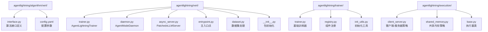
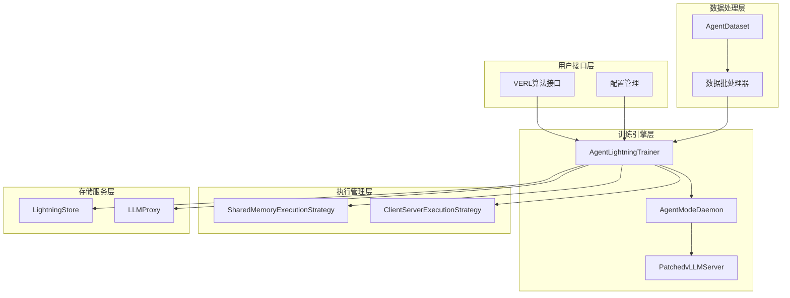
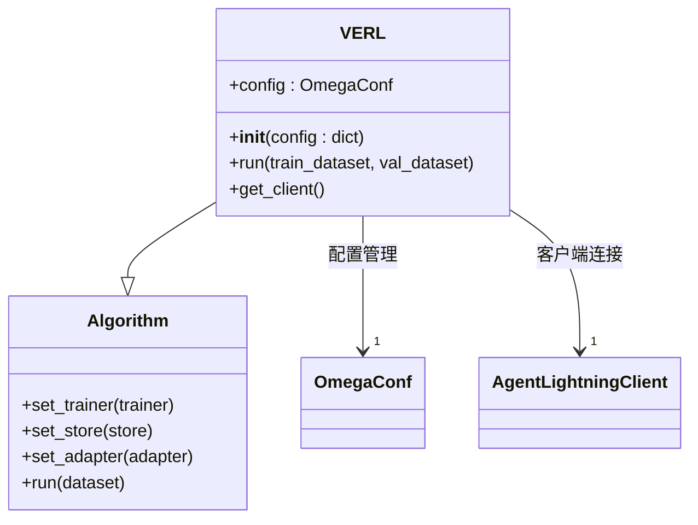
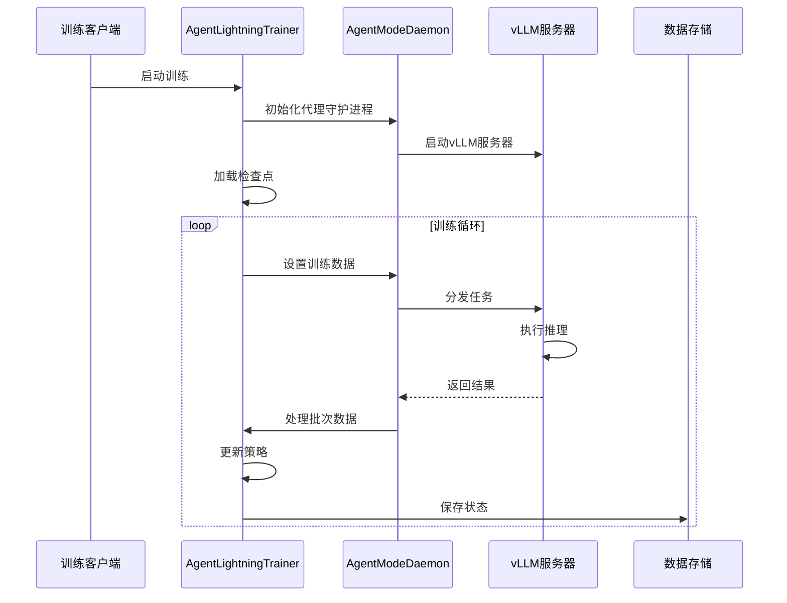
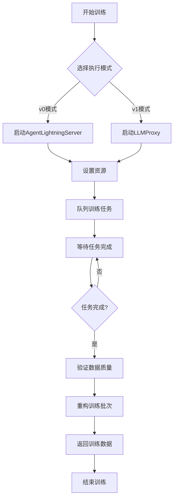
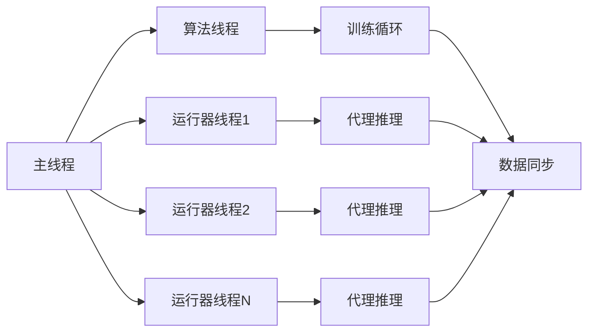
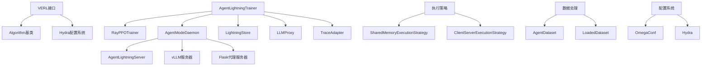

# VERL算法技术架构文档

<cite>
**本文档引用的文件**
- [interface.py](file://agentlightning/algorithm/verl/interface.py)
- [config.yaml](file://agentlightning/verl/config.yaml)
- [trainer.py](file://agentlightning/verl/trainer.py)
- [daemon.py](file://agentlightning/verl/daemon.py)
- [async_server.py](file://agentlightning/verl/async_server.py)
- [entrypoint.py](file://agentlightning/verl/entrypoint.py)
- [trainer.py](file://agentlightning/trainer/trainer.py)
- [client_server.py](file://agentlightning/execution/client_server.py)
- [shared_memory.py](file://agentlightning/execution/shared_memory.py)
</cite>

## 目录
1. [简介](#简介)
2. [项目结构](#项目结构)
3. [核心组件](#核心组件)
4. [架构概览](#架构概览)
5. [详细组件分析](#详细组件分析)
6. [依赖关系分析](#依赖关系分析)
7. [性能考虑](#性能考虑)
8. [故障排除指南](#故障排除指南)
9. [结论](#结论)

## 简介

向量增强强化学习（Vector Enhanced Reinforcement Learning, VERL）是一种基于代理的强化学习算法，专门设计用于处理复杂的对话系统和智能体训练场景。VERL算法通过与Agent Lightning框架的深度集成，提供了分布式训练能力、异步推理支持和高效的资源管理机制。

VERL算法的核心优势在于其独特的"代理模式"（Agent Mode），该模式允许智能体在训练过程中与外部环境进行实时交互，同时保持训练的稳定性和效率。这种设计使得VERL特别适合于需要大量交互式训练的场景，如对话系统、代码生成和复杂决策任务。

## 项目结构

VERL算法在Agent Lightning项目中的组织结构体现了清晰的分层架构设计：



**图表来源**
- [interface.py](file://agentlightning/algorithm/verl/interface.py#L1-L153)
- [trainer.py](file://agentlightning/verl/trainer.py#L1-L388)
- [daemon.py](file://agentlightning/verl/daemon.py#L1-L797)

**章节来源**
- [interface.py](file://agentlightning/algorithm/verl/interface.py#L1-L153)
- [config.yaml](file://agentlightning/verl/config.yaml#L1-L22)

## 核心组件

VERL算法由以下核心组件构成：

### 1. VERL算法接口
VERL类继承自Algorithm基类，提供了标准化的算法接口和配置管理功能。它负责与VERL PPO训练器的集成，并支持多种配置选项。

### 2. AgentLightningTrainer
专门针对代理强化学习场景优化的PPO训练器，集成了AgentModeDaemon以支持异步训练流程。

### 3. AgentModeDaemon
核心的异步任务管理器，负责协调训练任务、管理代理服务器通信和处理数据批处理。

### 4. 执行策略
支持多种执行模式：
- **共享内存模式（SHM）**：单进程内核间通信
- **客户端-服务器模式（CS）**：分布式进程通信

**章节来源**
- [interface.py](file://agentlightning/algorithm/verl/interface.py#L13-L153)
- [trainer.py](file://agentlightning/verl/trainer.py#L45-L388)
- [daemon.py](file://agentlightning/verl/daemon.py#L150-L797)

## 架构概览

VERL算法采用分层架构设计，实现了算法逻辑、训练管理和执行策略的分离：



**图表来源**
- [interface.py](file://agentlightning/algorithm/verl/interface.py#L13-L153)
- [trainer.py](file://agentlightning/verl/trainer.py#L45-L388)
- [daemon.py](file://agentlightning/verl/daemon.py#L150-L797)

## 详细组件分析

### VERL算法接口分析

VERL算法接口是整个VERL系统的核心入口点，提供了灵活的配置管理和训练启动功能：



**图表来源**
- [interface.py](file://agentlightning/algorithm/verl/interface.py#L13-L153)

VERL接口的关键特性包括：

1. **配置融合机制**：使用Hydra框架合并默认配置与用户自定义配置
2. **版本兼容性**：支持v0和v1两种执行模式
3. **依赖注入**：自动注入Store、LLM Proxy和Adapter组件

**章节来源**
- [interface.py](file://agentlightning/algorithm/verl/interface.py#L13-L153)

### AgentLightningTrainer训练器分析

AgentLightningTrainer是VERL算法的核心训练组件，专门针对代理强化学习进行了优化：



**图表来源**
- [trainer.py](file://agentlightning/verl/trainer.py#L45-L388)
- [daemon.py](file://agentlightning/verl/daemon.py#L150-L797)

训练器的主要功能模块：

1. **数据预处理**：处理提示词和响应的填充与截断
2. **奖励计算**：集成奖励模型评估生成质量
3. **优势估计**：支持多种优势估计方法（GRPO、REMAX等）
4. **批量平衡**：动态调整批次大小以优化GPU利用率

**章节来源**
- [trainer.py](file://agentlightning/verl/trainer.py#L45-L388)

### AgentModeDaemon异步任务管理

AgentModeDaemon是VERL算法异步训练的核心组件，负责协调训练任务和管理代理服务器通信：



**图表来源**
- [daemon.py](file://agentlightning/verl/daemon.py#L150-L797)

Daemon的关键功能：

1. **任务调度**：将训练样本分发到多个代理实例
2. **数据收集**：收集所有代理的输出并进行验证
3. **批次重构**：将分散的数据重新组合为训练批次
4. **质量控制**：验证数据完整性和奖励有效性

**章节来源**
- [daemon.py](file://agentlightning/verl/daemon.py#L150-L797)

### 执行策略分析

VERL算法支持两种主要的执行策略，适应不同的部署需求：

#### 共享内存执行策略



**图表来源**
- [shared_memory.py](file://agentlightning/execution/shared_memory.py#L1-L280)

#### 客户端-服务器执行策略

```mermaid
graph TB
subgraph "算法进程"
A[算法Bundle]
B[HTTP服务器]
end
subgraph "运行器进程"
C[运行器Bundle1]
D[运行器Bundle2]
E[运行器BundleN]
end
subgraph "存储服务"
F[LightningStore]
end
A < --> B
B < --> C
B < --> D
B < --> E
B < --> F
```

**图表来源**
- [client_server.py](file://agentlightning/execution/client_server.py#L1-L434)

**章节来源**
- [shared_memory.py](file://agentlightning/execution/shared_memory.py#L1-L280)
- [client_server.py](file://agentlightning/execution/client_server.py#L1-L434)

## 依赖关系分析

VERL算法的依赖关系体现了模块化设计原则：



**图表来源**
- [interface.py](file://agentlightning/algorithm/verl/interface.py#L1-L10)
- [trainer.py](file://agentlightning/verl/trainer.py#L1-L30)
- [daemon.py](file://agentlightning/verl/daemon.py#L1-L50)

关键依赖关系说明：

1. **配置管理**：Hydra框架提供强大的配置融合和验证功能
2. **分布式计算**：Ray框架支持大规模分布式训练
3. **异步处理**：基于asyncio的异步任务管理
4. **数据流**：TensorDict格式支持高效的张量操作

**章节来源**
- [interface.py](file://agentlightning/algorithm/verl/interface.py#L1-L153)
- [trainer.py](file://agentlightning/verl/trainer.py#L1-L388)

## 性能考虑

VERL算法在设计时充分考虑了性能优化：

### 内存管理优化

1. **梯度检查点**：启用梯度检查点减少内存占用
2. **参数卸载**：支持FSDP参数卸载策略
3. **微批次处理**：细粒度的批次处理避免OOM

### 计算效率优化

1. **异步推理**：vLLM服务器支持异步请求处理
2. **动态批处理**：根据GPU内存动态调整批次大小
3. **多GPU并行**：支持张量并行和流水线并行

### 网络通信优化

1. **负载均衡**：代理服务器实现请求负载均衡
2. **连接池**：复用HTTP连接减少建立开销
3. **压缩传输**：支持数据压缩减少网络带宽

## 故障排除指南

### 常见问题及解决方案

#### 1. 训练启动失败

**症状**：算法无法正常启动训练流程
**原因**：配置错误或依赖缺失
**解决方案**：
- 检查配置文件语法
- 验证模型路径可访问性
- 确认Ray集群正确初始化

#### 2. 代理服务器连接超时

**症状**：代理任务长时间无响应
**原因**：vLLM服务器启动失败或网络问题
**解决方案**：
- 检查GPU内存是否充足
- 验证网络连接状态
- 调整超时参数设置

#### 3. 内存溢出错误

**症状**：训练过程中出现CUDA OOM
**原因**：批次大小过大或序列长度过长
**解决方案**：
- 减小批次大小配置
- 限制最大序列长度
- 启用参数卸载功能

#### 4. 数据质量异常

**症状**：训练损失不稳定或收敛缓慢
**原因**：数据预处理或奖励函数问题
**解决方案**：
- 检查数据集完整性
- 验证奖励函数逻辑
- 调整数据过滤参数

### 性能监控指标

关键性能指标包括：

1. **训练吞吐量**：每秒处理的token数
2. **GPU利用率**：各GPU的计算资源使用率
3. **内存使用率**：显存和系统内存占用情况
4. **网络延迟**：代理服务器响应时间
5. **数据质量**：有效样本比例和奖励分布

### 超参数调优建议

#### 学习率调优

- 初始学习率：建议从1e-6开始
- 衰减策略：使用余弦衰减或线性衰减
- 最大学习率：不超过1e-4

#### 批次大小优化

- 微批次大小：根据GPU内存调整
- 主批次大小：平衡训练稳定性和效率
- 动态调整：根据实际内存使用动态调整

#### 强化学习参数

- KL散度系数：控制策略更新幅度
- 优势估计方法：GRPO适用于长序列
- 剪切比率：通常设置为0.2-0.3

## 结论

VERL算法代表了向量增强强化学习领域的重要进展，通过与Agent Lightning框架的深度集成，提供了强大而灵活的训练能力。其核心创新包括：

1. **代理模式**：实现了高效的异步训练流程
2. **分布式架构**：支持大规模并行训练
3. **模块化设计**：便于扩展和定制
4. **性能优化**：针对GPU训练进行了深度优化

VERL算法特别适合于需要大量交互式训练的场景，如对话系统、代码生成和复杂决策任务。通过合理的配置和调优，可以实现高效的模型训练和部署。

对于开发者而言，理解VERL算法的技术架构有助于更好地利用其功能，同时为未来的算法改进和扩展奠定基础。随着Agent Lightning框架的持续发展，VERL算法将在更多应用场景中发挥重要作用。