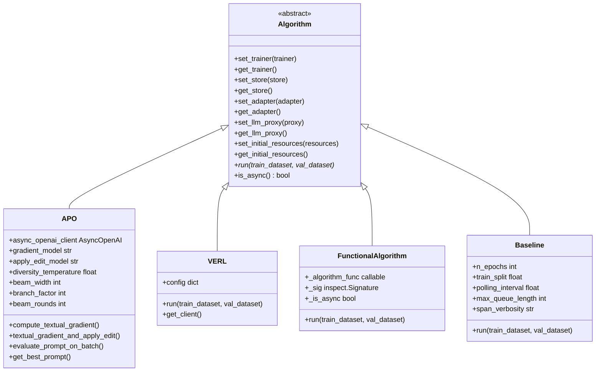
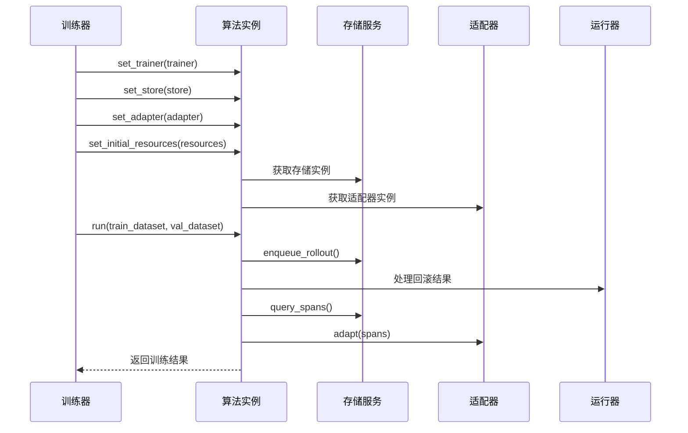
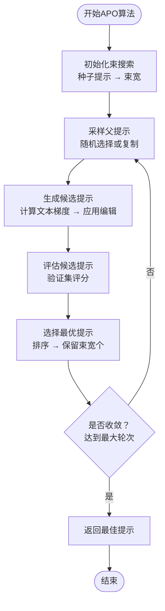
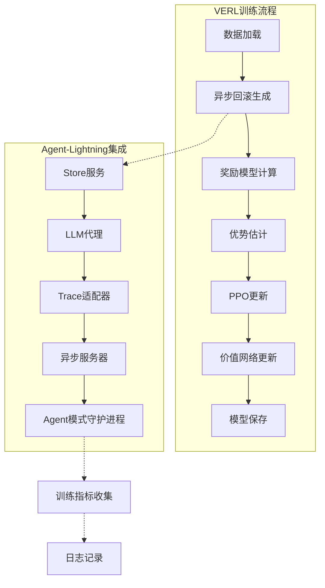
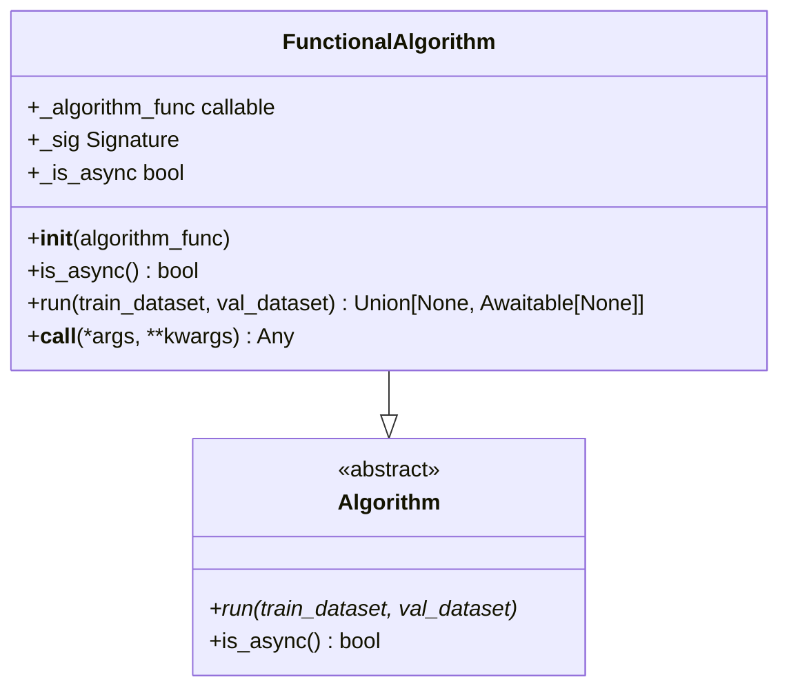
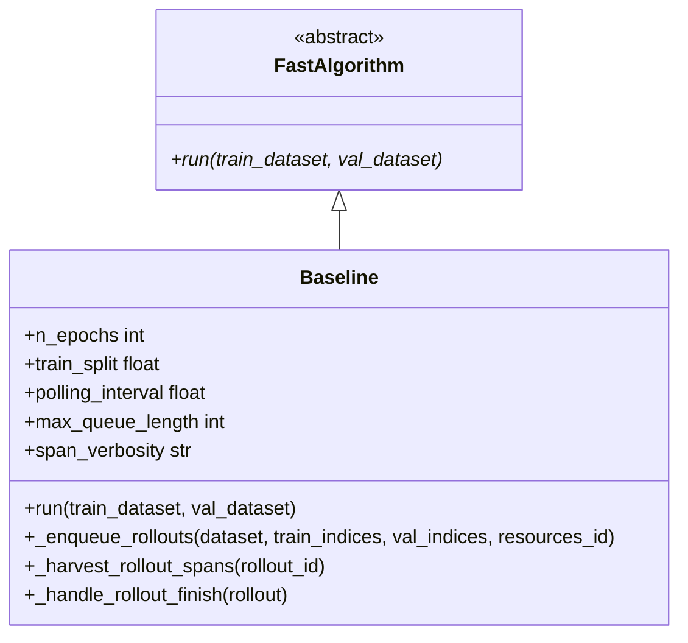
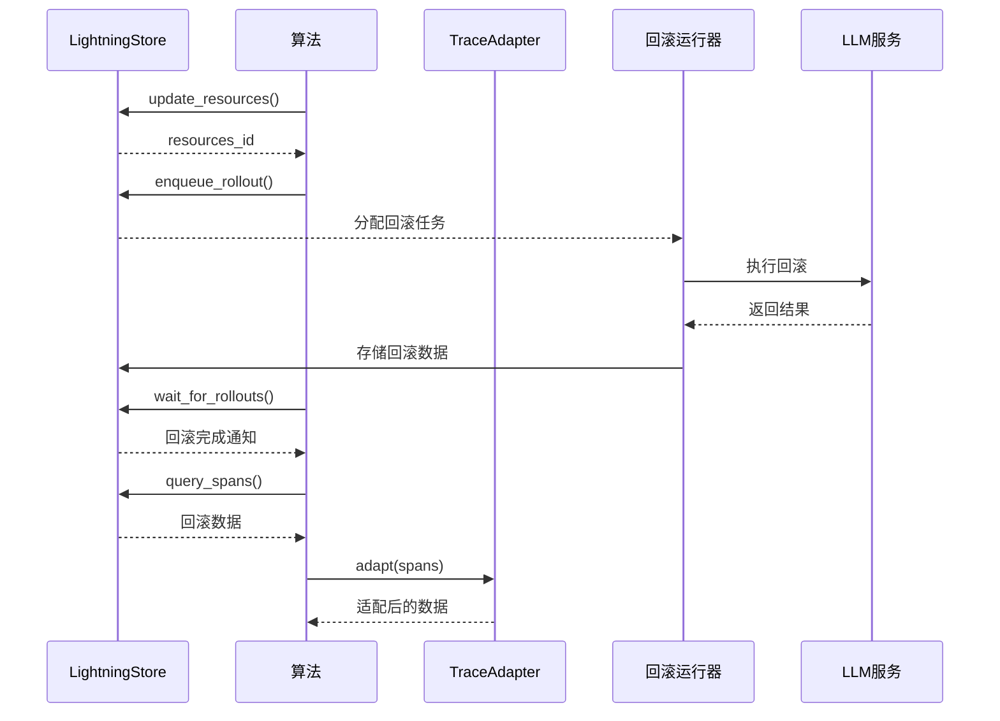

# 算法实现

<cite>
**本文档中引用的文件**
- [agentlightning/algorithm/base.py](file://agentlightning/algorithm/base.py)
- [agentlightning/algorithm/apo/apo.py](file://agentlightning/algorithm/apo/apo.py)
- [agentlightning/algorithm/verl/interface.py](file://agentlightning/algorithm/verl/interface.py)
- [agentlightning/algorithm/decorator.py](file://agentlightning/algorithm/decorator.py)
- [agentlightning/algorithm/fast.py](file://agentlightning/algorithm/fast.py)
- [agentlightning/trainer/trainer.py](file://agentlightning/trainer/trainer.py)
- [examples/apo/apo_custom_algorithm.py](file://examples/apo/apo_custom_algorithm.py)
- [examples/apo/apo_custom_algorithm_trainer.py](file://examples/apo/apo_custom_algorithm_trainer.py)
- [tests/algorithm/test_apo.py](file://tests/algorithm/test_apo.py)
- [agentlightning/verl/trainer.py](file://agentlightning/verl/trainer.py)
- [agentlightning/verl/config.yaml](file://agentlightning/verl/config.yaml)
</cite>

## 目录
1. [简介](#简介)
2. [算法架构概览](#算法架构概览)
3. [基础算法类](#基础算法类)
4. [APO算法详解](#apo算法详解)
5. [VERL算法详解](#verl算法详解)
6. [算法装饰器系统](#算法装饰器系统)
7. [快速算法基类](#快速算法基类)
8. [自定义算法实现](#自定义算法实现)
9. [算法配置与调优](#算法配置与调优)
10. [数据流与资源管理](#数据流与资源管理)
11. [使用示例](#使用示例)
12. [总结](#总结)

## 简介

Agent-Lightning框架提供了完整的算法实现体系，支持多种训练算法，包括自动提示优化(APO)和向量增强强化学习(VERL)等先进算法。该框架采用模块化设计，允许开发者轻松扩展和定制算法，同时提供了丰富的配置选项和调试工具。

## 算法架构概览

框架的算法架构采用分层设计，从基础抽象到具体实现形成清晰的层次结构：



**图表来源**
- [agentlightning/algorithm/base.py](file://agentlightning/algorithm/base.py#L20-L163)
- [agentlightning/algorithm/apo/apo.py](file://agentlightning/algorithm/apo/apo.py#L80-L200)
- [agentlightning/algorithm/verl/interface.py](file://agentlightning/algorithm/verl/interface.py#L10-L153)

## 基础算法类

### Algorithm基类设计

Algorithm类是所有算法的核心抽象基类，定义了算法的标准接口和生命周期管理：



**图表来源**
- [agentlightning/algorithm/base.py](file://agentlightning/algorithm/base.py#L40-L120)
- [agentlightning/trainer/trainer.py](file://agentlightning/trainer/trainer.py#L450-L520)

**节来源**
- [agentlightning/algorithm/base.py](file://agentlightning/algorithm/base.py#L20-L163)

## APO算法详解

### 算法原理与数学基础

APO（自动提示优化）算法是一种基于文本梯度的迭代提示优化方法，其核心思想是通过LLM生成的文本梯度来改进提示模板。

#### 工作原理

APO算法采用束搜索（Beam Search）策略进行提示优化：

1. **初始化阶段**：从种子提示开始，设置初始束宽度
2. **采样阶段**：从当前束中采样父提示
3. **生成阶段**：为每个父提示生成多个候选提示
4. **评估阶段**：在验证集上评估所有候选提示
5. **选择阶段**：选择表现最好的提示组成新的束



**图表来源**
- [agentlightning/algorithm/apo/apo.py](file://agentlightning/algorithm/apo/apo.py#L700-L800)

#### 数学基础

APO算法的核心数学表达式：

1. **文本梯度计算**：
   \[ G = \text{LLM}(P, \mathcal{R}) \]
   其中 \(G\) 是文本梯度，\(P\) 是当前提示，\(\mathcal{R}\) 是回滚结果集合。

2. **提示改进**：
   \[ P' = \text{LLM}(P, G) \]
   使用梯度信息生成改进后的提示。

3. **评分函数**：
   \[ S(P) = \frac{1}{N} \sum_{i=1}^{N} R_i \]
   平均奖励作为提示质量的评分指标。

### 核心组件详解

#### 文本梯度计算

文本梯度计算是APO算法的关键步骤，负责从回滚结果中提取有用的改进建议：

**节来源**
- [agentlightning/algorithm/apo/apo.py](file://agentlightning/algorithm/apo/apo.py#L300-L350)

#### 提示编辑应用

提示编辑应用阶段将文本梯度转化为具体的提示修改：

**节来源**
- [agentlightning/algorithm/apo/apo.py](file://agentlightning/algorithm/apo/apo.py#L350-L400)

#### 束搜索策略

束搜索策略控制算法的探索和利用平衡：

**节来源**
- [agentlightning/algorithm/apo/apo.py](file://agentlightning/algorithm/apo/apo.py#L600-L700)

### 适用场景与性能特征

#### 适用场景

1. **提示模板优化**：改进聊天机器人、问答系统的提示效果
2. **任务特定优化**：针对特定领域或任务定制提示
3. **多轮对话优化**：优化对话流程和响应质量

#### 性能特征

- **计算复杂度**：O(B × F × N)，其中B为束宽度，F为分支因子，N为评估样本数
- **内存需求**：主要取决于束大小和缓存的回滚结果
- **收敛性**：理论上保证局部最优解，实际效果依赖于梯度质量

## VERL算法详解

### 算法架构

VERL（Vector Enhanced Reinforcement Learning）算法基于PPO（Proximal Policy Optimization）框架，专门针对代理学习场景进行了优化：



**图表来源**
- [agentlightning/verl/trainer.py](file://agentlightning/verl/trainer.py#L50-L150)
- [agentlightning/algorithm/verl/interface.py](file://agentlightning/algorithm/verl/interface.py#L50-L100)

### 配置参数详解

VERL算法提供了丰富的配置选项：

| 参数类别 | 参数名 | 类型 | 默认值 | 描述 |
|---------|--------|------|--------|------|
| 算法参数 | adv_estimator | str | "grpo" | 优势估计器类型 |
| 算法参数 | use_kl_in_reward | bool | False | 是否在奖励中使用KL散度 |
| 数据参数 | train_batch_size | int | 32 | 训练批次大小 |
| 数据参数 | max_prompt_length | int | 4096 | 最大提示长度 |
| 数据参数 | max_response_length | int | 2048 | 最大响应长度 |
| Actor配置 | ppo_mini_batch_size | int | 32 | PPO迷你批次大小 |
| Actor配置 | ppo_micro_batch_size_per_gpu | int | 4 | 每GPU微批次大小 |
| Actor配置 | optim.lr | float | 1e-6 | 学习率 |
| Actor配置 | use_kl_loss | bool | False | 是否使用KL损失 |
| Actor配置 | entropy_coeff | float | 0 | 熵系数 |
| 模型配置 | model.path | str | "Qwen/Qwen2.5-1.5B-Instruct" | 模型路径 |
| 模型配置 | use_remove_padding | bool | True | 是否移除填充 |
| 模型配置 | enable_gradient_checkpointing | bool | True | 启用梯度检查点 |

**节来源**
- [agentlightning/algorithm/verl/interface.py](file://agentlightning/algorithm/verl/interface.py#L20-L100)
- [agentlightning/verl/config.yaml](file://agentlightning/verl/config.yaml#L1-L22)

### 与传统PPO的区别

VERL在传统PPO基础上进行了以下优化：

1. **Agent模式集成**：直接与Agent-Lightning生态系统集成
2. **简化数据流**：移除了复杂的弹出/合并操作
3. **异步处理**：支持异步回滚生成和服务器通信
4. **智能批处理**：根据提示长度动态调整批次大小

**节来源**
- [agentlightning/verl/trainer.py](file://agentlightning/verl/trainer.py#L40-L80)

## 算法装饰器系统

### FunctionalAlgorithm设计

算法装饰器系统提供了灵活的算法定义方式，允许开发者使用函数而非类来实现算法：



**图表来源**
- [agentlightning/algorithm/decorator.py](file://agentlightning/algorithm/decorator.py#L100-L200)

### 参数注入机制

装饰器系统自动检测函数签名并注入相应的依赖：

**节来源**
- [agentlightning/algorithm/decorator.py](file://agentlightning/algorithm/decorator.py#L150-L250)

### 使用示例

装饰器提供了简洁的算法定义语法：

**节来源**
- [agentlightning/algorithm/decorator.py](file://agentlightning/algorithm/decorator.py#L250-L265)

## 快速算法基类

### FastAlgorithm设计理念

FastAlgorithm基类专为开发工作流优化，提供轻量级的算法实现：



**图表来源**
- [agentlightning/algorithm/fast.py](file://agentlightning/algorithm/fast.py#L20-L50)

### Baseline算法实现

Baseline算法提供了最简单的训练循环实现：

**节来源**
- [agentlightning/algorithm/fast.py](file://agentlightning/algorithm/fast.py#L50-L242)

## 自定义算法实现

### 继承基础算法类

开发者可以通过继承Algorithm基类来实现自定义算法：

**节来源**
- [examples/apo/apo_custom_algorithm.py](file://examples/apo/apo_custom_algorithm.py#L30-L100)

### 使用算法装饰器

对于简单的算法逻辑，可以使用algo装饰器：

**节来源**
- [examples/apo/apo_custom_algorithm_trainer.py](file://examples/apo/apo_custom_algorithm_trainer.py#L20-L45)

### 算法模式分离

框架支持算法和运行器分离的模式：

**节来源**
- [examples/apo/apo_custom_algorithm.py](file://examples/apo/apo_custom_algorithm.py#L150-L186)

## 算法配置与调优

### APO算法调优指南

#### 关键参数配置

1. **束宽度（beam_width）**：影响搜索空间大小和计算成本
2. **分支因子（branch_factor）**：控制每个父提示生成的候选数量
3. **梯度批次大小（gradient_batch_size）**：影响梯度计算的稳定性
4. **多样性温度（diversity_temperature）**：控制生成的多样性程度

#### 调优策略

- **小规模实验**：使用较小的束宽度和分支因子进行快速验证
- **渐进式增加**：逐步增加参数值以观察性能变化
- **早停机制**：设置合理的最大轮次防止过拟合

### VERL算法调优指南

#### 训练参数调优

1. **学习率调度**：根据训练进度调整学习率
2. **批次大小优化**：平衡内存使用和训练效率
3. **优势估计器选择**：根据任务特性选择合适的估计器

#### 硬件资源配置

- **GPU内存**：确保足够的GPU内存用于大型模型训练
- **网络带宽**：优化客户端-服务器通信效率
- **存储性能**：使用高性能存储加速数据读取

## 数据流与资源管理

### 算法间的数据流转



**图表来源**
- [agentlightning/algorithm/base.py](file://agentlightning/algorithm/base.py#L80-L120)
- [agentlightning/trainer/trainer.py](file://agentlightning/trainer/trainer.py#L500-L557)

### 资源更新策略

框架提供了灵活的资源更新机制：

1. **版本化资源**：每次更新创建新版本，支持历史追踪
2. **原子更新**：确保资源更新的原子性
3. **缓存机制**：优化频繁访问的资源查询

**节来源**
- [agentlightning/algorithm/apo/apo.py](file://agentlightning/algorithm/apo/apo.py#L250-L300)

## 使用示例

### APO算法使用示例

#### 基础使用

```python
from agentlightning.algorithm import APO
from agentlightning.trainer import Trainer

# 创建APO算法实例
apo = APO(
    async_openai_client=openai_client,
    gradient_model="gpt-4",
    apply_edit_model="gpt-4",
    beam_width=4,
    branch_factor=4,
    beam_rounds=3
)

# 使用训练器执行
trainer = Trainer(algorithm=apo)
trainer.fit(agent, train_dataset, val_dataset)
```

#### 自定义APO算法

```python
from agentlightning.algorithm.decorator import algo

@algo
async def custom_apo_algorithm(*, store, train_dataset, val_dataset):
    # 自定义APO算法逻辑
    pass
```

### VERL算法使用示例

#### 基础配置

```python
from agentlightning.algorithm import VERL

# 创建VERL算法实例
verl_config = {
    "algorithm": {
        "adv_estimator": "grpo",
        "use_kl_in_reward": False,
    },
    "data": {
        "train_batch_size": 32,
        "max_prompt_length": 4096,
        "max_response_length": 2048,
    },
    "actor_rollout_ref": {
        "rollout": {
            "tensor_model_parallel_size": 1,
            "n": 4,
            "temperature": 0.7,
        },
        "actor": {
            "ppo_mini_batch_size": 32,
            "optim": {"lr": 1e-6},
        },
    },
}

verl = VERL(verl_config)
```

#### 完整训练流程

```python
from agentlightning.trainer import Trainer

# 设置训练器
trainer = Trainer(
    n_runners=4,
    algorithm=verl,
    llm_proxy=LLMProxy(port=12358),
    adapter=TraceToTriplet(),
    tracer=AgentOpsTracer()
)

# 执行训练
trainer.fit(agent, train_dataset, val_dataset)
```

### 多层次使用示例

#### 简单实验

适用于快速验证算法想法：

**节来源**
- [agentlightning/algorithm/fast.py](file://agentlightning/algorithm/fast.py#L50-L100)

#### 中等复杂度

适用于常规算法开发：

**节来源**
- [examples/apo/apo_custom_algorithm.py](file://examples/apo/apo_custom_algorithm.py#L30-L80)

#### 复杂系统

适用于生产环境部署：

**节来源**
- [examples/apo/apo_custom_algorithm_trainer.py](file://examples/apo/apo_custom_algorithm_trainer.py#L20-L45)

## 总结

Agent-Lightning框架提供了完整的算法实现体系，具有以下特点：

1. **模块化设计**：清晰的层次结构和接口定义
2. **多样化算法**：支持APO、VERL等多种先进算法
3. **灵活扩展**：提供装饰器和基类便于自定义
4. **丰富配置**：详细的参数配置和调优指南
5. **高效执行**：优化的数据流和资源管理机制

通过合理选择和配置算法，开发者可以构建高效的代理学习系统，满足从研究原型到生产部署的各种需求。