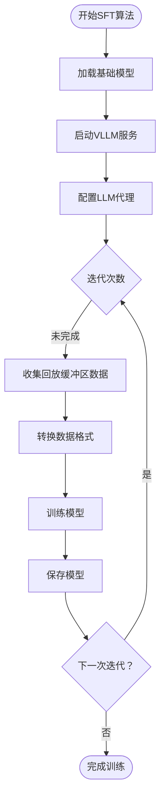

# 自定义算法开发

<cite>
**本文档中引用的文件**
- [base.py](file://agentlightning/algorithm/base.py)
- [decorator.py](file://agentlightning/algorithm/decorator.py)
- [trainer.py](file://agentlightning/trainer/trainer.py)
- [apo_custom_algorithm.py](file://examples/apo/apo_custom_algorithm.py)
- [apo_custom_algorithm_trainer.py](file://examples/apo/apo_custom_algorithm_trainer.py)
- [sft_algorithm.py](file://examples/unsloth/sft_algorithm.py)
- [resources.py](file://agentlightning/types/resources.py)
- [base.py](file://agentlightning/store/base.py)
- [fast.py](file://agentlightning/algorithm/fast.py)
- [registry.py](file://agentlightning/trainer/registry.py)
- [__init__.py](file://agentlightning/algorithm/__init__.py)
</cite>

## 目录
1. [简介](#简介)
2. [项目架构概览](#项目架构概览)
3. [核心抽象类分析](#核心抽象类分析)
4. [装饰器系统详解](#装饰器系统详解)
5. [算法开发流程](#算法开发流程)
6. [从简单到复杂的实现模式](#从简单到复杂的实现模式)
7. [配置注入与资源管理](#配置注入与资源管理)
8. [错误处理与日志记录](#错误处理与日志记录)
9. [调试技巧与集成测试](#调试技巧与集成测试)
10. [最佳实践指南](#最佳实践指南)
11. [总结](#总结)

## 简介

Agent-Lightning 是一个强大的智能体训练框架，提供了灵活的算法开发平台。本指南将详细介绍如何基于 `BaseAlgorithm` 抽象类开发自定义训练算法，并通过实际示例展示从简单规则引擎到复杂深度学习算法的完整实现过程。

框架的核心设计理念是将算法逻辑与执行环境分离，通过标准化的接口实现算法的可插拔性和可复用性。开发者可以专注于算法逻辑本身，而无需关心底层的执行细节。

## 项目架构概览

Agent-Lightning 框架采用分层架构设计，主要包含以下核心组件：


**图表来源**
- [base.py](file://agentlightning/algorithm/base.py#L1-L163)
- [trainer.py](file://agentlightning/trainer/trainer.py#L1-L557)

**章节来源**
- [base.py](file://agentlightning/algorithm/base.py#L1-L163)
- [trainer.py](file://agentlightning/trainer/trainer.py#L1-L557)

## 核心抽象类分析

### BaseAlgorithm 基础类

`BaseAlgorithm` 是所有训练算法的基础抽象类，定义了算法的核心接口和生命周期管理机制。


**图表来源**
- [base.py](file://agentlightning/algorithm/base.py#L25-L163)
- [decorator.py](file://agentlightning/algorithm/decorator.py#L100-L265)
- [fast.py](file://agentlightning/algorithm/fast.py#L15-L242)

#### 核心方法详解

1. **生命周期管理方法**
   - `set_trainer()`: 设置训练器实例，建立算法与训练环境的连接
   - `set_store()`: 注入存储服务，用于数据持久化和状态管理
   - `set_adapter()`: 配置适配器，处理追踪数据的转换和分析
   - `set_llm_proxy()`: 连接 LLM 代理，实现模型调用的拦截和监控

2. **核心执行方法**
   - `run()`: 算法的主要执行入口，接收训练和验证数据集
   - `is_async()`: 判断算法是否为异步执行模式

3. **资源访问方法**
   - `get_trainer()`, `get_store()`, `get_adapter()`, `get_llm_proxy()`: 获取已注入的组件实例

**章节来源**
- [base.py](file://agentlightning/algorithm/base.py#L25-L163)

## 装饰器系统详解

### algo 装饰器机制

`algo` 装饰器是框架提供的核心工具，用于将普通函数转换为符合 `Algorithm` 接口的可执行算法。


**图表来源**
- [decorator.py](file://agentlightning/algorithm/decorator.py#L100-L265)

#### 装饰器功能特性

1. **自动依赖注入**
   - 根据函数签名自动注入 `store`, `adapter`, `llm_proxy`, `initial_resources`, `train_dataset`, `val_dataset` 参数
   - 支持同步和异步函数的统一处理

2. **类型安全检查**
   - 编译时检查参数类型匹配
   - 运行时验证参数完整性

3. **签名分析机制**
   - 使用 `inspect.signature()` 分析函数参数
   - 动态决定需要注入的依赖项

**章节来源**
- [decorator.py](file://agentlightning/algorithm/decorator.py#L100-L265)

## 算法开发流程

### 开发步骤详解

1. **选择开发模式**
   - **继承 BaseAlgorithm**: 适用于复杂算法逻辑
   - **使用 algo 装饰器**: 适用于函数式算法

2. **实现核心逻辑**
   - 定义训练循环和数据处理逻辑
   - 实现与存储服务的交互
   - 处理奖励信号和优化目标

3. **配置执行策略**
   - 选择合适的执行策略（共享内存、客户端-服务器）
   - 配置资源限制和超时设置

4. **集成测试**
   - 使用 `Trainer.dev()` 进行快速调试
   - 验证算法的正确性和性能

### 调用时序图


**图表来源**
- [trainer.py](file://agentlightning/trainer/trainer.py#L450-L557)

**章节来源**
- [trainer.py](file://agentlightning/trainer/trainer.py#L450-L557)

## 从简单到复杂的实现模式

### 示例1：规则引擎算法（APO）

基于 APO（Adaptive Prompt Optimization）的简单规则引擎实现展示了算法的基本结构：


**图表来源**
- [apo_custom_algorithm.py](file://examples/apo/apo_custom_algorithm.py#L30-L80)

#### 关键实现要点

1. **资源管理**: 使用 `NamedResources` 管理提示模板
2. **任务调度**: 通过 `enqueue_rollout()` 提交任务
3. **结果收集**: 使用 `wait_for_rollouts()` 等待任务完成
4. **奖励评估**: 通过 LLM 评估器计算任务质量

**章节来源**
- [apo_custom_algorithm.py](file://examples/apo/apo_custom_algorithm.py#L30-L80)

### 示例2：深度学习算法（SFT）

基于 SFT（Supervised Fine-Tuning）的复杂算法展示了现代机器学习算法的实现模式：



**图表来源**
- [sft_algorithm.py](file://examples/unsloth/sft_algorithm.py#L150-L250)

#### 复杂算法的关键特性

1. **多阶段训练**: 包含数据收集、预处理、训练、保存等多个阶段
2. **外部服务集成**: 集成 VLLM 服务进行模型推理
3. **资源管理**: 动态管理模型版本和配置
4. **并发控制**: 使用进程池管理训练任务

**章节来源**
- [sft_algorithm.py](file://examples/unsloth/sft_algorithm.py#L150-L250)

## 配置注入与资源管理

### 资源类型系统

Agent-Lightning 提供了丰富的资源类型系统，支持各种配置需求：


**图表来源**
- [resources.py](file://agentlightning/types/resources.py#L20-L199)

### 配置注入机制

1. **静态资源配置**
   - 在训练器初始化时通过 `initial_resources` 参数注入
   - 支持 JSON/YAML 配置文件格式

2. **动态资源更新**
   - 使用 `store.add_resources()` 动态添加资源
   - 通过 `resources_id` 版本控制资源变更

3. **资源绑定**
   - 算法通过 `get_initial_resources()` 获取初始配置
   - 运行时通过 `store.get_latest_resources()` 获取最新配置

**章节来源**
- [resources.py](file://agentlightning/types/resources.py#L20-L199)

## 错误处理与日志记录

### 日志系统架构


### 错误处理最佳实践

1. **异常捕获与传播**
   ```python
   try:
       # 算法核心逻辑
       result = await algorithm.run(train_dataset, val_dataset)
   except Exception as e:
       logger.exception("算法执行失败: %s", e)
       raise
   ```

2. **资源清理**
   ```python
   finally:
       # 清理临时资源
       if hasattr(self, 'temp_files'):
           for file in self.temp_files:
               if os.path.exists(file):
                   os.remove(file)
   ```

3. **状态恢复**
   ```python
   def recover_from_error(self, error_state):
       # 恢复到安全状态
       self.cleanup_partial_work()
       self.notify_admin(error_state)
   ```

**章节来源**
- [fast.py](file://agentlightning/algorithm/fast.py#L100-L150)

## 调试技巧与集成测试

### 调试工具链

1. **开发模式调试**
   使用 `Trainer.dev()` 进行快速调试：
   ```python
   trainer = Trainer(dev=True, n_workers=1)
   trainer.dev(agent, train_dataset)
   ```

2. **Baseline 算法测试**
   使用内置的 `Baseline` 算法进行基础设施验证：
   ```python
   from agentlightning.algorithm.fast import Baseline
   
   algorithm = Baseline(n_epochs=1, train_split=0.5)
   trainer.fit(algorithm, train_dataset)
   ```

3. **日志级别配置**
   ```python
   import logging
   logging.getLogger('agentlightning').setLevel(logging.DEBUG)
   ```

### 集成测试方法

1. **单元测试**
   ```python
   @pytest.mark.asyncio
   async def test_algorithm_execution():
       # 测试算法基本功能
       algorithm = MyCustomAlgorithm()
       store = MockLightningStore()
       
       algorithm.set_store(store)
       await algorithm.run(test_dataset)
       
       assert store.has_received_tasks()
   ```

2. **端到端测试**
   ```python
   def test_full_pipeline():
       # 测试完整训练流水线
       trainer = Trainer(n_workers=1, algorithm=my_algorithm)
       trainer.fit(agent, train_dataset)
       
       # 验证结果
       assert trainer.algorithm.completed_iterations > 0
   ```

**章节来源**
- [fast.py](file://agentlightning/algorithm/fast.py#L50-L100)

## 最佳实践指南

### 性能优化建议

1. **批处理策略**
   - 合理设置批大小以平衡内存使用和吞吐量
   - 使用异步操作避免阻塞

2. **资源管理**
   - 及时释放不需要的资源
   - 使用弱引用避免循环依赖

3. **并发控制**
   - 限制同时运行的任务数量
   - 实现优雅的停止机制

### 代码组织原则

1. **单一职责**
   - 每个算法类专注特定的训练逻辑
   - 将通用功能抽取为独立模块

2. **依赖注入**
   - 明确声明所需的依赖项
   - 使用接口而非具体实现

3. **错误处理**
   - 提供有意义的错误信息
   - 实现适当的重试机制

### 部署注意事项

1. **配置管理**
   - 使用环境变量管理敏感配置
   - 支持配置热更新

2. **监控告警**
   - 监控算法执行状态
   - 设置关键指标阈值

3. **版本控制**
   - 跟踪算法版本变更
   - 维护配置历史记录

## 总结

Agent-Lightning 框架为算法开发提供了强大而灵活的基础设施。通过 `BaseAlgorithm` 抽象类和 `algo` 装饰器，开发者可以轻松实现从简单规则引擎到复杂深度学习算法的各种训练方案。

关键要点包括：

1. **架构清晰**: 分层设计确保了系统的可维护性和扩展性
2. **接口统一**: 标准化的算法接口简化了开发和集成过程
3. **工具丰富**: 提供了完整的开发、调试和部署工具链
4. **生态完善**: 支持多种执行策略和集成模式

遵循本指南的最佳实践，开发者可以高效地构建高质量的训练算法，充分发挥 Agent-Lightning 框架的强大能力。