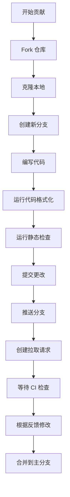
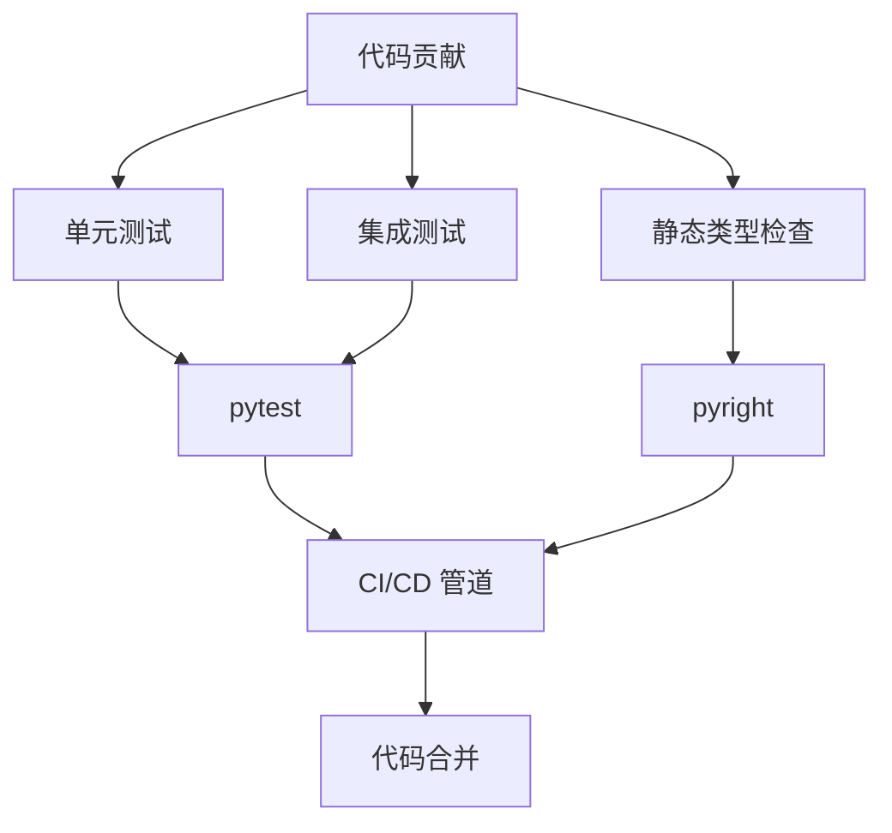

# 贡献指南

<cite>
**本文档中引用的文件**  
- [README.md](file://README.md)
- [SECURITY.md](file://SECURITY.md)
- [pyproject.toml](file://pyproject.toml)
- [RAI_README.md](file://RAI_README.md)
- [mkdocs.yml](file://mkdocs.yml)
- [scripts/check_python_headers.py](file://scripts/check_python_headers.py)
- [pyrightconfig.json](file://pyrightconfig.json)
- [tests/test_client.py](file://tests/test_client.py)
- [agentlightning/verl/config.yaml](file://agentlightning/verl/config.yaml)
- [scripts/litellm_ci.yaml](file://scripts/litellm_ci.yaml)
</cite>

## 目录
1. [简介](#简介)
2. [代码贡献流程](#代码贡献流程)
3. [文档改进](#文档改进)
4. [问题报告](#问题报告)
5. [拉取请求提交](#拉取请求提交)
6. [代码风格规范](#代码风格规范)
7. [测试要求和质量标准](#测试要求和质量标准)
8. [开发环境搭建](#开发环境搭建)
9. [测试执行方法](#测试执行方法)
10. [安全漏洞报告流程](#安全漏洞报告流程)
11. [CLA签署要求](#clasigning-要求)
12. [社区行为准则](#社区行为准则)
13. [沟通渠道](#沟通渠道)

## 简介
Agent Lightning 是一个灵活且可扩展的框架，旨在为任何现有的智能体框架提供无缝的优化能力。本贡献指南旨在为开发者、研究人员和贡献者提供清晰的流程和规范，以确保项目代码库的高质量和一致性。通过遵循本指南，您可以有效地参与项目开发，无论是提交代码、改进文档还是报告问题。

**Section sources**
- [README.md](file://README.md#L1-L109)

## 代码贡献流程
贡献代码到 Agent Lightning 项目需要遵循一系列步骤，以确保代码质量和项目稳定性。首先，您需要在 GitHub 上 fork 项目仓库，然后在本地克隆您的 fork。创建一个新的分支来开发您的功能或修复，确保您的分支名称具有描述性。在提交代码之前，请确保您的代码符合项目的代码风格规范，并通过所有测试。最后，提交一个拉取请求（Pull Request），详细描述您的更改和动机。

**Section sources**
- [README.md](file://README.md#L90-L104)

## 文档改进
文档是项目成功的关键部分。我们欢迎对文档的任何改进，包括修正拼写错误、改进说明的清晰度、添加新的使用示例或更新过时的信息。文档文件位于 `docs/` 目录下，使用 Markdown 格式编写。对于 API 参考文档，它们由 `mkdocs` 自动生成，源代码中的 docstring 决定了文档内容。因此，改进 API 文档的最佳方式是改进源代码中的 docstring。

**Section sources**
- [mkdocs.yml](file://mkdocs.yml#L0-L131)

## 问题报告
如果您在使用 Agent Lightning 时遇到问题或发现 bug，请通过 GitHub Issues 提交问题报告。在提交问题之前，请先搜索现有问题，以避免重复。提交问题时，请提供尽可能多的详细信息，包括：
- 操作系统和 Python 版本
- Agent Lightning 的版本
- 完整的错误消息和堆栈跟踪
- 复现问题的最小代码示例

这将帮助维护者更快地诊断和解决问题。

**Section sources**
- [README.md](file://README.md#L90-L104)

## 拉取请求提交
提交拉取请求（PR）是将您的代码贡献合并到主代码库的主要方式。当您提交 PR 时，一个 CLA 机器人会自动检查您是否需要签署贡献者许可协议（CLA）。如果需要，机器人会在 PR 上添加相应的状态检查和评论。请按照机器人提供的说明完成 CLA 签署。您只需在所有使用 Microsoft CLA 的仓库中签署一次。PR 必须通过所有 CI 检查，包括代码风格检查、单元测试和集成测试。

**Section sources**
- [README.md](file://README.md#L90-L104)

## 代码风格规范
Agent Lightning 项目遵循严格的代码风格规范，以确保代码的一致性和可读性。项目使用 `black` 作为代码格式化工具，`isort` 来整理导入语句，以及 `flake8` 进行代码质量检查。`pyproject.toml` 文件中定义了这些工具的配置。例如，`black` 的行长度设置为 120 个字符，目标 Python 版本为 3.12。所有 Python 文件必须以指定的版权头开始，即 `# Copyright (c) Microsoft. All rights reserved.`，并且在版权头后必须有一个空行。

**Diagram sources**
- [pyproject.toml](file://pyproject.toml#L240-L283)
- [scripts/check_python_headers.py](file://scripts/check_python_headers.py#L0-L76)

**Section sources**
- [pyproject.toml](file://pyproject.toml#L240-L283)
- [scripts/check_python_headers.py](file://scripts/check_python_headers.py#L0-L76)

## 测试要求和质量标准
项目对代码质量有严格的要求。所有贡献的代码必须附带相应的单元测试，以确保功能的正确性和防止回归。测试文件位于 `tests/` 目录下，使用 `pytest` 框架。CI 管道会运行 CPU 和 GPU 测试工作流，以验证代码在不同环境下的正确性。此外，项目使用 `pyright` 进行静态类型检查，配置为严格模式，以捕获潜在的类型错误。测试覆盖率是衡量代码质量的重要指标，我们鼓励贡献者保持高测试覆盖率。

**Diagram sources**
- [pyrightconfig.json](file://pyrightconfig.json#L0-L18)
- [tests/test_client.py](file://tests/test_client.py#L0-L199)

**Section sources**
- [pyrightconfig.json](file://pyrightconfig.json#L0-L18)
- [tests/test_client.py](file://tests/test_client.py#L0-L199)

## 开发环境搭建
搭建开发环境是开始贡献的第一步。首先，确保您的系统已安装 Python 3.10 或更高版本。我们推荐使用 `uv` 或 `pip` 来管理 Python 依赖。克隆项目仓库后，创建一个虚拟环境并安装项目依赖。可以通过运行 `pip install -e .[dev]` 来安装开发依赖，这将包括 `pytest`、`black`、`pre-commit` 等工具。对于需要 GPU 支持的开发，可以使用 `torch-gpu-stable` 依赖组来安装 PyTorch 和相关库。

**Section sources**
- [pyproject.toml](file://pyproject.toml#L0-L283)
- [RAI_README.md](file://RAI_README.md#L64-L77)

## 测试执行方法
在本地执行测试是确保代码更改不会破坏现有功能的关键步骤。要运行所有测试，可以在项目根目录下执行 `pytest` 命令。为了提高效率，可以使用 `pytest` 的各种选项来运行特定的测试模块或测试用例。例如，`pytest tests/test_client.py` 将只运行客户端相关的测试。我们还配置了 `pre-commit` 钩子，可以在提交代码前自动运行代码格式化和静态检查，帮助您在早期发现潜在问题。

**Section sources**
- [pyproject.toml](file://pyproject.toml#L270-L272)
- [tests/test_client.py](file://tests/test_client.py#L0-L199)

## 安全漏洞报告流程
安全是我们的首要任务。如果您发现 Agent Lightning 项目中的安全漏洞，请不要通过公共 GitHub Issues 报告。相反，请遵循 Microsoft 的安全报告指南，访问 [https://aka.ms/SECURITY.md](https://aka.ms/SECURITY.md) 获取详细的报告信息、联系信息和政策。通过安全渠道报告漏洞可以确保问题得到及时和负责任的处理，同时保护用户免受潜在威胁。

**Section sources**
- [SECURITY.md](file://SECURITY.md#L0-L14)

## CLA签署要求
大多数贡献都需要您同意贡献者许可协议（CLA），声明您有权并且确实授予我们使用您的贡献的权利。详细信息请访问 https://cla.opensource.microsoft.com。当您提交拉取请求时，CLA 机器人会自动确定您是否需要提供 CLA，并相应地装饰 PR（例如，状态检查、评论）。只需按照机器人提供的说明操作即可。您只需在所有使用我们 CLA 的仓库中完成一次此操作。

**Section sources**
- [README.md](file://README.md#L90-L104)

## 社区行为准则
本项目采用了 [Microsoft 开源行为准则](https://opensource.microsoft.com/codeofconduct/)。我们致力于为所有参与者创造一个开放和包容的环境。请尊重他人，避免任何形式的骚扰或歧视。对于行为准则的更多疑问，可以联系 [opencode@microsoft.com](mailto:opencode@microsoft.com)。

**Section sources**
- [README.md](file://README.md#L90-L104)

## 沟通渠道
我们鼓励通过多种渠道进行社区沟通。您可以加入我们的 [Discord 社区](https://discord.gg/RYk7CdvDR7) 与其他用户和贡献者联系。对于技术问题和功能讨论，GitHub Issues 和 Discussions 是主要的平台。对于更正式的反馈或合作提议，可以通过邮件列表或项目联系人进行沟通。保持开放和透明的沟通是项目健康发展的关键。

**Section sources**
- [README.md](file://README.md#L1-L109)
- [RAI_README.md](file://RAI_README.md#L64-L77)