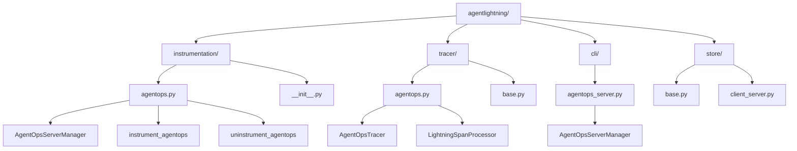
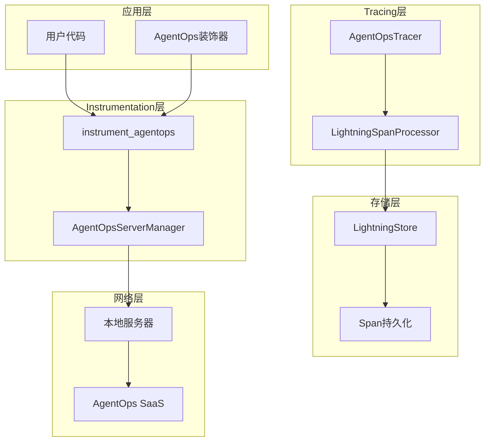
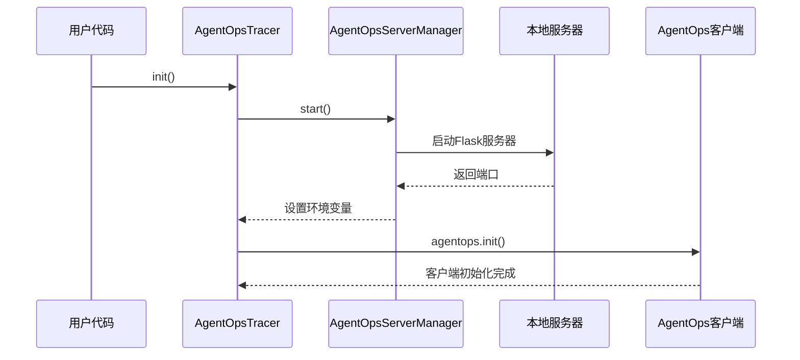
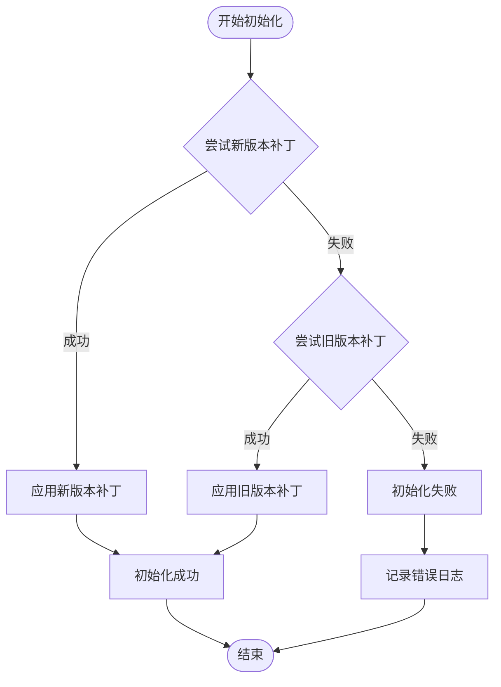
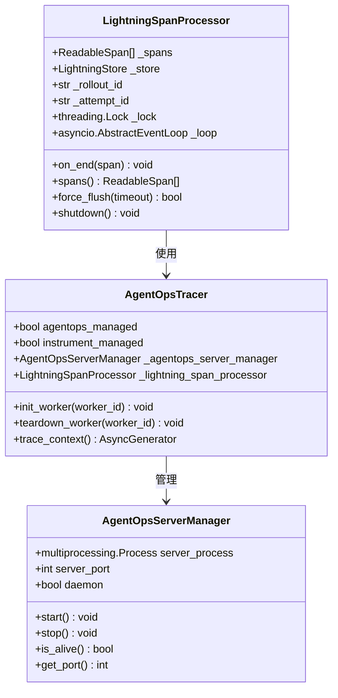
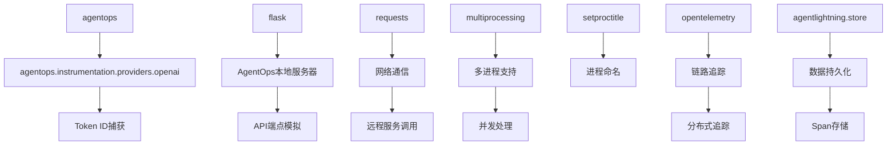

# AgentOps 集成

<cite>
**本文档中引用的文件**
- [agentlightning/instrumentation/agentops.py](file://agentlightning/instrumentation/agentops.py)
- [agentlightning/tracer/agentops.py](file://agentlightning/tracer/agentops.py)
- [examples/calc_x/tests/test_agentops.py](file://examples/calc_x/tests/test_agentops.py)
- [agentlightning/instrumentation/__init__.py](file://agentlightning/instrumentation/__init__.py)
- [agentlightning/store/base.py](file://agentlightning/store/base.py)
- [agentlightning/cli/agentops_server.py](file://agentlightning/cli/agentops_server.py)
- [tests/common/tracer.py](file://tests/common/tracer.py)
- [tests/store/test_client_server.py](file://tests/store/test_client_server.py)
- [tests/tracer/test_otel.py](file://tests/tracer/test_otel.py)
</cite>

## 目录
1. [简介](#简介)
2. [项目结构](#项目结构)
3. [核心组件](#核心组件)
4. [架构概览](#架构概览)
5. [详细组件分析](#详细组件分析)
6. [依赖关系分析](#依赖关系分析)
7. [性能考虑](#性能考虑)
8. [故障排除指南](#故障排除指南)
9. [结论](#结论)

## 简介

AgentOps集成是Agent Lightning框架中的一个关键组件，它提供了与AgentOps SaaS平台的无缝连接能力。该集成支持本地服务器模式、事件发射、会话管理、错误上报以及与本地存储系统的协同工作。通过智能的版本检测和自动补丁机制，AgentOps集成能够适配不同版本的AgentOps库，并提供可靠的数据同步机制。

## 项目结构

AgentOps集成的核心文件分布在以下目录结构中：

**图表来源**
- [agentlightning/instrumentation/agentops.py](file://agentlightning/instrumentation/agentops.py#L1-L316)
- [agentlightning/tracer/agentops.py](file://agentlightning/tracer/agentops.py#L1-L374)
- [agentlightning/cli/agentops_server.py](file://agentlightning/cli/agentops_server.py#L1-L31)

**章节来源**
- [agentlightning/instrumentation/agentops.py](file://agentlightning/instrumentation/agentops.py#L1-L50)
- [agentlightning/tracer/agentops.py](file://agentlightning/tracer/agentops.py#L1-L50)

## 核心组件

### AgentOpsServerManager

AgentOpsServerManager是本地服务器管理的核心类，负责启动和管理本地AgentOps服务实例。它支持多进程环境下的服务器生命周期管理，并提供端口自动分配功能。

### AgentOpsTracer

AgentOpsTracer继承自基础Tracer类，专门用于使用AgentOps库进行代理执行跟踪。它集成了AgentOps客户端初始化、服务器设置以及与OpenTelemetry跟踪生态系统的集成。

### LightningSpanProcessor

LightningSpanProcessor是一个自定义的OpenTelemetry SpanProcessor，它扩展了标准功能以支持将跟踪数据直接写入LightningStore。

**章节来源**
- [agentlightning/instrumentation/agentops.py](file://agentlightning/instrumentation/agentops.py#L248-L316)
- [agentlightning/tracer/agentops.py](file://agentlightning/tracer/agentops.py#L30-L100)
- [agentlightning/tracer/agentops.py](file://agentlightning/tracer/agentops.py#L320-L374)

## 架构概览

AgentOps集成采用分层架构设计，确保了模块化和可扩展性：

**图表来源**
- [agentlightning/instrumentation/agentops.py](file://agentlightning/instrumentation/agentops.py#L170-L213)
- [agentlightning/tracer/agentops.py](file://agentlightning/tracer/agentops.py#L30-L100)

## 详细组件分析

### 初始化和配置机制

AgentOps集成提供了灵活的初始化机制，支持自动和手动两种模式：

**图表来源**
- [agentlightning/tracer/agentops.py](file://agentlightning/tracer/agentops.py#L78-L106)
- [agentlightning/instrumentation/agentops.py](file://agentlightning/instrumentation/agentops.py#L248-L316)

### 版本兼容性处理

系统实现了智能的版本检测机制，自动选择最适合的补丁方法：

**图表来源**
- [agentlightning/instrumentation/agentops.py](file://agentlightning/instrumentation/agentops.py#L170-L190)

### 事件发射和会话管理

事件发射过程通过LightningSpanProcessor实现，支持异步处理和上下文管理：

**图表来源**
- [agentlightning/tracer/agentops.py](file://agentlightning/tracer/agentops.py#L320-L374)
- [agentlightning/tracer/agentops.py](file://agentlightning/tracer/agentops.py#L30-L100)
- [agentlightning/instrumentation/agentops.py](file://agentlightning/instrumentation/agentops.py#L248-L316)

**章节来源**
- [agentlightning/tracer/agentops.py](file://agentlightning/tracer/agentops.py#L320-L374)
- [agentlightning/instrumentation/agentops.py](file://agentlightning/instrumentation/agentops.py#L248-L316)

### 数据同步机制

AgentOps集成实现了可靠的批量上传和重试策略：

| 组件 | 功能 | 实现方式 | 错误处理 |
|------|------|----------|----------|
| SpanProcessor | 异步处理span | asyncio事件循环 | 异常捕获和日志记录 |
| 本地服务器 | 模拟AgentOps API | Flask应用 | 健康检查和重试 |
| 存储接口 | 持久化span数据 | LightningStore | 分段提交和确认 |
| 重试机制 | 网络异常恢复 | 指数退避算法 | 最大重试次数限制 |

**章节来源**
- [agentlightning/tracer/agentops.py](file://agentlightning/tracer/agentops.py#L320-L374)
- [tests/store/test_client_server.py](file://tests/store/test_client_server.py#L756-L769)

### 安全最佳实践

系统实现了多层次的安全保护机制：

1. **敏感信息过滤**：自动识别并过滤可能包含敏感数据的span
2. **访问控制**：通过环境变量隔离API密钥和端点配置
3. **传输加密**：支持HTTPS协议和TLS验证
4. **审计日志**：记录所有关键操作和异常情况

**章节来源**
- [agentlightning/tracer/agentops.py](file://agentlightning/tracer/agentops.py#L120-L150)

## 依赖关系分析

AgentOps集成的依赖关系展现了清晰的分层架构：

**图表来源**
- [agentlightning/instrumentation/agentops.py](file://agentlightning/instrumentation/agentops.py#L1-L20)
- [agentlightning/tracer/agentops.py](file://agentlightning/tracer/agentops.py#L1-L20)

**章节来源**
- [agentlightning/instrumentation/agentops.py](file://agentlightning/instrumentation/agentops.py#L1-L30)
- [agentlightning/tracer/agentops.py](file://agentlightning/tracer/agentops.py#L1-L30)

## 性能考虑

AgentOps集成在设计时充分考虑了性能优化：

### 异步处理
- 使用asyncio事件循环处理span写入
- 支持非阻塞的网络请求
- 实现了线程安全的上下文管理

### 内存管理
- 自动清理已完成的span列表
- 支持大容量数据的分批处理
- 实现了内存使用的监控和限制

### 并发支持
- 多进程安全的服务器管理
- 线程池化的网络操作
- 原子性的状态更新

## 故障排除指南

### 常见问题及解决方案

#### 事件丢失问题
**症状**：部分span没有被正确记录或上传
**原因**：
- 网络连接不稳定
- 本地服务器未启动
- 存储空间不足

**解决方案**：
1. 检查网络连接状态
2. 验证本地服务器运行状态
3. 监控磁盘空间使用情况
4. 启用详细日志记录

#### 延迟上报问题
**症状**：span数据上传延迟严重
**原因**：
- 网络带宽限制
- 服务器负载过高
- 配置的重试间隔过长

**解决方案**：
1. 优化网络配置
2. 调整重试策略参数
3. 实施数据压缩
4. 使用本地缓存机制

#### 认证失败问题
**症状**：无法连接到AgentOps服务
**原因**：
- API密钥无效
- 端点配置错误
- 证书验证失败

**解决方案**：
1. 验证API密钥的有效性
2. 检查端点URL配置
3. 更新SSL证书
4. 启用调试模式查看详细错误信息

**章节来源**
- [tests/common/tracer.py](file://tests/common/tracer.py#L25-L34)
- [tests/store/test_client_server.py](file://tests/store/test_client_server.py#L752-L779)

### 调试方法

系统提供了多种调试工具和方法：

1. **日志分析**：启用DEBUG级别日志记录
2. **健康检查**：定期检查服务器状态
3. **性能监控**：监控关键指标如延迟和吞吐量
4. **单元测试**：运行专门的测试套件验证功能

**章节来源**
- [tests/tracer/test_otel.py](file://tests/tracer/test_otel.py#L163-L200)

## 结论

AgentOps集成是Agent Lightning框架中的重要组成部分，它提供了完整的代理跟踪解决方案。通过智能的版本兼容性处理、可靠的本地服务器管理、高效的异步数据处理以及完善的安全机制，该集成能够满足各种生产环境的需求。

主要优势包括：
- **零代码变更**：无需修改现有代码即可启用跟踪功能
- **高度可配置**：支持多种部署模式和配置选项
- **生产就绪**：具备完善的错误处理和监控机制
- **易于调试**：提供丰富的诊断工具和日志信息

未来的发展方向包括：
- 更好的性能优化
- 扩展更多的数据源支持
- 增强的安全特性
- 更丰富的分析工具集成