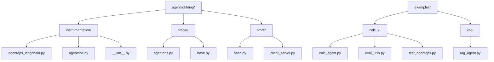
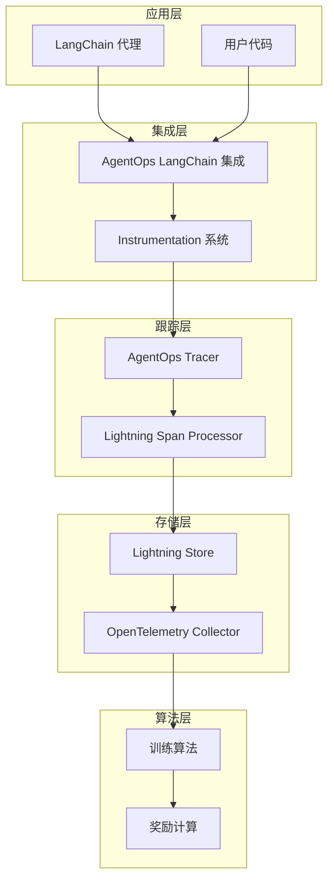
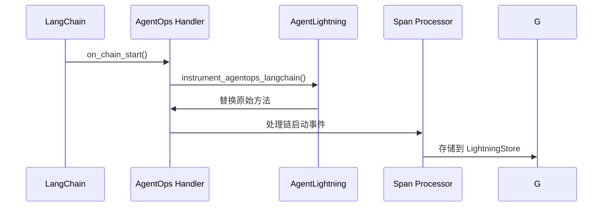
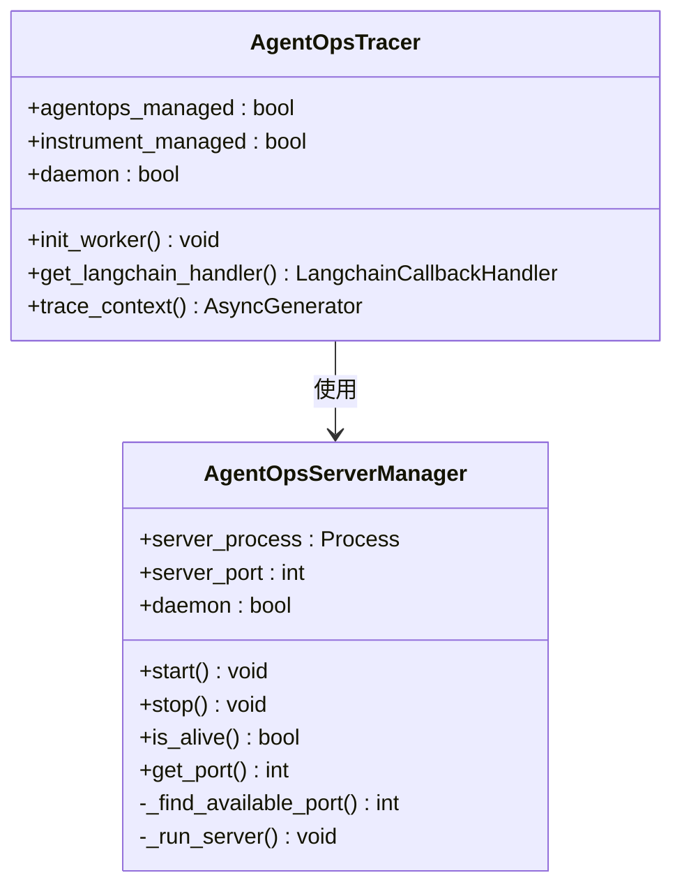
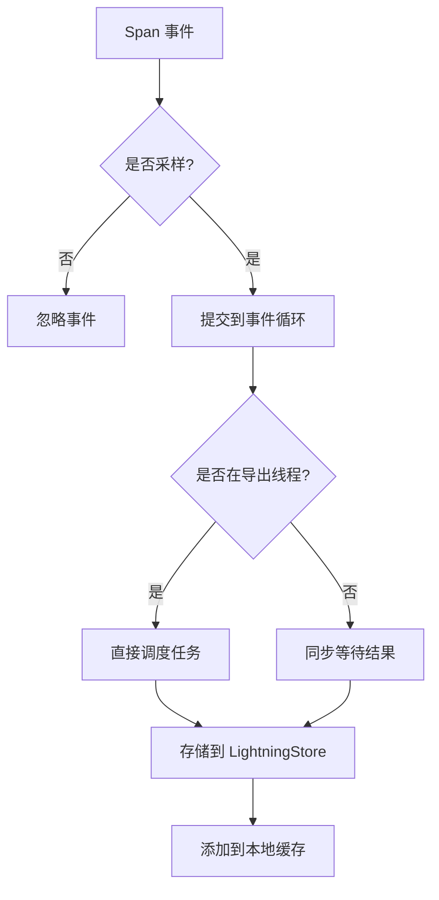
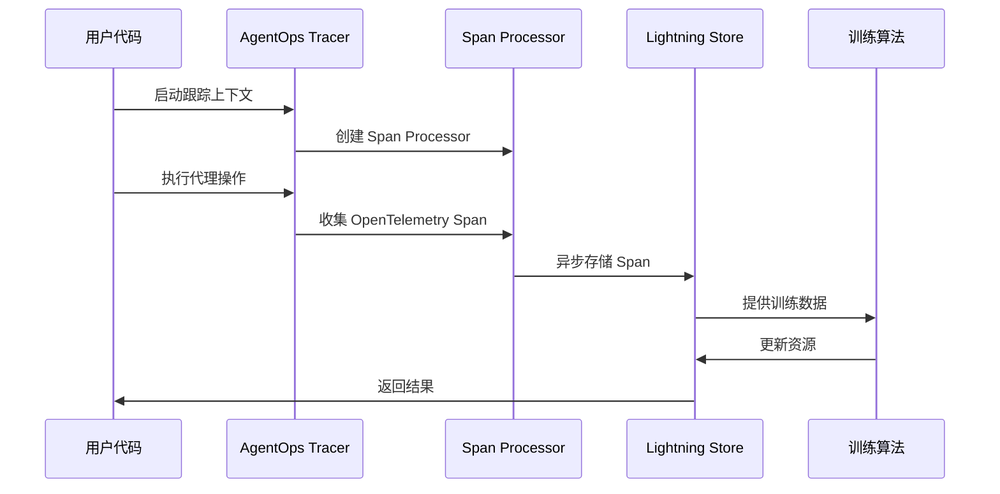
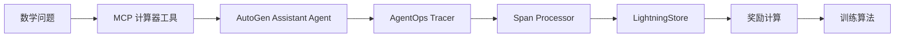
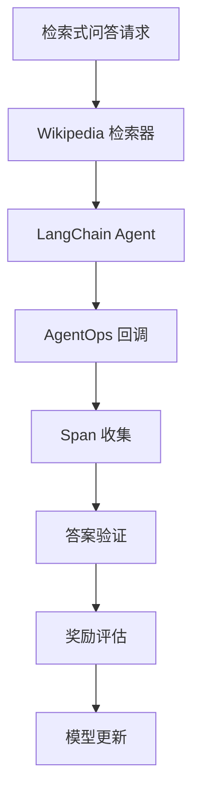
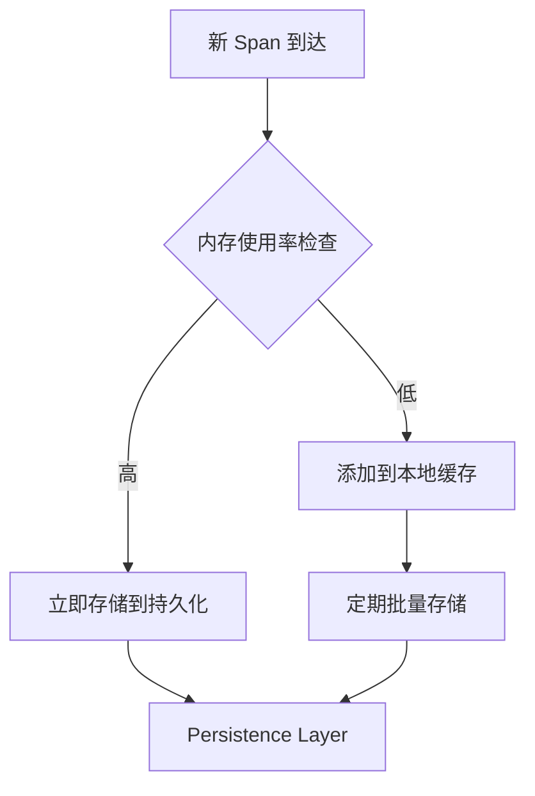
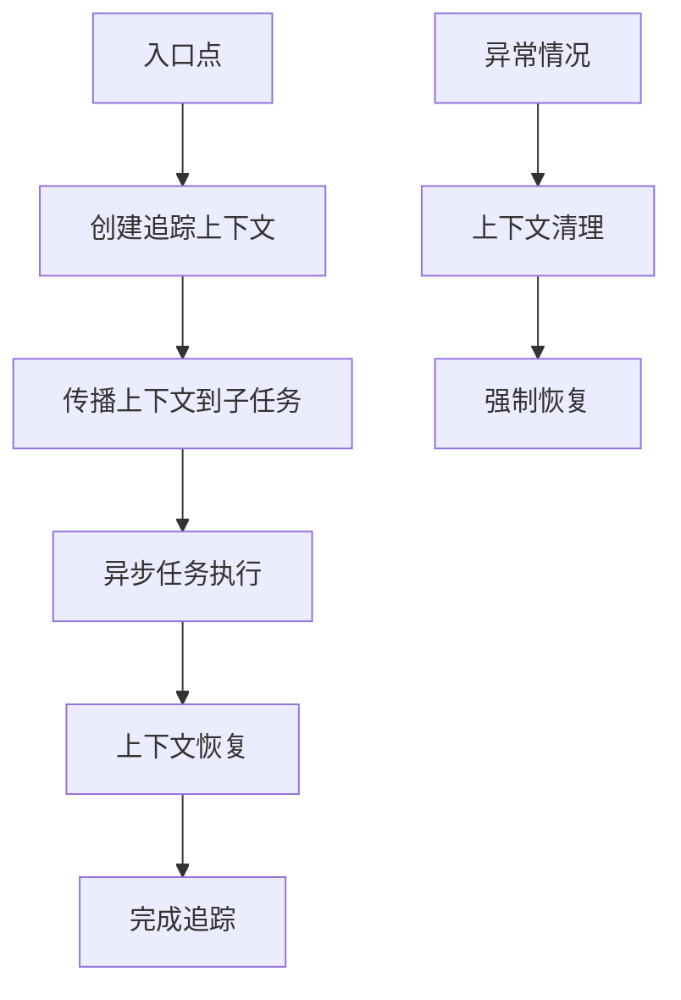

# LangChain 集成指南

<cite>
**本文档中引用的文件**
- [agentlightning/instrumentation/agentops_langchain.py](file://agentlightning/instrumentation/agentops_langchain.py)
- [agentlightning/instrumentation/agentops.py](file://agentlightning/instrumentation/agentops.py)
- [agentlightning/tracer/agentops.py](file://agentlightning/tracer/agentops.py)
- [agentlightning/instrumentation/__init__.py](file://agentlightning/instrumentation/__init__.py)
- [agentlightning/store/base.py](file://agentlightning/store/base.py)
- [examples/calc_x/calc_agent.py](file://examples/calc_x/calc_agent.py)
- [examples/rag/rag_agent.py](file://examples/rag/rag_agent.py)
- [examples/calc_x/tests/test_agentops.py](file://examples/calc_x/tests/test_agentops.py)
- [examples/calc_x/eval_utils.py](file://examples/calc_x/eval_utils.py)
- [tests/tracer/test_integration.py](file://tests/tracer/test_integration.py)
</cite>

## 目录
1. [简介](#简介)
2. [项目结构概览](#项目结构概览)
3. [核心组件分析](#核心组件分析)
4. [架构概览](#架构概览)
5. [详细组件分析](#详细组件分析)
6. [配置与集成步骤](#配置与集成步骤)
7. [数据流分析](#数据流分析)
8. [性能优化与最佳实践](#性能优化与最佳实践)
9. [常见问题解决方案](#常见问题解决方案)
10. [故障排除指南](#故障排除指南)
11. [总结](#总结)

## 简介

Agent Lightning 是一个强大的 AI 代理训练框架，提供了与 LangChain 的无缝集成能力。通过 `agentlightning/instrumentation/agentops_langchain.py` 模块，开发者可以在不修改现有 LangChain 代码的情况下，实现对代理执行过程的完整跟踪和监控。

本指南将详细介绍如何通过 Agent Lightning 实现 LangChain 集成，包括装饰器注入、回调系统集成、事件监听机制等核心技术，并结合实际案例展示完整的数据流处理过程。

## 项目结构概览

Agent Lightning 的 LangChain 集成主要分布在以下关键目录中：



**图表来源**
- [agentlightning/instrumentation/agentops_langchain.py](file://agentlightning/instrumentation/agentops_langchain.py#L1-L46)
- [agentlightning/tracer/agentops.py](file://agentlightning/tracer/agentops.py#L1-L374)

## 核心组件分析

### AgentOps LangChain 集成模块

`agentops_langchain.py` 是 LangChain 集成的核心模块，提供了以下关键功能：

#### 主要导出函数
- `instrument_agentops_langchain()`: 启用 LangChain 集成
- `uninstrument_agentops_langchain()`: 禁用 LangChain 集成

#### 核心机制
该模块通过替换 `LangchainCallbackHandler.on_chain_start` 方法来实现集成，同时管理 LangGraph 库的兼容性。

**章节来源**
- [agentlightning/instrumentation/agentops_langchain.py](file://agentlightning/instrumentation/agentops_langchain.py#L10-L46)

### AgentOps 跟踪器

`AgentOpsTracer` 类是整个跟踪系统的核心，负责：
- 管理 AgentOps 客户端初始化
- 处理服务器设置和本地代理
- 集成 OpenTelemetry 追踪生态系统
- 提供 LangChain 回调处理器

**章节来源**
- [agentlightning/tracer/agentops.py](file://agentlightning/tracer/agentops.py#L38-L165)

## 架构概览

Agent Lightning 的 LangChain 集成采用分层架构设计：



**图表来源**
- [agentlightning/instrumentation/agentops_langchain.py](file://agentlightning/instrumentation/agentops_langchain.py#L25-L46)
- [agentlightning/tracer/agentops.py](file://agentlightning/tracer/agentops.py#L135-L165)

## 详细组件分析

### LangChain 回调处理器集成

#### 原始方法替换机制



**图表来源**
- [agentlightning/instrumentation/agentops_langchain.py](file://agentlightning/instrumentation/agentops_langchain.py#L15-L25)

#### 关键修改点

集成模块通过以下方式增强原始回调功能：

1. **名称字段注入**: 当 `kwargs` 包含 `name` 时，自动添加到序列化对象
2. **运行 ID 处理**: 自动处理 `run_id` 并映射到序列化对象的 `id` 字段
3. **LangGraph 兼容性**: 临时移除 LangGraph 集成以避免冲突

**章节来源**
- [agentlightning/instrumentation/agentops_langchain.py](file://agentlightning/instrumentation/agentops_langchain.py#L15-L25)

### AgentOps 服务器管理

#### 本地服务器架构



**图表来源**
- [agentlightning/instrumentation/agentops.py](file://agentlightning/instrumentation/agentops.py#L250-L315)
- [agentlightning/tracer/agentops.py](file://agentlightning/tracer/agentops.py#L38-L59)

### Lightning Span Processor

#### 异步事件处理机制



**图表来源**
- [agentlightning/tracer/agentops.py](file://agentlightning/tracer/agentops.py#L320-L373)

**章节来源**
- [agentlightning/tracer/agentops.py](file://agentlightning/tracer/agentops.py#L320-L373)

## 配置与集成步骤

### 基础配置

#### 1. 安装依赖

```bash
pip install agentlightning
pip install "autogen-agentchat" "autogen-ext[openai]"
pip install "mcp>=1.10.0"
```

#### 2. 初始化 AgentOps 集成

```python
# 在应用启动时初始化
from agentlightning.instrumentation import instrument_all

# 启用所有仪器化功能（包括 LangChain）
instrument_all()
```

#### 3. 创建 AgentOps Tracer

```python
from agentlightning.tracer.agentops import AgentOpsTracer
from agentlightning.store.memory import InMemoryLightningStore

# 创建跟踪器
tracer = AgentOpsTracer(
    agentops_managed=True,
    instrument_managed=True,
    daemon=True
)

# 初始化工作进程
tracer.init_worker(0)
```

### LangChain 回调处理器集成

#### 获取回调处理器

```python
# 获取 LangChain 回调处理器
callback_handler = tracer.get_langchain_handler(tags=["my_agent"])

# 将处理器传递给 LangChain 组件
from langchain.callbacks import CallbackManager

callback_manager = CallbackManager([callback_handler])
```

#### 集成示例

```python
# 在 LangChain 代理中使用
from langchain.agents import load_tools
from langchain.agents import initialize_agent
from langchain.llms import OpenAI

# 创建带有回调的代理
llm = OpenAI(temperature=0)
tools = load_tools(["serpapi", "llm-math"], llm=llm)
agent = initialize_agent(
    tools, 
    llm, 
    agent="zero-shot-react-description",
    callback_manager=callback_manager
)
```

**章节来源**
- [agentlightning/tracer/agentops.py](file://agentlightning/tracer/agentops.py#L228-L250)

## 数据流分析

### 完整数据流路径



**图表来源**
- [agentlightning/tracer/agentops.py](file://agentlightning/tracer/agentops.py#L167-L226)

### 实际案例分析

#### Calc-X 数学代理案例

在 Calc-X 示例中，LangChain 集成展示了完整的数据流处理：



**图表来源**
- [examples/calc_x/calc_agent.py](file://examples/calc_x/calc_agent.py#L50-L100)

#### RAG 代理案例

RAG 代理展示了更复杂的 LangChain 集成模式：



**图表来源**
- [examples/rag/rag_agent.py](file://examples/rag/rag_agent.py#L30-L60)

**章节来源**
- [examples/calc_x/calc_agent.py](file://examples/calc_x/calc_agent.py#L50-L100)
- [examples/rag/rag_agent.py](file://examples/rag/rag_agent.py#L30-L60)

## 性能优化与最佳实践

### 异步处理优化

#### 事件循环管理

Agent Lightning 使用专门的异步事件循环来处理 Span 存储，避免阻塞主执行线程：

```python
# 异步事件循环架构
class LightningSpanProcessor:
    def __init__(self):
        self._loop_ready = threading.Event()
        self._loop = None
        self._loop_thread = threading.Thread(
            target=self._loop_runner, 
            name="otel-loop", 
            daemon=True
        )
        self._loop_thread.start()
        self._loop_ready.wait()  # 等待循环就绪
```

#### 上下文丢失预防

为防止异步执行中的上下文丢失，实现了智能检测机制：

```python
def _await_in_loop(self, coro, timeout=None):
    if threading.current_thread() is self._loop_thread:
        # 如果在导出线程中，直接调度任务
        self._loop.call_soon_threadsafe(asyncio.create_task, coro)
        return None
    # 否则同步等待结果
    fut = asyncio.run_coroutine_threadsafe(coro, self._loop)
    return fut.result(timeout)
```

**章节来源**
- [agentlightning/tracer/agentops.py](file://agentlightning/tracer/agentops.py#L280-L320)

### 内存管理优化

#### Span 缓存策略



#### 批量处理机制

为了提高高并发场景下的性能，实现了批量处理机制：

```python
# 批量存储优化
def force_flush(self, timeout_millis=30000):
    # 实现批量刷新逻辑
    return True
```

### 并发控制

#### 工作进程隔离

每个工作进程都有独立的跟踪上下文，确保：

1. **线程安全**: 每个进程维护独立的 Span 缓存
2. **资源隔离**: 避免跨进程的数据竞争
3. **性能优化**: 减少锁竞争和上下文切换

**章节来源**
- [agentlightning/tracer/agentops.py](file://agentlightning/tracer/agentops.py#L280-L320)

## 常见问题解决方案

### 循环依赖问题

#### 问题描述
当 AgentOps 和 LangChain 都尝试管理相同的回调时，可能出现循环依赖。

#### 解决方案
Agent Lightning 通过临时移除 LangGraph 集成来解决此问题：

```python
def instrument_agentops_langchain():
    """绕过 AgentOp 对 Langchain 的原生支持"""
    global langgraph_entry
    langgraph_entry = instrumentation.AGENTIC_LIBRARIES.pop("langgraph", None)
    LangchainCallbackHandler.on_chain_start = on_chain_start
```

#### 验证方法
```python
# 检查集成状态
import agentlightning.instrumentation as inst
print(f"AgentOps installed: {inst.AGENTOPS_INSTALLED}")
print(f"LangChain integration: {inst.AGENTOPS_LANGCHAIN_INSTALLED}")
```

**章节来源**
- [agentlightning/instrumentation/agentops_langchain.py](file://agentlightning/instrumentation/agentops_langchain.py#L25-L35)

### 异步执行冲突

#### 问题描述
在异步环境中，可能会出现事件循环冲突或上下文丢失。

#### 解决策略

1. **线程安全检测**
```python
def _await_in_loop(self, coro, timeout=None):
    if threading.current_thread() is self._loop_thread:
        # 避免自死锁
        self._loop.call_soon_threadsafe(asyncio.create_task, coro)
        return None
```

2. **优雅关闭机制**
```python
def shutdown(self):
    if self._loop:
        self._loop.call_soon_threadsafe(self._loop.stop)
        self._loop_thread.join(timeout=5)
        self._loop = None
```

#### 调试技巧
```python
# 启用详细日志
import logging
logging.getLogger('agentlightning.tracer.agentops').setLevel(logging.DEBUG)
```

**章节来源**
- [agentlightning/tracer/agentops.py](file://agentlightning/tracer/agentops.py#L290-L320)

### 上下文丢失问题

#### 问题表现
在复杂的异步调用链中，可能会丢失追踪上下文。

#### 解决方案
Agent Lightning 实现了多层上下文保护：



#### 实现细节
```python
# 上下文管理器模式
@contextmanager
def _trace_context_sync(self, name=None, store=None, rollout_id=None, attempt_id=None):
    if store is not None and rollout_id is not None and attempt_id is not None:
        ctx = self._lightning_span_processor.with_context(
            store=store, 
            rollout_id=rollout_id, 
            attempt_id=attempt_id
        )
        with ctx as processor:
            yield processor
    else:
        with self._lightning_span_processor:
            yield self._lightning_span_processor
```

**章节来源**
- [agentlightning/tracer/agentops.py](file://agentlightning/tracer/agentops.py#L175-L200)

### 性能瓶颈识别

#### 监控指标
```python
# 关键性能指标
class PerformanceMonitor:
    def __init__(self):
        self.span_count = 0
        self.storage_latency = []
        self.queue_size = 0
    
    def record_storage_latency(self, latency):
        self.storage_latency.append(latency)
    
    def get_average_latency(self):
        return sum(self.storage_latency) / len(self.storage_latency)
```

#### 优化建议
1. **批量大小调整**: 根据内存使用情况调整批量存储大小
2. **队列长度限制**: 设置最大队列长度防止内存溢出
3. **超时配置**: 合理设置异步操作超时时间

## 故障排除指南

### 集成失败诊断

#### 1. 检查依赖安装
```bash
# 验证 Agent Lightning 安装
python -c "import agentlightning; print(agentlightning.__version__)"

# 检查 LangChain 集成状态
python -c "from agentlightning.instrumentation import AGENTOPS_LANGCHAIN_INSTALLED; print(AGENTOPS_LANGCHAIN_INSTALLED)"
```

#### 2. 日志分析
```python
# 启用调试日志
import logging
logging.basicConfig(level=logging.DEBUG)

# 检查 AgentOps 日志
logger = logging.getLogger('agentlightning.instrumentation.agentops')
logger.setLevel(logging.DEBUG)
```

#### 3. 基本功能测试
```python
# 测试基本集成
from agentlightning.tracer.agentops import AgentOpsTracer

tracer = AgentOpsTracer()
print("Tracer initialized successfully")
```

### 性能问题排查

#### 内存使用监控
```python
import psutil
import gc

def monitor_memory_usage():
    process = psutil.Process()
    memory_mb = process.memory_info().rss / 1024 / 1024
    print(f"Memory usage: {memory_mb:.2f} MB")
    
    # 触发垃圾回收
    gc.collect()
    print(f"After GC: {process.memory_info().rss / 1024 / 1024:.2f} MB")
```

#### 异步性能分析
```python
import asyncio
import time

async def performance_test():
    start_time = time.time()
    
    # 执行大量 Span 存储
    for i in range(1000):
        # 模拟 Span 处理
        await asyncio.sleep(0.001)
    
    duration = time.time() - start_time
    print(f"Processed 1000 spans in {duration:.2f} seconds")
```

### 配置验证清单

#### 必需配置项
- [ ] Agent Lightning 已正确安装
- [ ] AgentOps 服务器正常运行
- [ ] 网络连接畅通
- [ ] 权限配置正确
- [ ] 资源配额充足

#### 可选优化项
- [ ] 批量处理已启用
- [ ] 异步处理已配置
- [ ] 监控指标已设置
- [ ] 日志级别已调整
- [ ] 超时参数已优化

**章节来源**
- [tests/tracer/test_integration.py](file://tests/tracer/test_integration.py#L674-L862)

## 总结

Agent Lightning 的 LangChain 集成提供了一个强大而灵活的解决方案，能够在保持原有代码结构不变的情况下实现完整的代理跟踪和监控。通过本指南介绍的技术，开发者可以：

1. **无缝集成**: 在不修改现有 LangChain 代码的情况下实现跟踪
2. **高性能处理**: 通过异步事件循环和批量处理确保高并发性能
3. **可靠监控**: 提供完整的 Span 收集和存储机制
4. **灵活配置**: 支持多种部署模式和配置选项

### 最佳实践总结

1. **渐进式集成**: 从简单的跟踪开始，逐步增加复杂功能
2. **性能监控**: 持续监控内存使用和处理延迟
3. **错误处理**: 实现完善的异常处理和恢复机制
4. **测试覆盖**: 建立全面的集成测试套件
5. **文档维护**: 保持集成文档的及时更新

### 未来发展方向

随着 Agent Lightning 的持续发展，LangChain 集成将在以下方面得到进一步改进：

- 更好的异步处理支持
- 更高效的内存管理
- 更丰富的监控指标
- 更灵活的配置选项
- 更完善的错误恢复机制

通过遵循本指南的最佳实践，开发者可以充分利用 Agent Lightning 的强大功能，构建高效、可靠的 AI 代理训练系统。