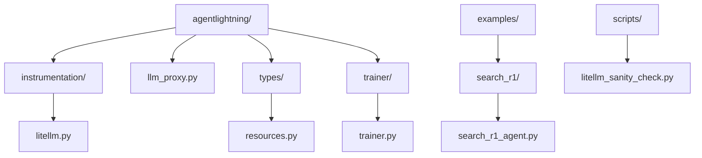
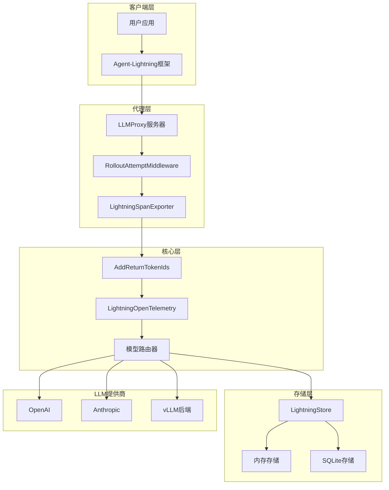
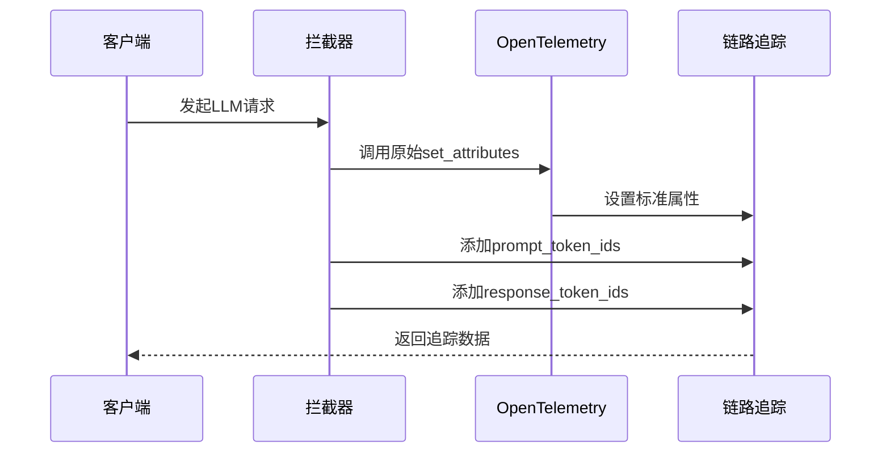
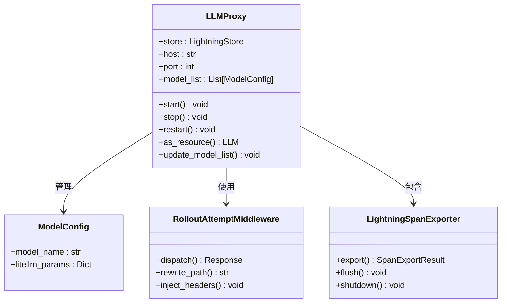
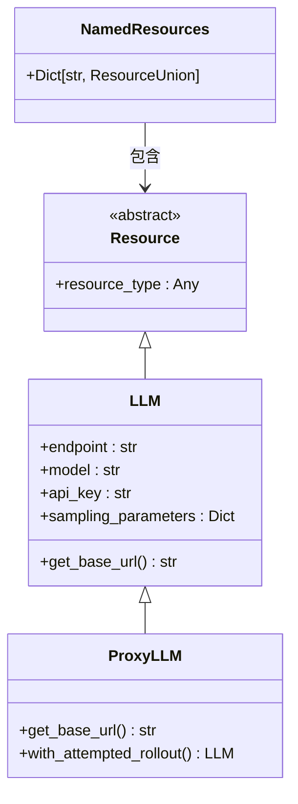
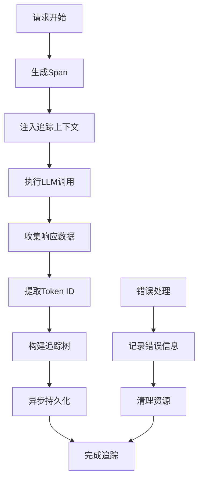
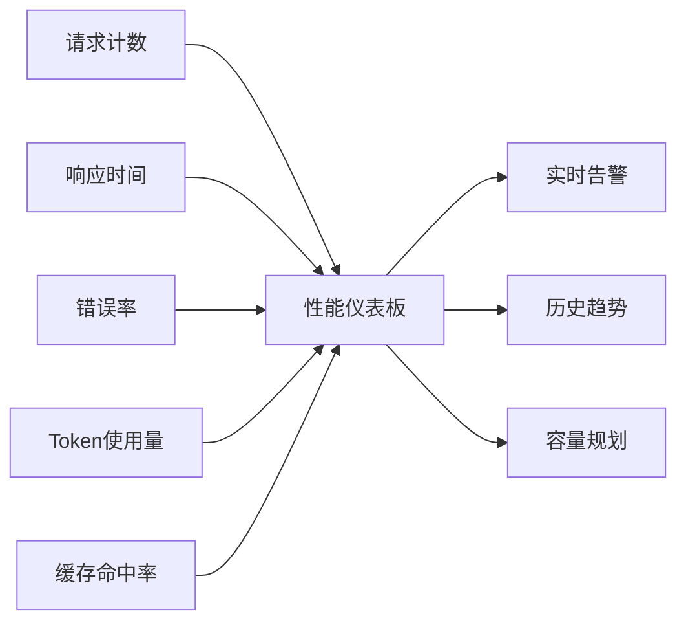
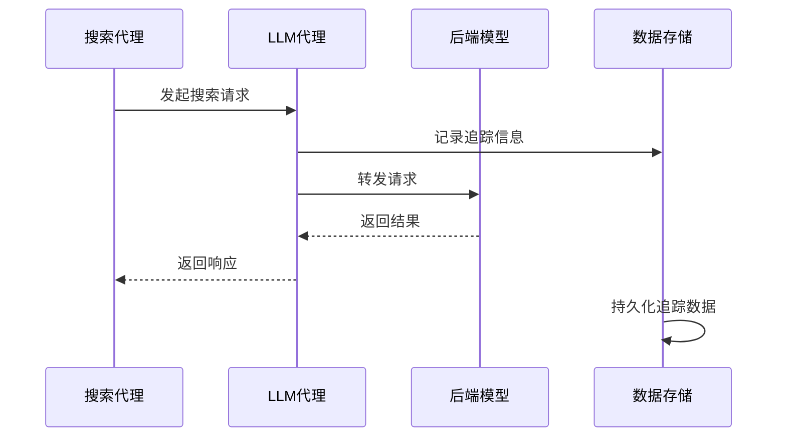
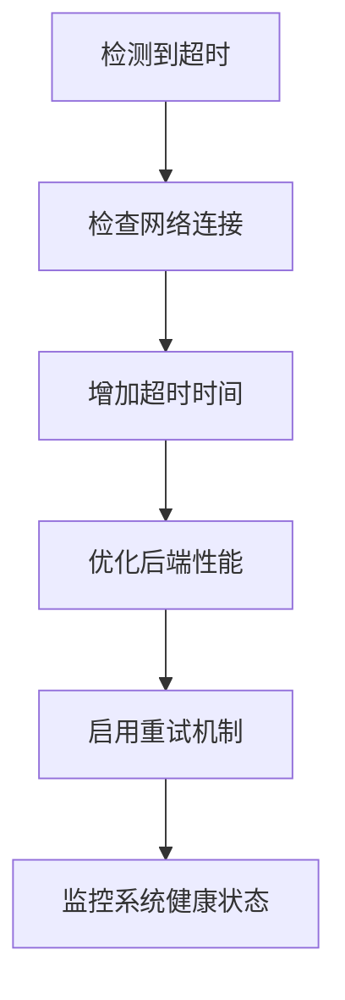

# LiteLLM 集成

<cite>
**本文档中引用的文件**
- [litellm.py](file://agentlightning/instrumentation/litellm.py)
- [llm_proxy.py](file://agentlightning/llm_proxy.py)
- [search_r1_agent.py](file://examples/search_r1/search_r1_agent.py)
- [litellm_sanity_check.py](file://scripts/litellm_sanity_check.py)
- [trainer.py](file://agentlightning/trainer/trainer.py)
- [resources.py](file://agentlightning/types/resources.py)
- [daemon.py](file://agentlightning/verl/daemon.py)
</cite>

## 目录
1. [简介](#简介)
2. [项目结构](#项目结构)
3. [核心组件](#核心组件)
4. [架构概览](#架构概览)
5. [详细组件分析](#详细组件分析)
6. [配置选项](#配置选项)
7. [性能监控与调试](#性能监控与调试)
8. [故障排除指南](#故障排除指南)
9. [结论](#结论)

## 简介

LiteLLM集成是Agent-Lightning框架中的核心组件，提供了统一的LLM（大语言模型）访问接口。该集成通过拦截和代理机制，实现了对各种LLM提供商的统一管理，包括请求路由、缓存策略、速率限制处理以及详细的性能监控。

LiteLLM集成的主要功能包括：
- 统一的LLM接口抽象
- 请求拦截与响应处理
- Token ID提取与追踪
- 多模型负载均衡
- 实时性能监控
- 故障恢复机制

## 项目结构

LiteLLM集成的核心文件分布在以下目录结构中：

**图表来源**
- [litellm.py](file://agentlightning/instrumentation/litellm.py#L1-L40)
- [llm_proxy.py](file://agentlightning/llm_proxy.py#L1-L50)
- [resources.py](file://agentlightning/types/resources.py#L1-L30)

**章节来源**
- [litellm.py](file://agentlightning/instrumentation/litellm.py#L1-L40)
- [llm_proxy.py](file://agentlightning/llm_proxy.py#L1-L100)

## 核心组件

LiteLLM集成包含以下核心组件：

### 1. LiteLLM拦截器 (Instrumentation)
负责捕获LLM调用和提取Token ID信息。

### 2. LLM代理服务器 (LLMProxy)
提供OpenAI兼容的API接口，支持请求路由、缓存和速率限制。

### 3. 资源管理系统
管理LLM资源的配置和生命周期。

### 4. 追踪系统
提供详细的性能监控和调试信息。

**章节来源**
- [litellm.py](file://agentlightning/instrumentation/litellm.py#L15-L40)
- [llm_proxy.py](file://agentlightning/llm_proxy.py#L400-L500)

## 架构概览

LiteLLM集成采用分层架构设计，确保了系统的可扩展性和可维护性：

**图表来源**
- [llm_proxy.py](file://agentlightning/llm_proxy.py#L400-L600)
- [litellm.py](file://agentlightning/instrumentation/litellm.py#L15-L40)

## 详细组件分析

### LiteLLM拦截器组件

LiteLLM拦截器通过修改OpenTelemetry的属性设置函数来捕获Token ID信息：

**图表来源**
- [litellm.py](file://agentlightning/instrumentation/litellm.py#L15-L35)

拦截器的核心功能包括：
- **Token ID捕获**：自动提取请求和响应的Token ID
- **链路追踪增强**：为分布式追踪添加详细的数据
- **无侵入式设计**：通过函数替换实现，不影响原有功能

**章节来源**
- [litellm.py](file://agentlightning/instrumentation/litellm.py#L15-L40)

### LLM代理服务器组件

LLM代理服务器是整个集成的核心，提供了完整的LLM服务基础设施：

**图表来源**
- [llm_proxy.py](file://agentlightning/llm_proxy.py#L400-L600)

代理服务器的关键特性：
- **OpenAI兼容**：完全兼容OpenAI API格式
- **路由支持**：支持基于rollout和attempt的请求路由
- **并发处理**：支持高并发请求处理
- **配置热更新**：运行时动态更新模型配置

**章节来源**
- [llm_proxy.py](file://agentlightning/llm_proxy.py#L400-L800)

### 资源管理系统

资源管理系统提供了灵活的LLM资源配置和管理：

**图表来源**
- [resources.py](file://agentlightning/types/resources.py#L20-L100)

**章节来源**
- [resources.py](file://agentlightning/types/resources.py#L20-L150)

### 追踪系统组件

追踪系统提供了全面的性能监控和调试能力：

**图表来源**
- [llm_proxy.py](file://agentlightning/llm_proxy.py#L200-L400)

**章节来源**
- [llm_proxy.py](file://agentlightning/llm_proxy.py#L200-L500)

## 配置选项

### 基本配置

LiteLLM集成支持多种配置方式：

| 配置项 | 类型 | 默认值 | 描述 |
|--------|------|--------|------|
| port | int | 8000 | 代理服务器监听端口 |
| model_list | List[ModelConfig] | [] | 模型配置列表 |
| store | LightningStore | None | 数据存储实例 |
| host | str | 自动检测 | 服务器主机地址 |
| num_retries | int | 0 | 默认重试次数 |

### 模型配置

每个模型需要配置以下参数：

| 参数 | 类型 | 必需 | 描述 |
|------|------|------|------|
| model_name | str | 是 | 逻辑模型名称 |
| litellm_params | Dict | 是 | LiteLLM参数配置 |

### 高级配置

| 配置项 | 类型 | 描述 |
|--------|------|------|
| litellm_settings | Dict | LiteLLM全局设置 |
| cache_enabled | bool | 是否启用缓存 |
| rate_limit | int | 每秒请求数限制 |
| timeout | float | 请求超时时间 |

**章节来源**
- [llm_proxy.py](file://agentlightning/llm_proxy.py#L700-L800)

## 性能监控与调试

### 性能指标

LiteLLM集成提供了丰富的性能监控指标：

### 调试工具

系统提供了多种调试工具：

1. **Sanity检查脚本**：验证代理服务器的正常运行
2. **链路追踪**：详细的请求追踪信息
3. **性能分析**：自动化的性能瓶颈识别
4. **日志系统**：结构化的日志记录

**章节来源**
- [litellm_sanity_check.py](file://scripts/litellm_sanity_check.py#L1-L56)

### 实际部署示例

以search_r1示例展示实际部署场景：

**图表来源**
- [search_r1_agent.py](file://examples/search_r1/search_r1_agent.py#L100-L168)

**章节来源**
- [search_r1_agent.py](file://examples/search_r1/search_r1_agent.py#L1-L168)

## 故障排除指南

### 常见问题及解决方案

#### 1. 模型不兼容问题

**症状**：请求失败，返回不支持的模型错误

**解决方案**：
- 检查模型名称是否正确配置
- 验证LiteLLM参数设置
- 确认后端模型可用性

#### 2. 超时问题

**症状**：请求长时间无响应或超时

**解决方案**：

#### 3. Token计算偏差

**症状**：Token计数不准确

**解决方案**：
- 确保启用`return_token_ids`参数
- 检查Token ID提取逻辑
- 验证模型的Token处理方式

#### 4. 并发问题

**症状**：高并发下性能下降或错误

**解决方案**：
- 调整并发连接数
- 启用请求队列
- 实施负载均衡

### 错误代码参考

| 错误代码 | 描述 | 解决方案 |
|----------|------|----------|
| 400 | 请求参数错误 | 检查请求格式和参数 |
| 404 | 模型未找到 | 验证模型配置 |
| 500 | 内部服务器错误 | 检查后端服务状态 |
| 503 | 服务不可用 | 检查服务健康状态 |

### 监控和告警

建议设置以下监控指标：

1. **请求成功率**：目标≥99%
2. **平均响应时间**：<2秒
3. **错误率**：<1%
4. **Token处理速度**：>1000 tokens/秒

**章节来源**
- [llm_proxy.py](file://agentlightning/llm_proxy.py#L100-L200)

## 结论

LiteLLM集成是Agent-Lightning框架中的关键组件，提供了强大而灵活的LLM管理能力。通过统一的接口抽象、智能的请求路由、完善的追踪监控和健壮的错误处理，该集成能够满足各种复杂的生产环境需求。

主要优势包括：
- **统一管理**：支持多种LLM提供商的统一接入
- **高性能**：优化的并发处理和缓存机制
- **可观测性**：全面的性能监控和调试支持
- **可扩展性**：模块化设计，易于扩展和定制

未来发展方向：
- 更智能的负载均衡算法
- 更完善的缓存策略
- 更丰富的监控指标
- 更强大的故障恢复能力

通过合理配置和使用LiteLLM集成，开发者可以构建出高性能、高可靠性的AI应用系统。