# vLLM 集成

<cite>
**本文档中引用的文件**
- [agentlightning/instrumentation/vllm.py](file://agentlightning/instrumentation/vllm.py)
- [agentlightning/cli/vllm.py](file://agentlightning/cli/vllm.py)
- [examples/spider/sql_agent.py](file://examples/spider/sql_agent.py)
- [agentlightning/types/resources.py](file://agentlightning/types/resources.py)
- [agentlightning/config.py](file://agentlightning/config.py)
- [agentlightning/llm_proxy.py](file://agentlightning/llm_proxy.py)
- [agentlightning/verl/config.yaml](file://agentlightning/verl/config.yaml)
- [examples/calc_x/train_calc_agent.py](file://examples/calc_x/train_calc_agent.py)
</cite>

## 目录
1. [简介](#简介)
2. [核心架构](#核心架构)
3. [vLLM集成原理](#vllm集成原理)
4. [命令行启动配置](#命令行启动配置)
5. [资源分配与管理](#资源分配与管理)
6. [分布式部署配置](#分布式部署配置)
7. [KV缓存共享机制](#kv缓存共享机制)
8. [批处理调度策略](#批处理调度策略)
9. [内存优化策略](#内存优化策略)
10. [性能基准测试](#性能基准测试)
11. [调优参数推荐](#调优参数推荐)
12. [实际应用案例](#实际应用案例)
13. [故障排除指南](#故障排除指南)
14. [总结](#总结)

## 简介

Agent Lightning框架通过深度集成vLLM（vLLM: Vectorized Large Language Model）实现了高效的推理能力，为代理执行环境提供了低延迟、高吞吐量的解决方案。本文档详细阐述了vLLM与Agent Lightning框架的集成原理、配置方法、性能优化策略以及最佳实践。

vLLM作为高性能的大语言模型推理引擎，通过其向量化推理技术和先进的内存管理机制，能够显著提升模型推理效率。Agent Lightning框架则提供了完整的代理生命周期管理、资源调度和训练支持。两者的结合为复杂的AI代理系统提供了强大的基础设施支撑。

## 核心架构

Agent Lightning与vLLM的集成采用了多层次的架构设计，确保了系统的可扩展性和高性能。

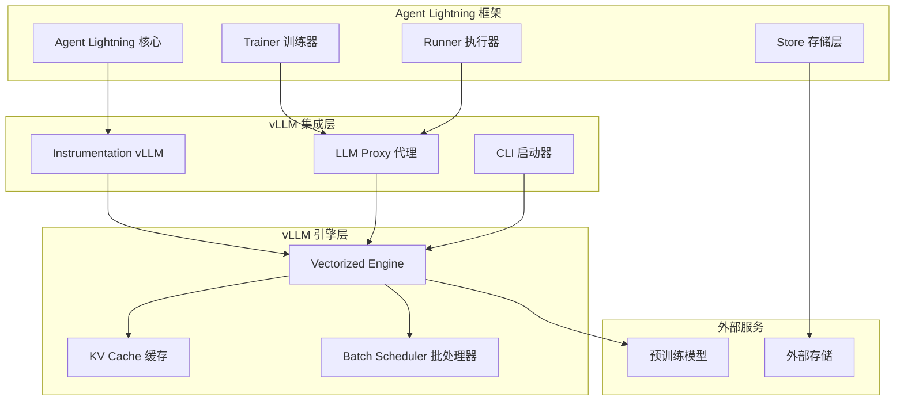

**图表来源**
- [agentlightning/instrumentation/vllm.py](file://agentlightning/instrumentation/vllm.py#L1-L82)
- [agentlightning/llm_proxy.py](file://agentlightning/llm_proxy.py#L1-L100)

**章节来源**
- [agentlightning/instrumentation/vllm.py](file://agentlightning/instrumentation/vllm.py#L1-L82)
- [agentlightning/llm_proxy.py](file://agentlightning/llm_proxy.py#L1-L200)

## vLLM集成原理

### Token ID捕获机制

Agent Lightning通过专门的instrumentation模块实现了对vLLM推理过程的深度集成，特别是token ID的捕获功能。

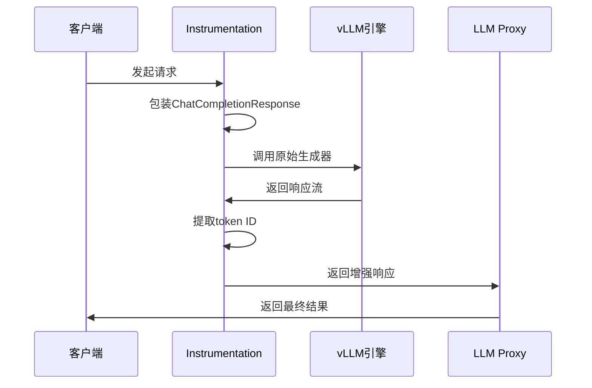

**图表来源**
- [agentlightning/instrumentation/vllm.py](file://agentlightning/instrumentation/vllm.py#L20-L60)

### 关键特性

1. **Token ID追踪**：通过扩展ChatCompletionResponse类，捕获输入和输出的token ID序列
2. **非破坏性集成**：保持vLLM原有功能不变，仅添加额外的token ID信息
3. **版本兼容性**：支持v0.10.2及更高版本的vLLM

**章节来源**
- [agentlightning/instrumentation/vllm.py](file://agentlightning/instrumentation/vllm.py#L1-L82)

## 命令行启动配置

### 基本启动命令

Agent Lightning提供了专门的CLI工具来启动vLLM实例，简化了配置过程。

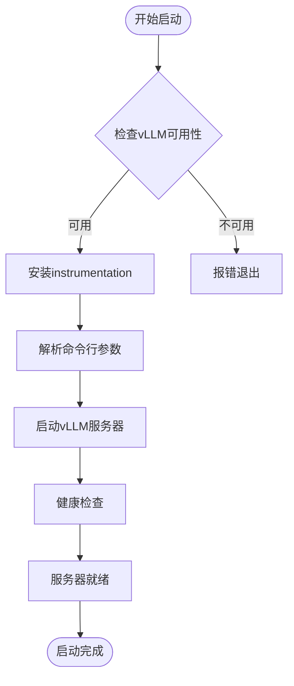

**图表来源**
- [agentlightning/cli/vllm.py](file://agentlightning/cli/vllm.py#L8-L28)

### 常用启动参数

| 参数名称 | 类型 | 默认值 | 描述 |
|---------|------|--------|------|
| `--model` | string | 必需 | 模型路径或Hugging Face ID |
| `--tensor-parallel-size` | int | 1 | 张量并行度 |
| `--gpu-memory-utilization` | float | 0.9 | GPU内存利用率 |
| `--max-model-len` | int | 8192 | 最大模型长度 |
| `--quantization` | string | null | 量化方法（awq, gptq等） |
| `--enable-auto-tool-choice` | bool | false | 启用自动工具选择 |

### 分布式部署参数

对于大规模部署，需要考虑以下参数：

| 参数名称 | 推荐值 | 说明 |
|---------|--------|------|
| `--distributed-executor-backend` | ray | 使用Ray进行分布式执行 |
| `--pipeline-parallel-size` | 2 | 管道并行度 |
| `--block-size` | 16 | KV缓存块大小 |
| `--swap-space` | 4 | 交换空间大小(GB) |

**章节来源**
- [agentlightning/cli/vllm.py](file://agentlightning/cli/vllm.py#L1-L30)

## 资源分配与管理

### LLM资源类型定义

Agent Lightning通过类型安全的方式管理各种资源，包括LLM、代理LLM和提示模板。

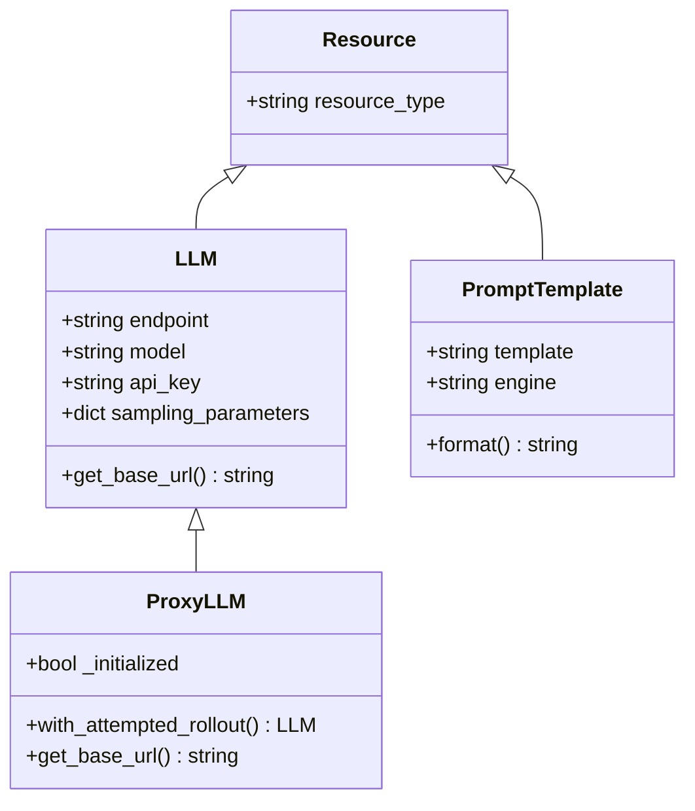

**图表来源**
- [agentlightning/types/resources.py](file://agentlightning/types/resources.py#L25-L150)

### 资源配置示例

```python
# 基础LLM资源配置
resources = {
    "main_llm": LLM(
        endpoint="http://localhost:8080",
        model="llama3",
        sampling_parameters={
            "temperature": 0.7,
            "max_tokens": 100,
            "top_p": 0.9
        }
    )
}

# 代理LLM资源配置（带追踪）
resources = {
    "main_llm": ProxyLLM(
        endpoint="http://localhost:8080",
        model="llama3",
        sampling_parameters={"temperature": 0.7}
    )
}
```

### 动态资源更新

系统支持运行时动态更新资源配置，无需重启整个服务：

```python
# 更新模型配置
proxy_llm = resources["main_llm"]
proxy_llm.model = "new-model-name"
proxy_llm.sampling_parameters["temperature"] = 0.8
```

**章节来源**
- [agentlightning/types/resources.py](file://agentlightning/types/resources.py#L1-L199)

## 分布式部署配置

### LLM Proxy架构

Agent Lightning的LLM Proxy提供了强大的分布式部署能力，支持多节点、多GPU的高效利用。

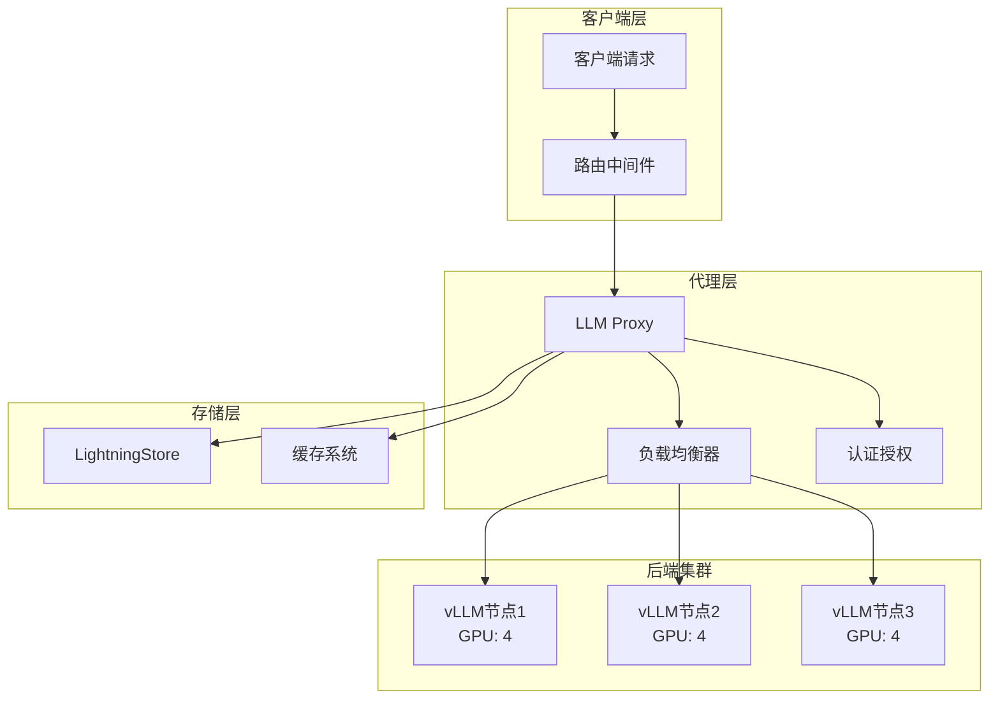

**图表来源**
- [agentlightning/llm_proxy.py](file://agentlightning/llm_proxy.py#L400-L600)

### 配置参数详解

| 配置项 | 类型 | 推荐值 | 说明 |
|-------|------|--------|------|
| `port` | int | 8000 | 代理服务器端口 |
| `model_list` | List[ModelConfig] | - | 支持的模型列表 |
| `store` | LightningStore | - | 存储后端实例 |
| `host` | string | "0.0.0.0" | 绑定地址 |
| `num_retries` | int | 3 | 重试次数 |
| `litellm_config` | Dict | {} | LiteLLM配置 |

### 高可用配置

```yaml
# 高可用配置示例
llm_proxy:
  port: 8000
  model_list:
    - model_name: "llama3-8b"
      litellm_params:
        model: "meta-llama/Llama-2-7b-chat-hf"
        api_base: "http://vllm-node1:8000"
    - model_name: "llama3-70b"
      litellm_params:
        model: "meta-llama/Llama-2-70b-chat-hf"
        api_base: "http://vllm-node2:8000"
  store:
    type: "sqlite"
    path: "/data/proxy_store.db"
  num_retries: 5
  litellm_config:
    litellm_settings:
      request_timeout: 60
      num_retries: 3
```

**章节来源**
- [agentlightning/llm_proxy.py](file://agentlightning/llm_proxy.py#L1-L400)

## KV缓存共享机制

### 缓存架构设计

vLLM的KV缓存机制是其高性能推理的关键。Agent Lightning通过多种策略优化缓存使用效率。

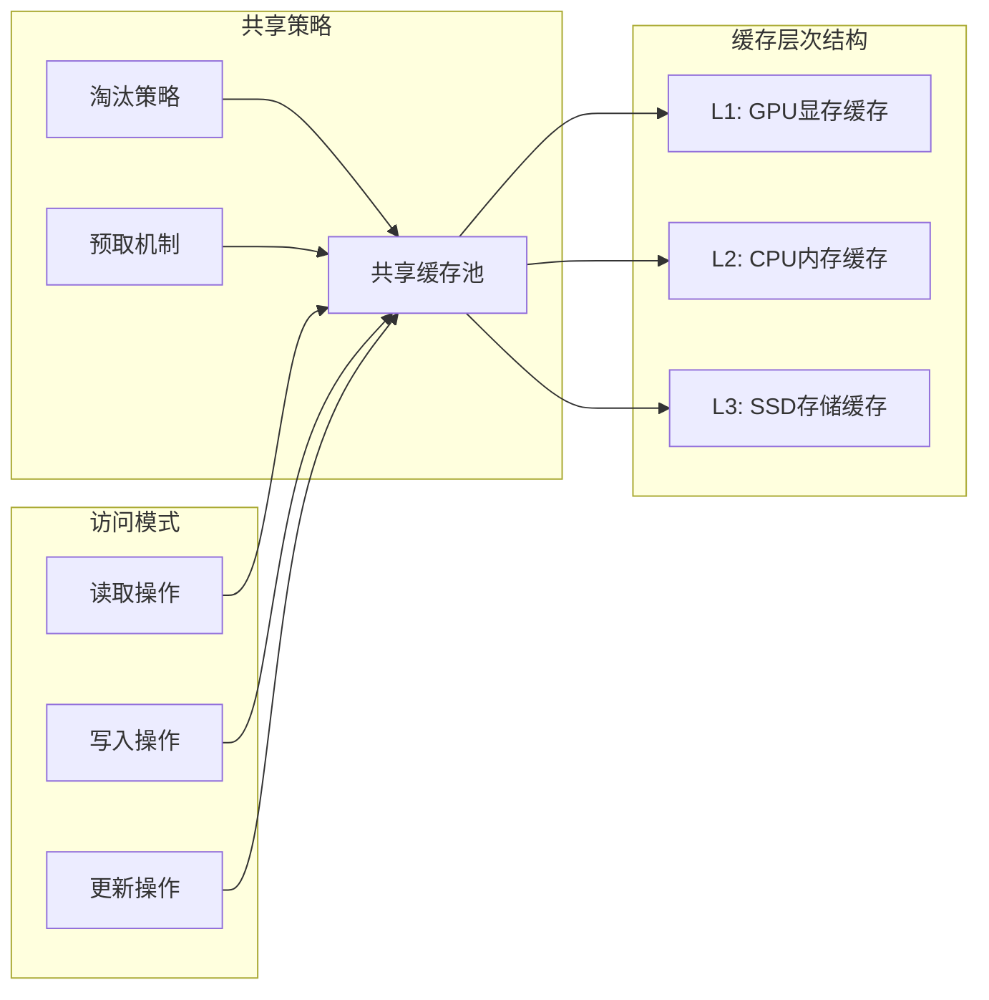

### 缓存优化策略

1. **智能预取**：根据历史访问模式预测未来的缓存需求
2. **分层存储**：利用不同层级的存储介质优化访问延迟
3. **并发控制**：实现高效的缓存锁机制避免数据竞争
4. **压缩算法**：采用高效的KV对压缩算法减少内存占用

### 内存管理配置

| 参数 | 推荐值 | 说明 |
|------|--------|------|
| `gpu_memory_utilization` | 0.8-0.9 | GPU内存利用率 |
| `swap_space` | 4-8 GB | 交换空间大小 |
| `block_size` | 16-32 | KV缓存块大小 |
| `max_num_seqs` | 256 | 最大并发序列数 |

**章节来源**
- [examples/calc_x/train_calc_agent.py](file://examples/calc_x/train_calc_agent.py#L40-L80)

## 批处理调度策略

### 批处理架构

Agent Lightning实现了智能的批处理调度系统，能够动态调整批次大小以最大化GPU利用率。

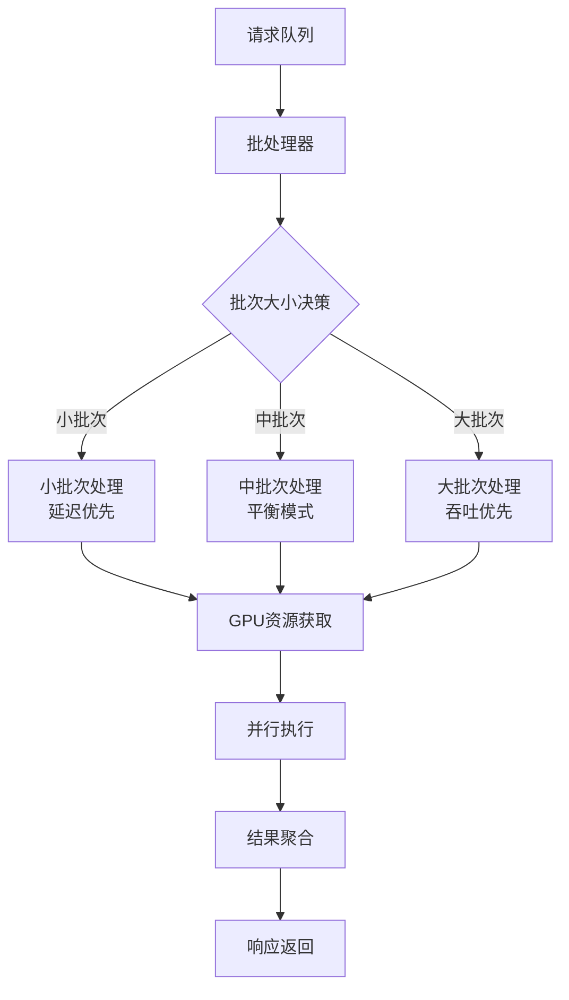

### 调度算法

1. **自适应批次大小**：根据GPU利用率动态调整批次大小
2. **优先级队列**：支持不同优先级的请求处理
3. **超时保护**：防止长时间等待导致的资源浪费
4. **负载均衡**：在多个GPU之间均匀分配工作负载

### 性能监控指标

| 指标名称 | 目标值 | 监控方法 |
|---------|--------|----------|
| GPU利用率 | >80% | 实时监控 |
| 批处理效率 | >90% | 统计分析 |
| 平均延迟 | <100ms | 请求跟踪 |
| 吞吐量 | >1000 tokens/s | 性能计数器 |

**章节来源**
- [agentlightning/verl/daemon.py](file://agentlightning/verl/daemon.py#L390-L420)

## 内存优化策略

### 多级内存管理

Agent Lightning实现了多层次的内存优化策略，从模型权重到中间激活都进行了精细的内存管理。

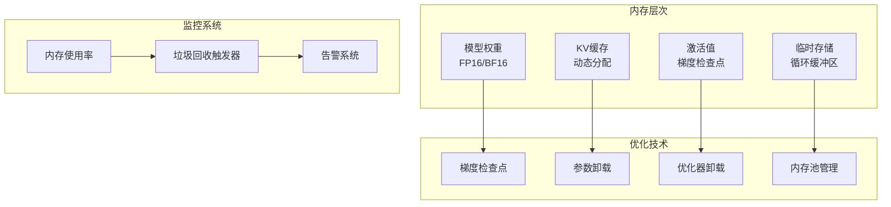

### 具体优化措施

1. **梯度检查点**：通过重新计算减少激活值内存占用
2. **参数卸载**：将不活跃的参数移动到CPU内存
3. **优化器状态卸载**：分离优化器状态和模型参数
4. **内存池化**：复用内存分配减少碎片

### 内存配置示例

```yaml
# 内存优化配置
memory_optimization:
  gradient_checkpointing: true
  param_offload: true
  optimizer_offload: true
  cpu_offload: false
  max_memory_per_gpu: 40GiB
  swap_threshold: 0.8
  gc_interval: 300  # 秒
```

**章节来源**
- [examples/calc_x/train_calc_agent.py](file://examples/calc_x/train_calc_agent.py#L60-L80)

## 性能基准测试

### 测试框架设计

Agent Lightning提供了完整的性能测试框架，支持多种基准测试场景。

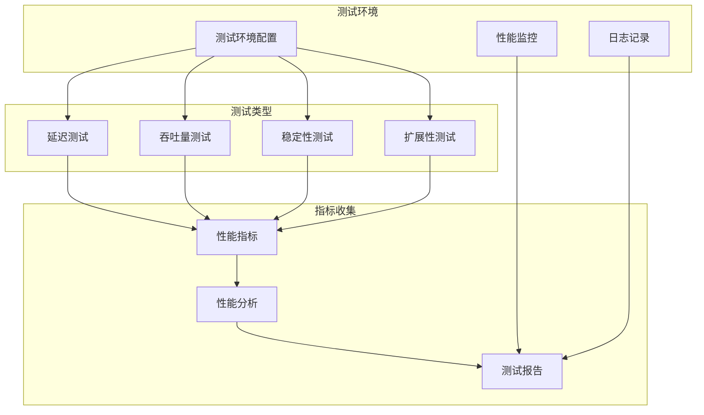

### 基准测试指标

| 测试类别 | 主要指标 | 目标值 | 测试方法 |
|---------|----------|--------|----------|
| 延迟测试 | P50, P95, P99延迟 | <100ms | 固定批次大小 |
| 吞吐量测试 | tokens/second | >1000 | 最大批次大小 |
| 内存测试 | GPU内存使用率 | <90% | 长时间运行 |
| 稳定性测试 | 错误率 | <0.1% | 压力测试 |

### 自动化测试流程

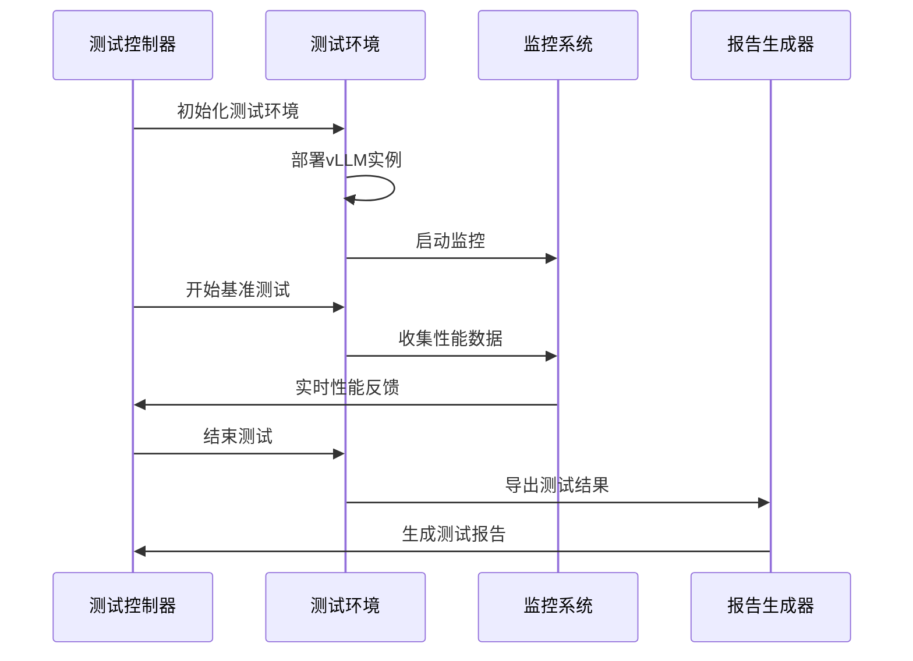

**章节来源**
- [examples/spider/spider_eval/evaluation.py](file://examples/spider/spider_eval/evaluation.py#L550-L600)

## 调优参数推荐

### GPU配置优化

基于不同硬件配置的最佳实践：

| GPU型号 | 推荐配置 | 内存需求 | 性能预期 |
|---------|----------|----------|----------|
| A100 80GB | 1张卡，80%利用率 | 64GB | 10K+ tokens/s |
| A100 40GB | 2张卡，40%利用率 | 80GB | 8K+ tokens/s |
| V100 32GB | 4张卡，30%利用率 | 128GB | 6K+ tokens/s |
| RTX 3090 | 6张卡，25%利用率 | 192GB | 4K+ tokens/s |

### 批处理参数调优

```yaml
# 批处理优化配置
batch_optimization:
  micro_batch_size: 4  # 微批次大小
  gradient_accumulation_steps: 8  # 梯度累积步数
  max_seq_len: 4096  # 最大序列长度
  pad_to_multiple_of: 8  # 对齐到倍数
  enable_padding: true  # 启用填充优化
```

### 网络优化配置

```yaml
# 网络优化配置
network_optimization:
  max_connections: 1000  # 最大连接数
  connection_timeout: 30  # 连接超时
  read_timeout: 60  # 读取超时
  write_timeout: 60  # 写入超时
  keepalive_idle: 60  # 保活空闲时间
  keepalive_interval: 10  # 保活间隔
```

**章节来源**
- [examples/calc_x/train_calc_agent.py](file://examples/calc_x/train_calc_agent.py#L40-L100)

## 实际应用案例

### SQL Agent集成示例

Agent Lightning与vLLM的集成在复杂任务场景中展现了强大的能力，以SQL Agent为例展示完整的集成效果。

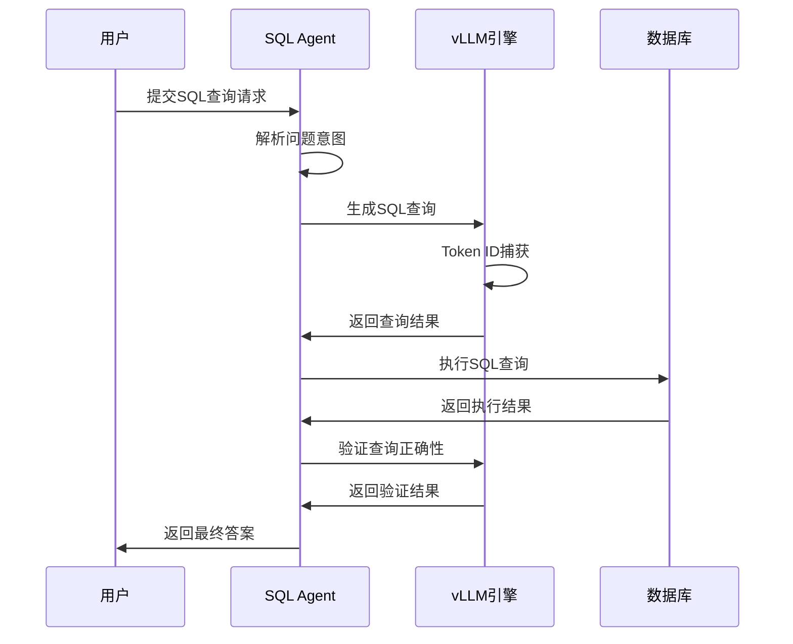

**图表来源**
- [examples/spider/sql_agent.py](file://examples/spider/sql_agent.py#L200-L300)

### 关键集成特性

1. **智能查询生成**：利用vLLM的强大语言理解能力生成准确的SQL查询
2. **查询验证机制**：通过多轮对话确保查询的正确性
3. **错误恢复能力**：自动检测并修正查询错误
4. **性能监控**：实时跟踪查询执行时间和成功率

### 部署配置示例

```python
# SQL Agent部署配置
sql_agent_config = {
    "max_turns": 5,  # 最大对话轮次
    "table_info_truncate": 2048,  # 表信息截断长度
    "execution_truncate": 2048,  # 执行结果截断长度
    "debug": False,  # 调试模式
    "verl_replacement": {
        "model": "llama3-70b",
        "temperature": 0.1
    }
}
```

**章节来源**
- [examples/spider/sql_agent.py](file://examples/spider/sql_agent.py#L1-L200)

## 故障排除指南

### 常见问题诊断

| 问题类型 | 症状描述 | 可能原因 | 解决方案 |
|---------|----------|----------|----------|
| 内存不足 | OOM错误 | GPU内存超限 | 降低批次大小或启用卸载 |
| 性能下降 | 延迟增加 | 缓存失效 | 优化缓存配置 |
| 连接失败 | 无法连接vLLM | 端口冲突 | 检查端口占用 |
| 认证错误 | API密钥无效 | 配置错误 | 验证API密钥设置 |

### 性能调优检查清单

1. **硬件层面**
   - [ ] GPU驱动程序是最新的
   - [ ] CUDA版本兼容
   - [ ] 内存充足且无碎片
   - [ ] 网络带宽足够

2. **软件层面**
   - [ ] vLLM版本匹配
   - [ ] Agent Lightning版本兼容
   - [ ] 依赖库完整安装
   - [ ] 环境变量正确设置

3. **配置层面**
   - [ ] 内存利用率合理
   - [ ] 批处理大小优化
   - [ ] 缓存策略有效
   - [ ] 网络配置正确

### 日志分析技巧

```bash
# 查看vLLM启动日志
tail -f /var/log/vllm.log | grep -E "(ERROR|WARNING)"

# 监控GPU使用情况
nvidia-smi -l 1

# 分析性能瓶颈
python -m cProfile -o profile.stats agent_lightning.py
```

## 总结

Agent Lightning与vLLM的深度集成为构建高性能AI代理系统提供了完整的解决方案。通过本文档的详细介绍，开发者可以：

1. **理解核心原理**：掌握instrumentation机制和token ID捕获技术
2. **配置部署环境**：学会使用CLI工具和配置文件进行部署
3. **优化系统性能**：应用内存管理和批处理优化策略
4. **解决实际问题**：通过故障排除指南快速定位和解决问题

随着AI技术的不断发展，Agent Lightning将继续演进，为更多复杂的AI应用场景提供强大的基础设施支持。通过持续的优化和改进，我们相信这套解决方案将在生产环境中发挥更大的价值。