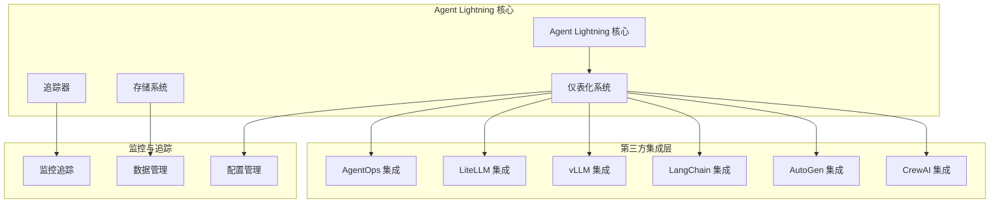
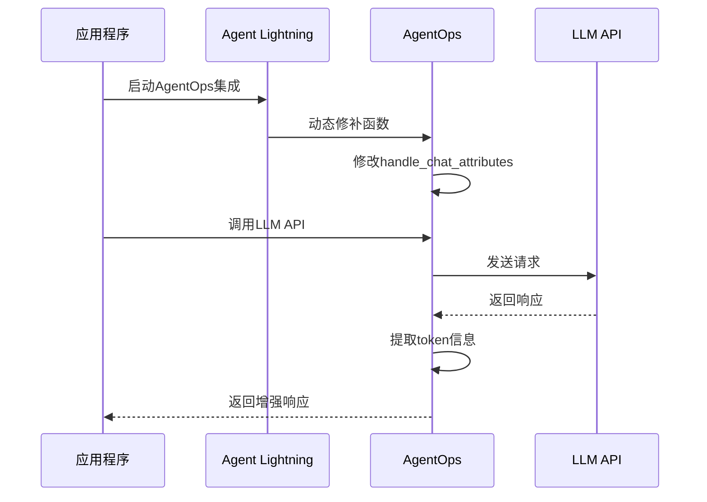
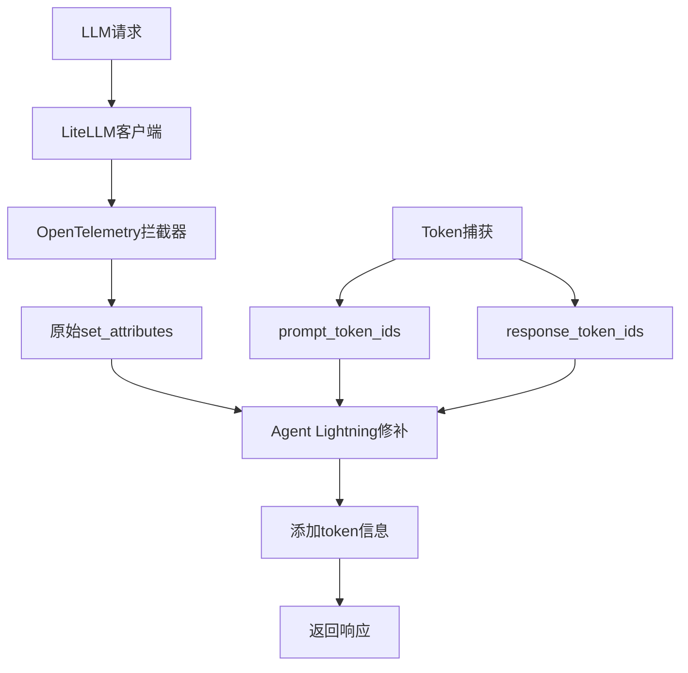
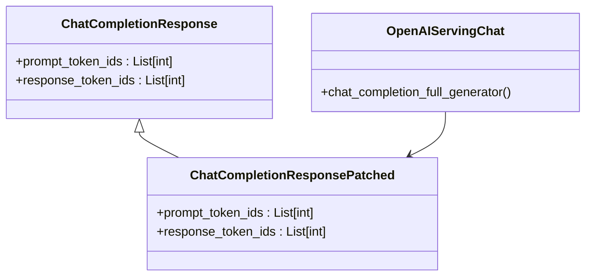
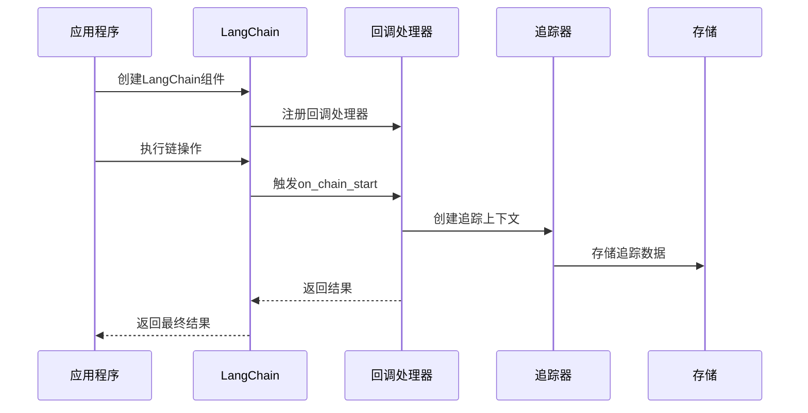
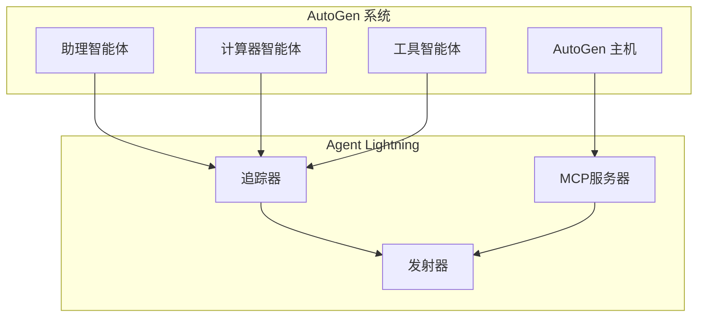
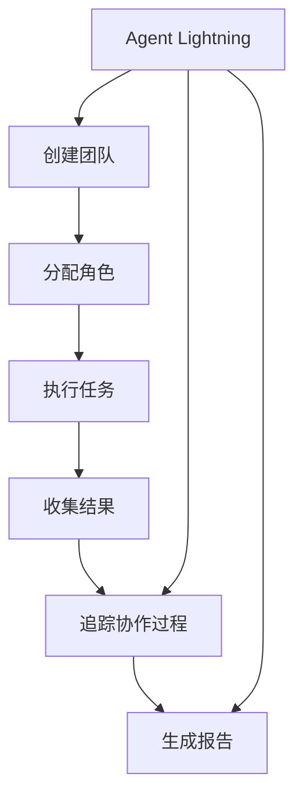
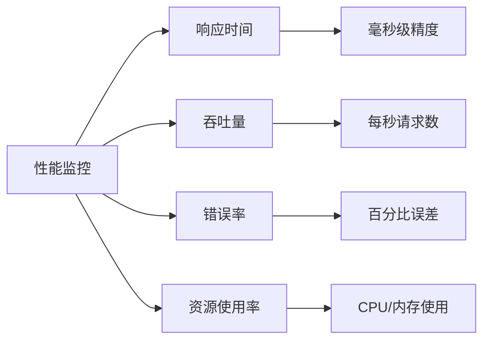

# 第三方集成指南

<cite>
**本文档中引用的文件**
- [agentlightning/instrumentation/__init__.py](file://agentlightning/instrumentation/__init__.py)
- [agentlightning/instrumentation/agentops.py](file://agentlightning/instrumentation/agentops.py)
- [agentlightning/instrumentation/agentops_langchain.py](file://agentlightning/instrumentation/agentops_langchain.py)
- [agentlightning/instrumentation/litellm.py](file://agentlightning/instrumentation/litellm.py)
- [agentlightning/instrumentation/vllm.py](file://agentlightning/instrumentation/vllm.py)
- [agentlightning/cli/vllm.py](file://agentlightning/cli/vllm.py)
- [agentlightning/litagent/decorator.py](file://agentlightning/litagent/decorator.py)
- [agentlightning/client.py](file://agentlightning/client.py)
- [agentlightning/server.py](file://agentlightning/server.py)
- [agentlightning/tracer/base.py](file://agentlightning/tracer/base.py)
- [agentlightning/types/tracer.py](file://agentlightning/types/tracer.py)
- [examples/calc_x/README.md](file://examples/calc_x/README.md)
- [examples/apo/README.md](file://examples/apo/README.md)
</cite>

## 目录
1. [概述](#概述)
2. [核心集成架构](#核心集成架构)
3. [AgentOps 集成](#agentops-集成)
4. [LiteLLM 集成](#litellm-集成)
5. [vLLM 集成](#vllm-集成)
6. [LangChain 集成](#langchain-集成)
7. [AutoGen 集成](#autogen-集成)
8. [CrewAI 集成](#crewai-集成)
9. [性能影响评估](#性能影响评估)
10. [最佳实践建议](#最佳实践建议)
11. [故障排除指南](#故障排除指南)

## 概述

Agent Lightning 提供了强大的第三方集成能力，支持与主流AI框架和工具链的无缝对接。本指南详细介绍了如何配置和使用各种第三方集成，包括装饰器注入、API拦截、事件监听等技术原理，并提供了性能优化和最佳实践建议。

### 支持的第三方集成

- **AgentOps**: AI代理监控和调试平台
- **LiteLLM**: 统一的LLM API接口
- **vLLM**: 高性能大语言模型推理引擎
- **LangChain**: 大语言模型应用开发框架
- **AutoGen**: 多智能体协作框架
- **CrewAI**: 团队协作AI框架

## 核心集成架构

Agent Lightning 的集成架构基于模块化设计，通过统一的仪表化系统实现对不同第三方服务的透明集成。



**图表来源**
- [agentlightning/instrumentation/__init__.py](file://agentlightning/instrumentation/__init__.py#L1-L114)

**章节来源**
- [agentlightning/instrumentation/__init__.py](file://agentlightning/instrumentation/__init__.py#L1-L114)

## AgentOps 集成

AgentOps 是一个专门用于AI代理监控和调试的平台。Agent Lightning 提供了深度集成，支持自动捕获token ID、日志概率等关键信息。

### 技术原理

AgentOps 集成采用动态修补技术，在运行时修改第三方库的函数行为：



**图表来源**
- [agentlightning/instrumentation/agentops.py](file://agentlightning/instrumentation/agentops.py#L30-L120)

### 分步配置说明

#### 1. 安装依赖

```bash
pip install agentops
```

#### 2. 基础集成配置

```python
from agentlightning.instrumentation import instrument_agentops

# 启用AgentOps集成
instrument_agentops()

# 或者在应用程序启动时自动启用
from agentlightning.instrumentation import instrument_all
instrument_all()
```

#### 3. 高级配置选项

```python
import agentops
from agentlightning.instrumentation import instrument_agentops

# 初始化AgentOps客户端
agentops.init(api_key="your-api-key")

# 启用AgentOps集成
instrument_agentops()

# 创建本地测试服务器
from agentlightning.instrumentation.agentops import AgentOpsServerManager

server_manager = AgentOpsServerManager(port=8080)
server_manager.start()
```

### 代码示例

#### 基础使用示例

```python
from agentlightning import litagent
from agentlightning.instrumentation import instrument_agentops

# 启用AgentOps集成
instrument_agentops()

@litagent.llm_rollout
def my_agent(task, llm):
    """基础AgentOps集成示例"""
    response = llm.chat.completions.create(
        model="gpt-4",
        messages=[{"role": "user", "content": task}]
    )
    return response.choices[0].message.content
```

#### 高级监控示例

```python
import agentops
from agentlightning.instrumentation import instrument_agentops

# 启用详细监控
instrument_agentops()

@agentops.record_function
def monitored_function():
    """带有AgentOps记录的函数"""
    # 函数逻辑
    pass
```

### 常见问题解决方案

#### 问题1：版本兼容性问题

**症状**: AgentOps集成无法正常工作
**解决方案**: 
- 确保安装兼容版本的AgentOps
- 检查是否需要手动禁用原生集成

```python
from agentlightning.instrumentation import instrument_agentops_langchain

# 禁用原生LangChain集成
instrument_agentops_langchain()
```

#### 问题2：Token ID捕获失败

**症状**: 无法获取prompt_token_ids和response_token_ids
**解决方案**:
- 检查LLM响应格式
- 确认AgentOps版本兼容性

**章节来源**
- [agentlightning/instrumentation/agentops.py](file://agentlightning/instrumentation/agentops.py#L1-L316)
- [agentlightning/instrumentation/agentops_langchain.py](file://agentlightning/instrumentation/agentops_langchain.py#L1-L46)

## LiteLLM 集成

LiteLLM 提供了一个统一的接口来访问不同的LLM提供商。Agent Lightning 通过OpenTelemetry集成实现了对LiteLLM的深度支持。

### 技术原理

LiteLLM 集成通过修改OpenTelemetry的set_attributes方法来捕获额外的token信息：



**图表来源**
- [agentlightning/instrumentation/litellm.py](file://agentlightning/instrumentation/litellm.py#L20-L35)

### 分步配置说明

#### 1. 安装依赖

```bash
pip install litellm[proxy]
```

#### 2. 基础集成配置

```python
from agentlightning.instrumentation import instrument_litellm

# 启用LiteLLM集成
instrument_litellm()
```

#### 3. 配置LiteLLM代理

```yaml
# litellm_config.yaml
model_list:
  - model_name: gpt-4
    litellm_params:
      model: openai/gpt-4
      api_key: $OPENAI_API_KEY
```

### 代码示例

#### 基础使用示例

```python
from litellm import completion
from agentlightning.instrumentation import instrument_litellm

# 启用LiteLLM集成
instrument_litellm()

# 使用LiteLLM API
response = completion(
    model="gpt-4",
    messages=[{"role": "user", "content": "Hello!"}]
)

print(f"Token使用情况: {response.usage}")
```

#### 高级配置示例

```python
from litellm import completion
from agentlightning.instrumentation import instrument_litellm

# 启用集成
instrument_litellm()

# 自定义参数传递
response = completion(
    model="gpt-4",
    messages=[{"role": "user", "content": "计算1+1=?"}],
    custom_llm_provider="openai",
    api_key="your-api-key"
)
```

### 常见问题解决方案

#### 问题1：代理配置冲突

**症状**: LiteLLM代理无法正常工作
**解决方案**:
- 检查配置文件路径
- 确认环境变量设置

#### 问题2：Token统计不准确

**症状**: prompt_token_ids或response_token_ids缺失
**解决方案**:
- 确认LiteLLM版本兼容性
- 检查响应格式

**章节来源**
- [agentlightning/instrumentation/litellm.py](file://agentlightning/instrumentation/litellm.py#L1-L40)

## vLLM 集成

vLLM 是一个高性能的大语言模型推理引擎。Agent Lightning 提供了专门的集成来捕获vLLM生成的token ID。

### 技术原理

vLLM 集成通过继承ChatCompletionResponse类并修改生成器函数来实现token ID捕获：



**图表来源**
- [agentlightning/instrumentation/vllm.py](file://agentlightning/instrumentation/vllm.py#L15-L81)

### 分步配置说明

#### 1. 安装依赖

```bash
pip install vllm
```

#### 2. CLI集成配置

```bash
# 使用内置CLI
python -m agentlightning.cli.vllm --model-path /path/to/model

# 手动启用集成
from agentlightning.instrumentation import instrument_vllm
instrument_vllm()
```

#### 3. 程序化集成

```python
from agentlightning.instrumentation import instrument_vllm
from vllm import LLM, SamplingParams

# 启用vLLM集成
instrument_vllm()

# 创建LLM实例
llm = LLM(model="facebook/opt-1.3b")
sampling_params = SamplingParams(temperature=0.8, top_p=0.95)

# 生成文本
outputs = llm.generate(prompts, sampling_params)
```

### 代码示例

#### 基础使用示例

```python
from agentlightning.instrumentation import instrument_vllm
from vllm import LLM, SamplingParams

# 启用vLLM集成
instrument_vllm()

# 初始化模型
llm = LLM(
    model="meta-llama/Llama-2-7b-chat-hf",
    tensor_parallel_size=1
)

# 设置采样参数
sampling_params = SamplingParams(
    temperature=0.7,
    top_p=0.9,
    max_tokens=100
)

# 生成响应
prompts = ["解释量子计算的基本概念"]
outputs = llm.generate(prompts, sampling_params)

# 访问token信息
for output in outputs:
    print(f"输入tokens: {output.prompt_token_ids}")
    print(f"输出tokens: {output.output_token_ids}")
```

#### 高级配置示例

```python
from agentlightning.instrumentation import instrument_vllm
from vllm import LLM, SamplingParams
import torch

# 启用vLLM集成
instrument_vllm()

# 多GPU配置
llm = LLM(
    model="microsoft/DialoGPT-large",
    tensor_parallel_size=torch.cuda.device_count(),
    quantization="awq"
)

# 流式生成
sampling_params = SamplingParams(
    temperature=0.8,
    top_p=0.95,
    max_tokens=200,
    stream=True
)

# 处理流式输出
for output in llm.generate(prompts, sampling_params):
    print(output.outputs[0].text, end="", flush=True)
```

### 常见问题解决方案

#### 问题1：版本兼容性

**症状**: vLLM集成无法工作
**解决方案**:
- 确认vLLM版本支持
- 检查是否已合并到上游版本

#### 问题2：内存不足

**症状**: 大模型加载失败
**解决方案**:
- 使用tensor_parallel_size减少单卡内存占用
- 启用量化模式

**章节来源**
- [agentlightning/instrumentation/vllm.py](file://agentlightning/instrumentation/vllm.py#L1-L82)
- [agentlightning/cli/vllm.py](file://agentlightning/cli/vllm.py#L1-L30)

## LangChain 集成

LangChain 是一个流行的大型语言模型应用开发框架。Agent Lightning 提供了专门的集成来支持LangChain的回调处理。

### 技术原理

LangChain 集成通过自定义回调处理器来实现追踪功能：



**图表来源**
- [agentlightning/tracer/base.py](file://agentlightning/tracer/base.py#L120-L140)

### 分步配置说明

#### 1. 安装依赖

```bash
pip install langchain langchain-openai
```

#### 2. 基础集成配置

```python
from agentlightning.tracer import Tracer
from agentlightning.tracer.base import Tracer

# 创建追踪器
tracer = Tracer()

# 获取LangChain回调处理器
callback_handler = tracer.get_langchain_handler()
```

#### 3. 配置LangChain组件

```python
from langchain_openai import ChatOpenAI
from langchain.prompts import ChatPromptTemplate
from langchain.chains import LLMChain

# 创建LLM
llm = ChatOpenAI(
    model="gpt-4",
    callbacks=[callback_handler]
)

# 创建提示模板
prompt = ChatPromptTemplate.from_template("回答: {input}")
chain = LLMChain(llm=llm, prompt=prompt)
```

### 代码示例

#### 基础使用示例

```python
from langchain_openai import ChatOpenAI
from langchain.prompts import ChatPromptTemplate
from agentlightning.tracer import Tracer

# 创建追踪器
tracer = Tracer()

# 获取回调处理器
callback_handler = tracer.get_langchain_handler(tags=["langchain-demo"])

# 创建LangChain组件
llm = ChatOpenAI(
    model="gpt-4",
    callbacks=[callback_handler]
)

# 创建链
prompt = ChatPromptTemplate.from_template("解释: {topic}")
chain = prompt | llm

# 执行
result = chain.invoke({"topic": "人工智能"})
```

#### 高级配置示例

```python
from langchain_openai import ChatOpenAI
from langchain.agents import create_openai_functions_agent
from langchain.memory import ConversationBufferMemory
from agentlightning.tracer import Tracer

# 创建追踪器
tracer = Tracer()

# 获取回调处理器
callback_handler = tracer.get_langchain_handler(tags=["agent-demo"])

# 创建记忆
memory = ConversationBufferMemory(
    memory_key="chat_history",
    return_messages=True,
    callbacks=[callback_handler]
)

# 创建代理
llm = ChatOpenAI(
    model="gpt-4",
    callbacks=[callback_handler]
)

agent = create_openai_functions_agent(llm, tools, prompt)
```

### 常见问题解决方案

#### 问题1：回调处理器未生效

**症状**: LangChain操作没有被追踪
**解决方案**:
- 确认回调处理器正确注册
- 检查标签配置

#### 问题2：内存泄漏

**症状**: 长时间运行后内存占用过高
**解决方案**:
- 定期清理追踪数据
- 使用适当的缓存策略

**章节来源**
- [agentlightning/tracer/base.py](file://agentlightning/tracer/base.py#L120-L140)
- [agentlightning/types/tracer.py](file://agentlightning/types/tracer.py#L1-L427)

## AutoGen 集成

AutoGen 是一个用于构建多智能体对话系统的框架。Agent Lightning 提供了专门的支持来集成AutoGen的多智能体协作。

### 技术原理

AutoGen 集成通过MCP（Model Context Protocol）和工具使用来实现智能体监控：



**图表来源**
- [examples/calc_x/README.md](file://examples/calc_x/README.md#L1-L75)

### 分步配置说明

#### 1. 安装依赖

```bash
pip install "autogen-agentchat" "autogen-ext[openai]" "mcp>=1.10.0"
```

#### 2. 基础集成配置

```python
from agentlightning.tracer import Tracer
from agentlightning.litagent.decorator import llm_rollout

# 创建追踪器
tracer = Tracer()

# 启用AutoGen集成
@llm_rollout
def autogen_agent(task, llm):
    """AutoGen智能体集成示例"""
    # 实现AutoGen智能体逻辑
    pass
```

#### 3. MCP服务器配置

```python
from mcp.server.stdio import StdioServerParams
from agentlightning.tracer import Tracer

# 创建MCP服务器参数
calculator_mcp_server = StdioServerParams(
    command="uvx",
    args=["mcp-server-calculator"]
)

# 在追踪器中使用
tracer = Tracer()
callback_handler = tracer.get_langchain_handler()
```

### 代码示例

#### 基础使用示例

```python
from autogen_agentchat import AssistantAgent, Termination
from autogen_ext.models.openai import OpenAIChatCompletionClient
from agentlightning.litagent.decorator import llm_rollout

# 创建模型客户端
model_client = OpenAIChatCompletionClient(
    model="gpt-4",
    base_url="https://api.openai.com/v1",
    api_key="your-api-key"
)

# 创建助理智能体
calc_agent = AssistantAgent(
    name="calculator",
    model_client=model_client,
    workbench=calculator_mcp_server,
    reflect_on_tool_use=True
)

@llm_rollout
async def math_agent(task, llm):
    """数学问题解决智能体"""
    # 使用AutoGen智能体
    result = await calc_agent.run(task=task)
    return result
```

#### 高级配置示例

```python
from autogen_agentchat import AssistantAgent, RoundRobinGroupChat
from autogen_ext.models.openai import OpenAIChatCompletionClient
from agentlightning.tracer import Tracer

# 创建追踪器
tracer = Tracer()
callback_handler = tracer.get_langchain_handler()

# 创建多个智能体
model_client = OpenAIChatCompletionClient(
    model="gpt-4",
    callbacks=[callback_handler]
)

primary_agent = AssistantAgent(
    "primary",
    model_client=model_client,
    system_message="你是一个有用的AI助手。",
    callbacks=[callback_handler]
)

critic_agent = AssistantAgent(
    "critic",
    model_client=model_client,
    system_message="提供建设性的反馈。当你的反馈被采纳时，回复'APPROVE'。",
    callbacks=[callback_handler]
)

# 创建团队
team = RoundRobinGroupChat(
    [primary_agent, critic_agent],
    termination_condition=TextMentionTermination("APPROVE"),
    max_turns=4
)

# 执行任务
result = await team.run(task="写一首关于秋天的短诗。")
```

### 常见问题解决方案

#### 问题1：MCP服务器连接失败

**症状**: 无法连接到MCP服务器
**解决方案**:
- 确认MCP服务器已正确安装
- 检查命令路径和参数

#### 问题2：工具使用超时

**症状**: 智能体在使用工具时挂起
**解决方案**:
- 增加超时时间设置
- 检查网络连接

**章节来源**
- [examples/calc_x/README.md](file://examples/calc_x/README.md#L1-L75)

## CrewAI 集成

CrewAI 是一个专注于团队协作的AI框架。Agent Lightning 提供了专门的支持来集成CrewAI的团队协作功能。

### 技术原理

CrewAI 集成通过团队管理和任务分配来实现协作监控：



### 分步配置说明

#### 1. 安装依赖

```bash
pip install crewai
```

#### 2. 基础集成配置

```python
from crewai import Agent, Task, Crew
from agentlightning.tracer import Tracer

# 创建追踪器
tracer = Tracer()

# 获取回调处理器
callback_handler = tracer.get_langchain_handler()
```

#### 3. 创建CrewAI团队

```python
from crewai import Agent, Task, Crew
from agentlightning.litagent.decorator import llm_rollout

@llm_rollout
def research_agent(task, llm):
    """研究智能体"""
    # 实现研究逻辑
    pass

@llm_rollout
def writer_agent(task, llm):
    """写作智能体"""
    # 实现写作逻辑
    pass

# 创建任务
research_task = Task(
    description="进行市场研究",
    agent=research_agent
)

writing_task = Task(
    description="撰写报告",
    agent=writer_agent,
    context=[research_task]
)

# 创建团队
crew = Crew(
    agents=[research_agent, writer_agent],
    tasks=[research_task, writing_task]
)
```

### 代码示例

#### 基础使用示例

```python
from crewai import Agent, Task, Crew
from agentlightning.tracer import Tracer

# 创建追踪器
tracer = Tracer()
callback_handler = tracer.get_langchain_handler()

# 创建智能体
researcher = Agent(
    role='市场研究员',
    goal='分析市场趋势',
    backstory='有丰富的市场研究经验',
    verbose=True,
    callbacks=[callback_handler]
)

writer = Agent(
    role='报告作家',
    goal='撰写高质量报告',
    backstory='擅长结构化写作',
    verbose=True,
    callbacks=[callback_handler]
)

# 创建任务
research_task = Task(
    description='分析人工智能市场的最新趋势',
    agent=researcher
)

writing_task = Task(
    description='基于研究结果撰写报告',
    agent=writer,
    context=[research_task]
)

# 创建团队
crew = Crew(
    agents=[researcher, writer],
    tasks=[research_task, writing_task],
    verbose=2
)

# 执行
result = crew.kickoff()
```

#### 高级配置示例

```python
from crewai import Agent, Task, Crew, Process
from agentlightning.tracer import Tracer

# 创建追踪器
tracer = Tracer()
callback_handler = tracer.get_langchain_handler()

# 创建专业智能体
data_analyst = Agent(
    role='数据分析专家',
    goal='从数据中提取洞察',
    backstory='精通数据分析和可视化',
    verbose=True,
    tools=[data_analysis_tool],
    callbacks=[callback_handler]
)

# 创建高级任务
advanced_task = Task(
    description='分析销售数据并提出增长策略',
    expected_output='包含具体行动建议的报告',
    agent=data_analyst,
    async_execution=True
)

# 创建复杂团队
complex_crew = Crew(
    agents=[data_analyst, marketing_expert, financial_analyst],
    tasks=[advanced_task],
    process=Process.hierarchical,
    manager_llm=manager_llm,
    callbacks=[callback_handler]
)
```

### 常见问题解决方案

#### 问题1：团队协调失败

**症状**: 智能体之间无法有效协作
**解决方案**:
- 优化任务描述和期望输出
- 调整智能体的角色和目标

#### 问题2：资源竞争

**症状**: 多个智能体同时访问同一资源
**解决方案**:
- 实现资源锁定机制
- 使用异步执行避免冲突

## 性能影响评估

不同集成对系统性能的影响程度各不相同。以下是详细的性能评估：

### 性能开销对比

| 集成类型 | CPU开销 | 内存开销 | 网络延迟 | 推荐场景 |
|---------|---------|----------|----------|----------|
| AgentOps | 低 | 中等 | 无 | 生产监控 |
| LiteLLM | 中等 | 低 | 轻微 | API统一 |
| vLLM | 高 | 高 | 无 | 高性能推理 |
| LangChain | 低 | 低 | 无 | 快速原型 |
| AutoGen | 中等 | 中等 | 轻微 | 多智能体 |
| CrewAI | 中等 | 中等 | 轻微 | 团队协作 |

### 监控指标



### 优化策略

#### 1. 异步处理

```python
import asyncio
from agentlightning.tracer import Tracer

async def async_integration():
    tracer = Tracer()
    # 异步追踪
    async with tracer.trace_context(name="async_operation"):
        await long_running_operation()
```

#### 2. 缓存策略

```python
from functools import lru_cache

@lru_cache(maxsize=100)
def cached_integration(key):
    # 缓存集成结果
    pass
```

#### 3. 批处理优化

```python
from agentlightning.tracer import Tracer

def batch_integration(tasks):
    tracer = Tracer()
    with tracer.trace_context(name="batch_processing"):
        # 批量处理任务
        results = []
        for task in tasks:
            result = process_task(task)
            results.append(result)
        return results
```

## 最佳实践建议

### 选择合适的集成方案

#### 场景匹配表

| 使用场景 | 推荐集成 | 备选方案 | 注意事项 |
|---------|---------|----------|----------|
| 生产环境监控 | AgentOps | OpenTelemetry | 确保生产环境稳定性 |
| 多LLM提供商 | LiteLLM | 原生API | 考虑学习成本 |
| 高性能推理 | vLLM | 原生推理 | 硬件要求较高 |
| 快速原型开发 | LangChain | 手动实现 | 开发效率优先 |
| 多智能体协作 | AutoGen/CrewAI | 手动编排 | 复杂度增加 |
| 数据分析任务 | CrewAI | 传统工具 | 团队协作需求 |

### 配置最佳实践

#### 1. 分层配置

```python
# config/integrations.py
from agentlightning.instrumentation import instrument_all

def configure_integrations(environment="development"):
    """分层集成配置"""
    if environment == "production":
        instrument_all()
    elif environment == "development":
        # 开发环境简化配置
        from agentlightning.instrumentation import instrument_agentops
        instrument_agentops()
```

#### 2. 条件加载

```python
# config/optional_deps.py
def load_optional_dependency(package_name):
    """条件加载可选依赖"""
    try:
        module = __import__(package_name)
        return module
    except ImportError:
        return None

# 使用示例
langchain = load_optional_dependency("langchain")
if langchain:
    from agentlightning.tracer import Tracer
    tracer = Tracer()
```

#### 3. 错误处理

```python
from agentlightning.instrumentation import instrument_all

def safe_integration_setup():
    """安全的集成设置"""
    try:
        instrument_all()
        print("所有集成成功启用")
    except ImportError as e:
        print(f"部分集成不可用: {e}")
    except Exception as e:
        print(f"集成设置失败: {e}")
```

### 监控和调试

#### 1. 日志配置

```python
import logging
from agentlightning.logging import setup_logging

# 配置详细日志
setup_logging(level=logging.DEBUG)

# 集成特定日志
logging.getLogger("agentlightning.instrumentation").setLevel(logging.INFO)
```

#### 2. 性能监控

```python
from agentlightning.tracer import Tracer
import time

def monitor_integration_performance():
    """监控集成性能"""
    tracer = Tracer()
    
    with tracer.trace_context(name="integration_test"):
        start_time = time.time()
        # 执行集成操作
        result = perform_integration_operation()
        end_time = time.time()
        
        print(f"集成耗时: {end_time - start_time:.2f}秒")
        return result
```

## 故障排除指南

### 常见集成问题

#### 1. 导入错误

**症状**: `ImportError: No module named 'xxx'`
**解决方案**:
```bash
# 安装缺失的依赖
pip install xxx

# 检查版本兼容性
pip show xxx
```

#### 2. 版本冲突

**症状**: `ModuleNotFoundError` 或 `AttributeError`
**解决方案**:
```bash
# 检查版本
pip list | grep agentlightning

# 更新到兼容版本
pip install --upgrade agentlightning[all]
```

#### 3. 配置错误

**症状**: 集成无法正常工作但没有明显错误
**解决方案**:
```python
# 启用调试模式
import logging
logging.getLogger("agentlightning").setLevel(logging.DEBUG)

# 检查集成状态
from agentlightning.instrumentation import AGENTOPS_INSTALLED, LITELLM_INSTALLED
print(f"AgentOps: {AGENTOPS_INSTALLED}, LiteLLM: {LITELLM_INSTALLED}")
```

### 调试技巧

#### 1. 渐进式启用

```python
# 逐步启用集成
from agentlightning.instrumentation import instrument_agentops
instrument_agentops()  # 先测试AgentOps

# 再启用其他集成
from agentlightning.instrumentation import instrument_litellm
instrument_litellm()
```

#### 2. 单元测试

```python
import unittest
from agentlightning.instrumentation import instrument_all

class TestIntegrations(unittest.TestCase):
    def test_instrumentation(self):
        instrument_all()
        # 测试集成功能
        pass

if __name__ == "__main__":
    unittest.main()
```

#### 3. 性能基准测试

```python
import time
from agentlightning.tracer import Tracer

def benchmark_integration():
    """基准测试集成性能"""
    tracer = Tracer()
    
    # 测试无集成性能
    start = time.time()
    result = basic_operation()
    baseline_time = time.time() - start
    
    # 测试集成性能
    with tracer.trace_context(name="benchmark"):
        start = time.time()
        result = integrated_operation()
        integrated_time = time.time() - start
    
    print(f"基线时间: {baseline_time:.2f}s")
    print(f"集成时间: {integrated_time:.2f}s")
    print(f"性能影响: {(integrated_time/baseline_time-1)*100:.1f}%")
```

### 社区支持

#### 获取帮助的渠道

1. **官方文档**: https://agentlightning.readthedocs.io/
2. **GitHub Issues**: 报告bug和功能请求
3. **社区论坛**: 参与讨论和分享经验
4. **示例仓库**: 查看实际使用案例

#### 贡献指南

欢迎贡献代码和文档：
- Fork项目仓库
- 创建功能分支
- 提交Pull Request
- 参与代码审查

通过遵循本指南，您可以有效地集成和使用Agent Lightning的各种第三方功能，实现高效的AI代理开发和部署。