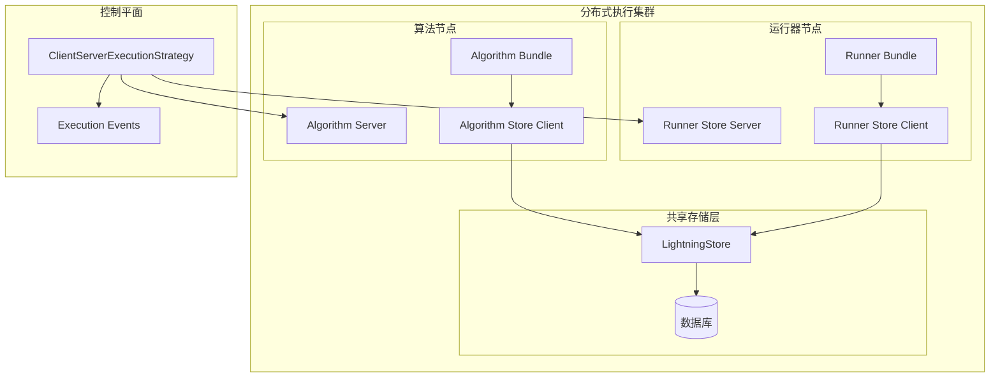
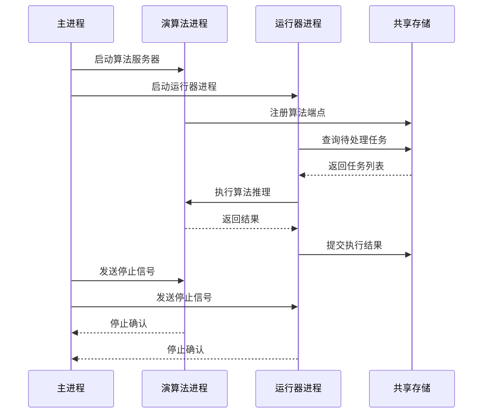
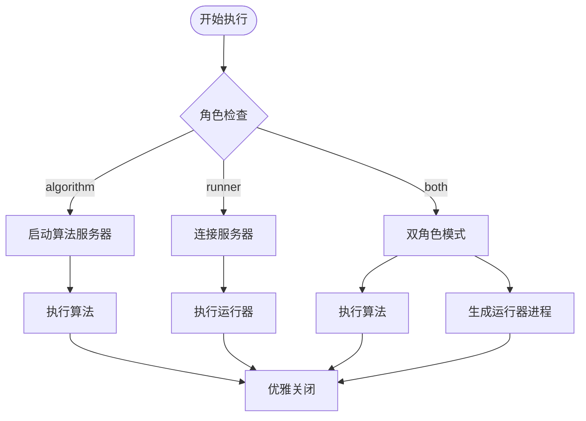
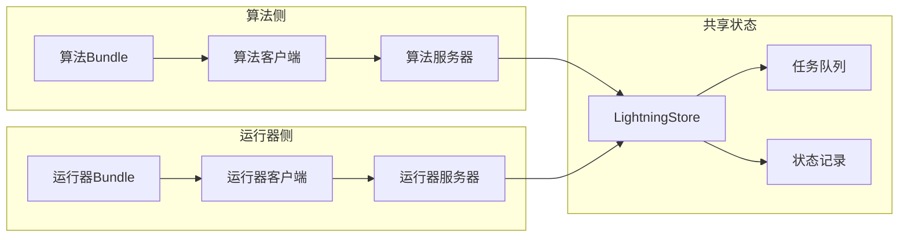
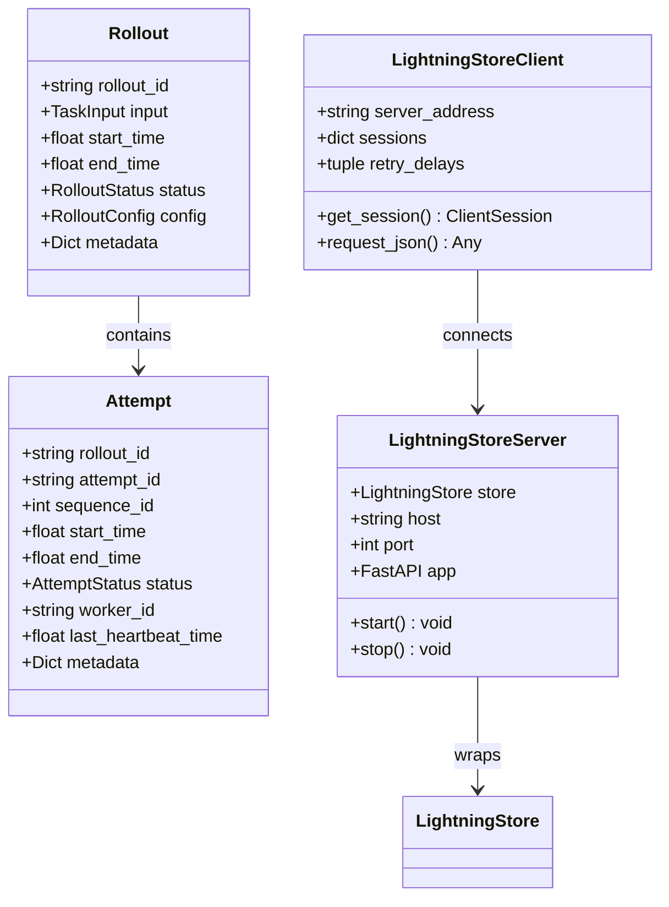
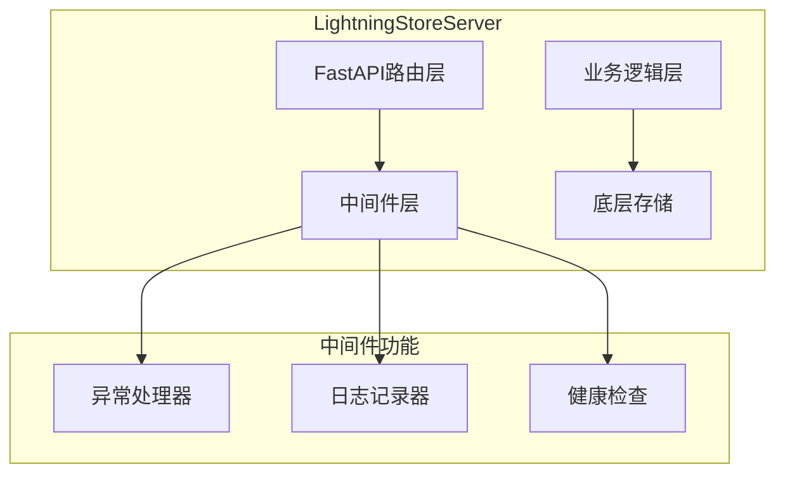
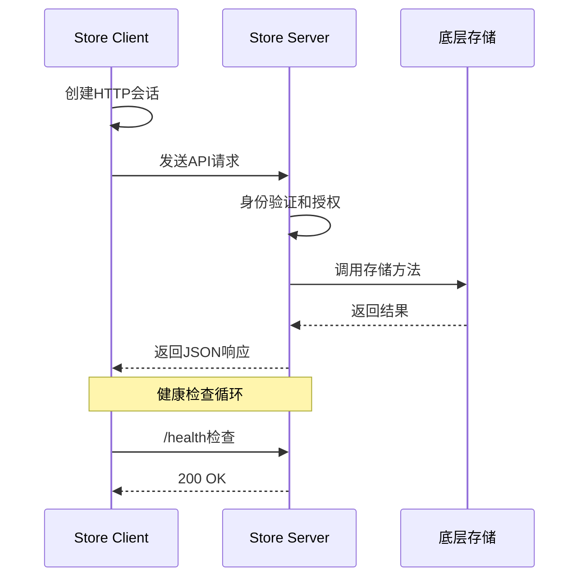
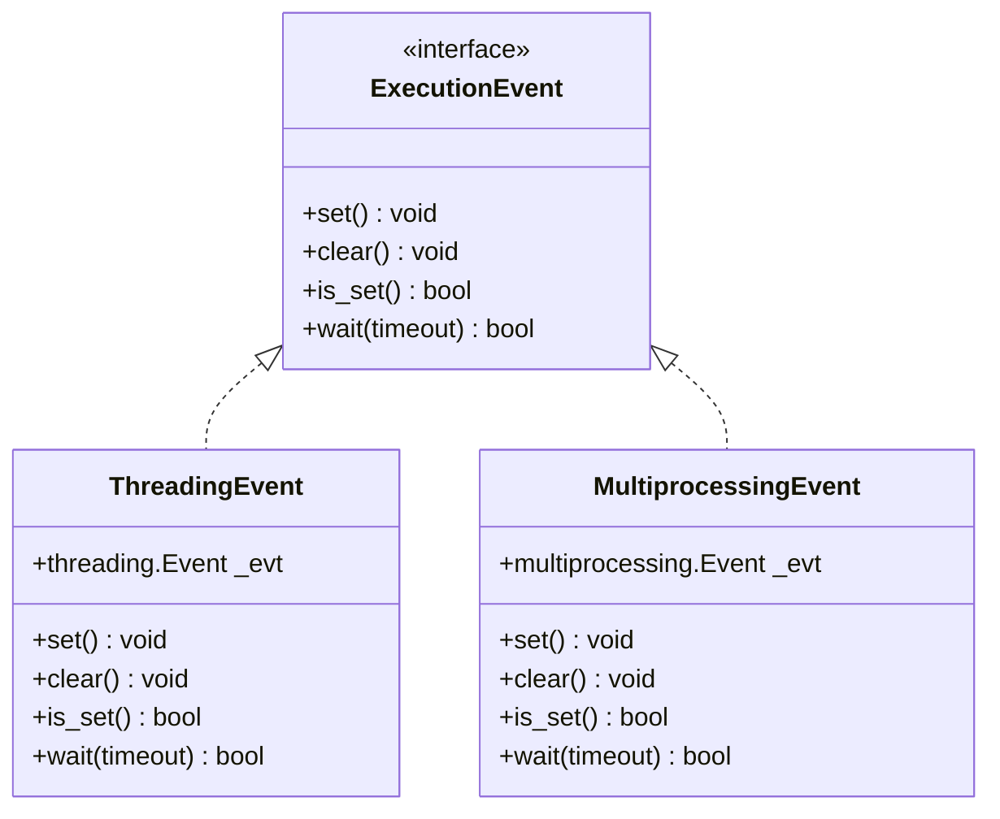
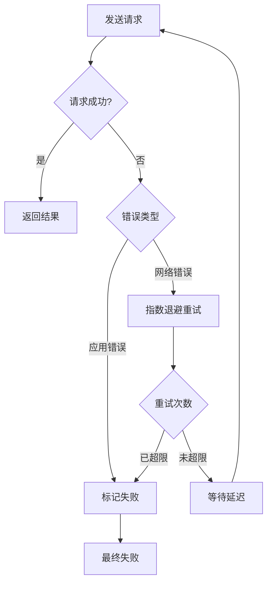

# 分布式部署架构文档

<cite>
**本文档中引用的文件**
- [agentlightning/execution/client_server.py](file://agentlightning/execution/client_server.py)
- [agentlightning/store/client_server.py](file://agentlightning/store/client_server.py)
- [agentlightning/execution/base.py](file://agentlightning/execution/base.py)
- [agentlightning/store/base.py](file://agentlightning/store/base.py)
- [agentlightning/execution/events.py](file://agentlightning/execution/events.py)
- [agentlightning/execution/shared_memory.py](file://agentlightning/execution/shared_memory.py)
- [agentlightning/server.py](file://agentlightning/server.py)
- [agentlightning/types/core.py](file://agentlightning/types/core.py)
- [tests/execution/test_client_server.py](file://tests/execution/test_client_server.py)
- [examples/apo/legacy_apo_server.py](file://examples/apo/legacy_apo_server.py)
</cite>

## 目录
1. [概述](#概述)
2. [系统架构](#系统架构)
3. [ClientServerExecutionStrategy核心机制](#clientserverexecutionstrategy核心机制)
4. [角色模式与协作机制](#角色模式与协作机制)
5. [HTTP服务端与客户端通信协议](#http服务端与客户端通信协议)
6. [LightningStore分布式状态管理](#lightningstore分布式状态管理)
7. [Abort Model四阶段终止机制](#abort-model四阶段终止机制)
8. [网络分区与故障恢复](#网络分区与故障恢复)
9. [最佳实践指南](#最佳实践指南)
10. [总结](#总结)

## 概述

Agent Lightning的分布式部署架构通过ClientServerExecutionStrategy实现了跨进程、跨节点的分布式执行能力。该架构采用HTTP通信协议，支持算法（algorithm）、运行器（runner）和两者的组合（both）三种角色模式，在保证高可用性的同时提供了灵活的部署选项。

### 核心特性

- **跨进程分布式执行**：支持算法和运行器在不同进程中独立运行
- **角色模式灵活性**：提供algorithm、runner、both三种角色配置
- **可靠的终止机制**：实现四阶段Abort Model确保优雅关闭
- **状态一致性保障**：通过LightningStore实现分布式状态同步
- **网络容错能力**：具备网络分区检测和自动恢复机制

## 系统架构



**图表来源**
- [agentlightning/execution/client_server.py](file://agentlightning/execution/client_server.py#L1-L50)
- [agentlightning/store/client_server.py](file://agentlightning/store/client_server.py#L1-L100)

**章节来源**
- [agentlightning/execution/client_server.py](file://agentlightning/execution/client_server.py#L1-L434)
- [agentlightning/store/base.py](file://agentlightning/store/base.py#L1-L516)

## ClientServerExecutionStrategy核心机制

ClientServerExecutionStrategy是分布式部署的核心执行策略，它协调算法和运行器在不同进程间的协作。

### 执行流程架构



**图表来源**
- [agentlightning/execution/client_server.py](file://agentlightning/execution/client_server.py#L150-L250)

### 关键组件说明

#### 1. 角色配置机制

ClientServerExecutionStrategy支持三种角色配置：

- **algorithm**：仅运行算法逻辑，启动HTTP服务器
- **runner**：仅运行运行器逻辑，连接现有服务器
- **both**：同时运行算法和运行器，支持主进程选择

#### 2. 存储管理策略

系统提供两种存储管理模式：

- **托管存储（Managed Store）**：自动创建客户端-服务器包装器
- **手动存储（Manual Store）**：直接传递存储实例给各组件

#### 3. 进程管理



**图表来源**
- [agentlightning/execution/client_server.py](file://agentlightning/execution/client_server.py#L364-L434)

**章节来源**
- [agentlightning/execution/client_server.py](file://agentlightning/execution/client_server.py#L50-L150)

## 角色模式与协作机制

### 角色模式详解

#### Algorithm角色
- **职责**：启动LightningStoreServer，提供HTTP API接口
- **特点**：独占服务器资源，负责算法执行调度
- **适用场景**：算法开发调试、单节点部署

#### Runner角色  
- **职责**：连接现有服务器，执行具体任务
- **特点**：轻量级，可并行多个实例
- **适用场景**：大规模任务处理、负载均衡

#### Both角色
- **职责**：同时承担算法和运行器功能
- **特点**：主进程可选择运行算法或运行器
- **适用场景**：混合部署、资源受限环境

### 协作机制



**图表来源**
- [agentlightning/execution/client_server.py](file://agentlightning/execution/client_server.py#L20-L50)

**章节来源**
- [agentlightning/execution/client_server.py](file://agentlightning/execution/client_server.py#L20-L80)

## HTTP服务端与客户端通信协议

### 通信协议设计

系统采用RESTful API设计，基于FastAPI框架实现HTTP通信。

#### 核心API端点

| 端点路径 | 方法 | 功能描述 |
|---------|------|----------|
| `/agl/v1/health` | GET | 健康检查 |
| `/agl/v1/queues/rollouts/enqueue` | POST | 添加任务到队列 |
| `/agl/v1/queues/rollouts/dequeue` | POST | 从队列获取任务 |
| `/agl/v1/rollouts` | POST | 开始新的执行尝试 |
| `/agl/v1/rollouts/{id}` | GET/POST | 获取或更新任务状态 |
| `/agl/v1/resources` | POST | 更新资源配置 |

### 数据序列化方式

#### 请求响应格式
- **请求体**：JSON格式，使用Pydantic模型验证
- **响应体**：标准化JSON响应，包含状态码和错误信息
- **错误处理**：统一的HTTP异常处理和重试机制

#### 数据模型



**图表来源**
- [agentlightning/store/client_server.py](file://agentlightning/store/client_server.py#L100-L200)
- [agentlightning/types/core.py](file://agentlightning/types/core.py#L100-L200)

### 错误传播策略

#### 1. HTTP状态码映射
- **200-299**：成功响应
- **400-499**：客户端错误（不重试）
- **500-599**：服务器错误（可重试）

#### 2. 异常处理机制
- **应用级异常**：转换为500内部服务器错误
- **网络异常**：自动重试和健康检查
- **超时处理**：分层超时策略

**章节来源**
- [agentlightning/store/client_server.py](file://agentlightning/store/client_server.py#L200-L400)

## LightningStore分布式状态管理

### LightningStoreServer架构

LightningStoreServer作为HTTP服务器，提供分布式状态访问接口。

#### 核心功能模块



**图表来源**
- [agentlightning/store/client_server.py](file://agentlightning/store/client_server.py#L150-L300)

### LightningStoreClient通信机制

#### 客户端特性
- **连接池管理**：基于事件循环的会话复用
- **健康检查**：定期探测服务器健康状态
- **重试策略**：指数退避重试机制

#### 通信流程



**图表来源**
- [agentlightning/store/client_server.py](file://agentlightning/store/client_server.py#L600-L800)

### 存储模式对比

| 特性 | 共享内存 | 客户端-服务器 |
|------|----------|---------------|
| 部署复杂度 | 简单 | 中等 |
| 性能开销 | 无 | 网络延迟 |
| 可扩展性 | 局限 | 高 |
| 故障隔离 | 低 | 高 |
| 数据一致性 | 强 | 最终一致 |

**章节来源**
- [agentlightning/store/client_server.py](file://agentlightning/store/client_server.py#L1-L200)
- [agentlightning/store/base.py](file://agentlightning/store/base.py#L1-L100)

## Abort Model四阶段终止机制

Abort Model是Agent Lightning分布式环境中的核心可靠性保障机制。

### 四阶段终止流程

```mermaid
flowchart TD
Step1[第一阶段<br/>协作停止] --> Step2[第二阶段<br/>键盘中断合成]
Step2 --> Step3[第三阶段<br/>终止请求]
Step3 --> Step4[第四阶段<br/>强制杀死]
Step1 --> |设置停止事件| CoopStop[算法和运行器收到停止信号]
Step2 --> |发送SIGINT| SigInt[子进程接收中断信号]
Step3 --> |发送terminate()| Terminate[进程被强制终止]
Step4 --> |发送kill()| Kill[进程被强制杀死]
CoopStop --> Cleanup[清理资源]
SigInt --> Cleanup
Terminate --> Cleanup
Kill --> Cleanup
```

**图表来源**
- [agentlightning/execution/client_server.py](file://agentlightning/execution/client_server.py#L300-L400)

### 终止策略详解

#### 第一阶段：协作停止
- **触发条件**：主进程接收到停止信号或异常发生
- **执行动作**：设置全局停止事件
- **等待时间**：graceful_timeout参数控制

#### 第二阶段：键盘中断合成
- **触发条件**：第一阶段后仍有活跃进程
- **执行动作**：向子进程发送SIGINT信号
- **目的**：触发Python的KeyboardInterrupt异常处理

#### 第三阶段：终止请求
- **触发条件**：第二阶段后仍有活跃进程
- **执行动作**：调用process.terminate()方法
- **信号类型**：POSIX系统使用SIGTERM

#### 第四阶段：强制杀死
- **触发条件**：第三阶段后仍有活跃进程
- **执行动作**：调用process.kill()方法
- **信号类型**：POSIX系统使用SIGKILL

### 事件协调机制



**图表来源**
- [agentlightning/execution/events.py](file://agentlightning/execution/events.py#L1-L70)

**章节来源**
- [agentlightning/execution/client_server.py](file://agentlightning/execution/client_server.py#L300-L434)
- [agentlightning/execution/events.py](file://agentlightning/execution/events.py#L1-L70)

## 网络分区与故障恢复

### 网络分区检测机制

#### 健康检查策略
- **主动探测**：定期发送健康检查请求
- **被动监控**：监听连接失败和超时事件
- **多维度评估**：结合响应时间和成功率

#### 故障检测指标

| 指标类型 | 阈值设置 | 检测方法 |
|----------|----------|----------|
| 连接超时 | 5秒 | TCP连接建立超时 |
| 响应超时 | 30秒 | HTTP请求响应超时 |
| 心跳间隔 | 10秒 | 定期健康检查 |
| 失败率阈值 | 30% | 连续失败比例 |

### 自动恢复机制

#### 重试策略


**图表来源**
- [agentlightning/store/client_server.py](file://agentlightning/store/client_server.py#L700-L800)

#### 恢复策略

1. **渐进式恢复**：从低优先级任务开始恢复
2. **熔断保护**：连续失败时暂停请求
3. **降级处理**：使用本地缓存或默认值
4. **监控告警**：及时通知运维人员

### 故障隔离与容错

#### 进程隔离
- **独立进程**：算法和运行器在不同进程中运行
- **资源限制**：每个进程独立的CPU和内存配额
- **异常隔离**：单个进程崩溃不影响其他进程

#### 数据隔离
- **副本机制**：关键数据的多副本存储
- **版本控制**：支持数据版本回滚
- **一致性检查**：定期验证数据完整性

**章节来源**
- [agentlightning/store/client_server.py](file://agentlightning/store/client_server.py#L600-L800)

## 最佳实践指南

### 部署配置建议

#### 1. 角色分配策略
- **小规模部署**：使用both模式简化配置
- **大规模部署**：分离algorithm和runner角色
- **开发环境**：both模式便于调试
- **生产环境**：algorithm+runner分离提高稳定性

#### 2. 网络配置优化
- **端口规划**：为不同角色预留专用端口
- **防火墙规则**：开放必要的通信端口
- **负载均衡**：使用反向代理分发请求
- **SSL/TLS**：生产环境启用加密通信

#### 3. 资源配置
```python
# 推荐配置示例
strategy = ClientServerExecutionStrategy(
    role="both",
    server_host="0.0.0.0",
    server_port=4747,
    n_runners=4,  # 根据CPU核心数调整
    graceful_timeout=10.0,
    terminate_timeout=5.0,
    main_process="algorithm"
)
```

### 监控与运维

#### 关键指标监控
- **系统指标**：CPU、内存、磁盘I/O使用率
- **网络指标**：连接数、吞吐量、错误率
- **业务指标**：任务完成率、平均响应时间
- **健康指标**：服务可用性、数据一致性

#### 日志管理
- **结构化日志**：使用JSON格式便于解析
- **分级日志**：区分DEBUG、INFO、WARNING、ERROR级别
- **关联追踪**：通过trace_id关联相关日志
- **日志轮转**：定期归档和清理日志文件

### 性能优化

#### 1. 并发优化
- **连接池**：复用HTTP连接减少开销
- **异步处理**：使用asyncio提高并发性能
- **批处理**：合并小请求减少网络往返

#### 2. 缓存策略
- **客户端缓存**：缓存频繁访问的资源配置
- **服务端缓存**：Redis等内存数据库加速查询
- **智能预取**：预测性加载可能需要的数据

#### 3. 数据库优化
- **索引优化**：为常用查询字段建立索引
- **读写分离**：分离查询和写入操作
- **分片策略**：按rollout_id分片分散压力

### 安全考虑

#### 访问控制
- **身份认证**：使用API密钥或OAuth令牌
- **权限管理**：基于角色的访问控制（RBAC）
- **审计日志**：记录所有敏感操作

#### 数据保护
- **传输加密**：HTTPS传输重要数据
- **存储加密**：敏感数据加密存储
- **备份策略**：定期备份和异地存放

**章节来源**
- [agentlightning/execution/client_server.py](file://agentlightning/execution/client_server.py#L50-L150)
- [tests/execution/test_client_server.py](file://tests/execution/test_client_server.py#L1-L100)

## 总结

Agent Lightning的分布式部署架构通过ClientServerExecutionStrategy实现了高度灵活和可靠的跨进程分布式执行能力。其核心优势包括：

### 技术优势
- **灵活的角色模式**：支持algorithm、runner、both三种部署模式
- **可靠的终止机制**：四阶段Abort Model确保优雅关闭
- **强一致性保障**：通过LightningStore实现分布式状态同步
- **容错能力**：具备网络分区检测和自动恢复机制

### 架构特点
- **模块化设计**：清晰的职责分离和接口定义
- **可扩展性**：支持水平扩展和垂直扩展
- **兼容性**：向后兼容传统HTTP服务器架构
- **可观测性**：完善的监控和日志体系

### 应用价值
- **开发效率**：简化分布式系统的开发和维护
- **运维便利**：提供完整的监控和故障恢复能力
- **性能优化**：通过多种优化策略提升系统性能
- **安全可靠**：多层次的安全防护和容错机制

该架构为构建大规模、高可用的AI训练平台提供了坚实的技术基础，能够满足从原型开发到生产部署的各种需求场景。