# 性能优化

<cite>
**本文档中引用的文件**
- [agentlightning/execution/client_server.py](file://agentlightning/execution/client_server.py)
- [agentlightning/logging.py](file://agentlightning/logging.py)
- [agentlightning/config.py](file://agentlightning/config.py)
- [agentlightning/server.py](file://agentlightning/server.py)
- [agentlightning/client.py](file://agentlightning/client.py)
- [agentlightning/types/resources.py](file://agentlightning/types/resources.py)
- [agentlightning/store/base.py](file://agentlightning/store/base.py)
- [agentlightning/store/memory.py](file://agentlightning/store/memory.py)
- [tests/execution/test_client_server.py](file://tests/execution/test_client_server.py)
- [examples/tinker/q20_train.py](file://examples/tinker/q20_train.py)
- [examples/spider/train_sql_agent.py](file://examples/spider/train_sql_agent.py)
</cite>

## 目录
1. [简介](#简介)
2. [ClientServerExecutionStrategy核心架构](#clientserverexecutionstrategy核心架构)
3. [超时配置与进程管理](#超时配置与进程管理)
4. [资源监控与内存优化](#资源监控与内存优化)
5. [日志系统与性能分析](#日志系统与性能分析)
6. [环境变量配置](#环境变量配置)
7. [性能基准测试](#性能基准测试)
8. [负载场景优化策略](#负载场景优化策略)
9. [故障排除指南](#故障排除指南)
10. [最佳实践建议](#最佳实践建议)

## 简介

Agent Lightning是一个高性能的分布式训练框架，专为大规模强化学习场景设计。本文档深入探讨了ClientServerExecutionStrategy中的性能优化策略，重点关注超时配置、进程管理和资源释放机制，以及如何通过日志系统识别和解决性能瓶颈。

该框架采用客户端-服务器架构，支持算法和运行器在不同进程中独立执行，通过HTTP协议进行通信。这种设计提供了良好的隔离性，但也带来了额外的网络开销和同步挑战。

## ClientServerExecutionStrategy核心架构

### 架构概览

ClientServerExecutionStrategy是Agent Lightning的核心执行策略，负责协调算法和运行器之间的交互。其主要特点包括：

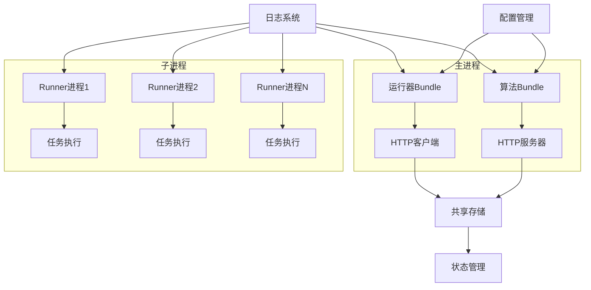

**图表来源**
- [agentlightning/execution/client_server.py](file://agentlightning/execution/client_server.py#L1-L50)

### 执行角色模式

ClientServerExecutionStrategy支持三种执行角色：

1. **algorithm**: 仅运行算法逻辑，启动HTTP服务器
2. **runner**: 仅运行运行器逻辑，连接现有服务器
3. **both**: 同时运行算法和运行器，实现本地编排

每种角色都有特定的资源配置和性能特征：

| 角色类型 | 进程数量 | 内存占用 | 网络开销 | 推荐场景 |
|---------|---------|---------|---------|---------|
| algorithm | 1个服务器进程 | 中等 | 高（监听端口） | 单节点训练 |
| runner | N个工作进程 | 低 | 中等（HTTP请求） | 大规模推理 |
| both | 1+N个进程 | 高 | 最高（本地通信+HTTP） | 开发调试 |

**章节来源**
- [agentlightning/execution/client_server.py](file://agentlightning/execution/client_server.py#L25-L85)

## 超时配置与进程管理

### 关键超时参数

ClientServerExecutionStrategy提供了两个关键的超时配置参数，直接影响系统的响应性和稳定性：

#### graceful_timeout参数

`graceful_timeout`定义了协作式停止信号后等待的时间窗口。在此期间，子进程应该能够优雅地完成当前任务并退出。

**默认值**: 5.0秒  
**影响范围**: 进程优雅关闭阶段  
**性能考虑**: 
- 较短的值可能导致未完成的任务被中断
- 较长的值增加系统响应时间但提高任务完整性

#### terminate_timeout参数

`terminate_timeout`定义了各个终止阶段之间等待的时间间隔。这个参数在所有强制终止步骤中重复使用。

**默认值**: 5.0秒  
**影响范围**: 强制终止阶段（SIGINT、terminate、kill）  
**性能考虑**:
- 用于处理对SIGINT信号无响应的进程
- 影响系统整体关闭时间
- 在高负载下可能需要适当调整

### 四步终止机制

ClientServerExecutionStrategy实现了严格的四步终止流程，确保进程能够有序退出：

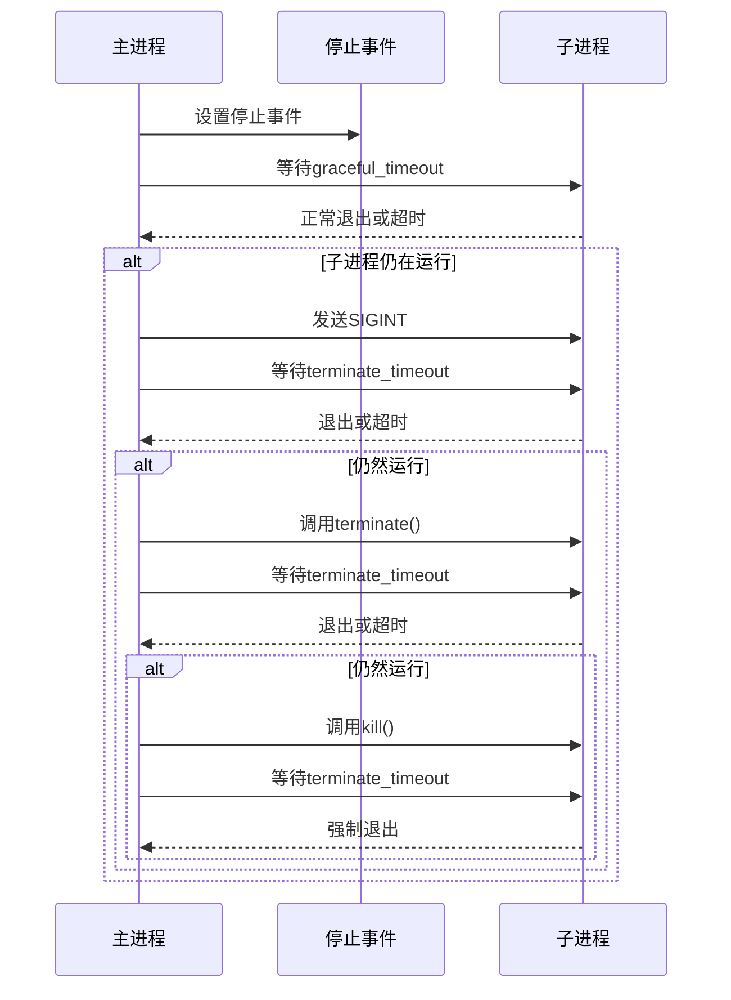

**图表来源**
- [agentlightning/execution/client_server.py](file://agentlightning/execution/client_server.py#L290-L340)

### 进程管理策略

#### 进程池管理

对于多运行器场景，ClientServerExecutionStrategy维护一个进程池，支持动态扩展和收缩：

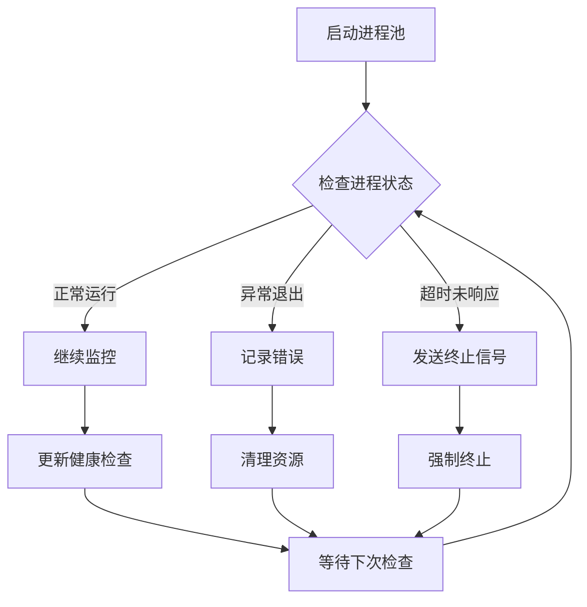

**图表来源**
- [agentlightning/execution/client_server.py](file://agentlightning/execution/client_server.py#L250-L290)

#### 资源释放流程

每个进程的资源释放遵循严格的顺序：

1. **存储连接关闭**: 断开与共享存储的连接
2. **HTTP客户端/服务器停止**: 关闭网络服务
3. **临时文件清理**: 删除临时生成的数据
4. **内存释放**: 清理Python对象引用

**章节来源**
- [agentlightning/execution/client_server.py](file://agentlightning/execution/client_server.py#L340-L434)

## 资源监控与内存优化

### 内存容量检测

Agent Lightning实现了智能的内存容量检测机制，自动适应运行环境：

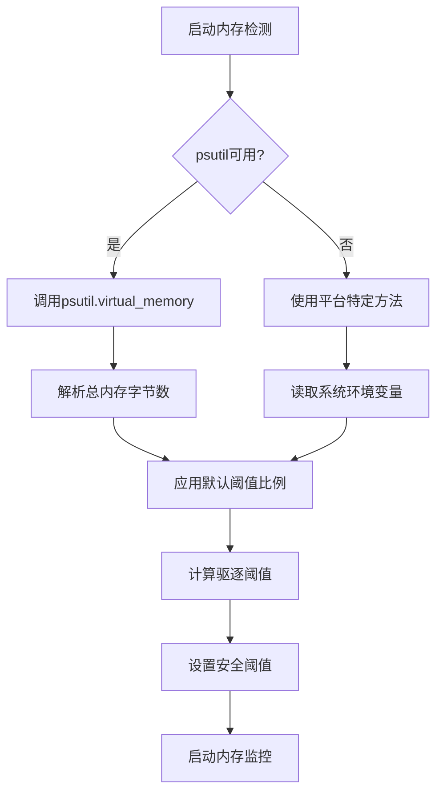

**图表来源**
- [agentlightning/store/memory.py](file://agentlightning/store/memory.py#L140-L160)

### 内存阈值配置

框架提供了灵活的内存阈值配置选项：

| 参数名称 | 默认值 | 类型 | 描述 |
|---------|-------|------|------|
| eviction_memory_threshold | 总内存的70% | float/int | 驱逐触发阈值 |
| safe_memory_threshold | 驱逐阈值的80% | float/int | 安全保留阈值 |
| default_ratio | 0.7 | float | 默认阈值比例 |

### 自动驱逐机制

当内存使用超过阈值时，系统会自动启动驱逐机制：

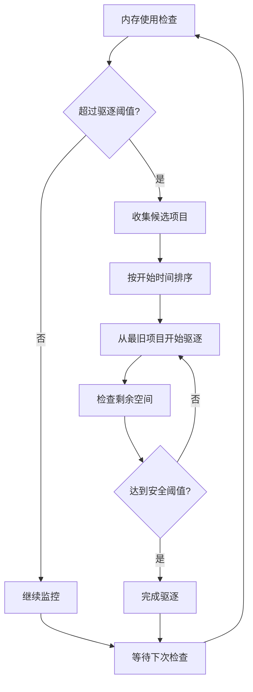

**图表来源**
- [agentlightning/store/memory.py](file://agentlightning/store/memory.py#L639-L664)

### 资源类型优化

不同的资源类型采用不同的优化策略：

#### LLM资源优化

LLM资源通过代理层实现动态路由，支持：
- 滚动ID注入
- 尝试ID跟踪
- 请求重写

#### Prompt模板优化

Prompt模板采用缓存机制：
- 字符串格式化优化
- 引擎特定优化
- 内存预分配

**章节来源**
- [agentlightning/types/resources.py](file://agentlightning/types/resources.py#L40-L120)

## 日志系统与性能分析

### 日志配置系统

Agent Lightning提供了统一的日志配置接口，支持多种输出格式和级别控制：

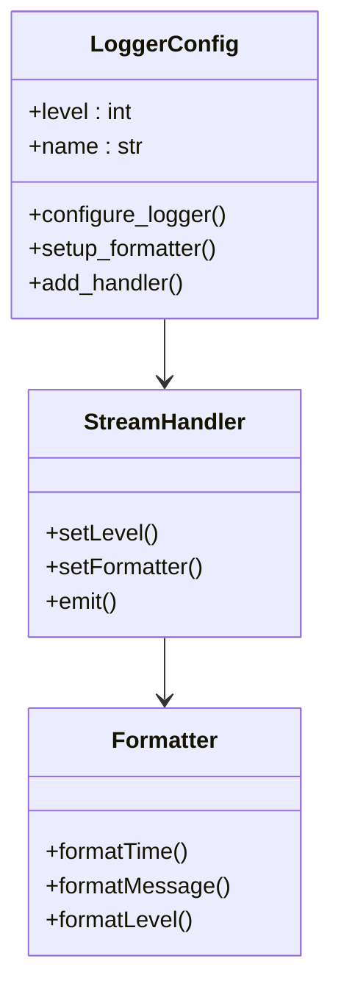

**图表来源**
- [agentlightning/logging.py](file://agentlightning/logging.py#L10-L55)

### 性能指标追踪

系统内置了多个性能指标追踪点：

#### 进程生命周期指标

| 指标名称 | 记录时机 | 用途 |
|---------|---------|------|
| 进程启动时间 | `_spawn_runners` | 测量进程创建延迟 |
| 进程退出码 | `_check_process_exitcodes` | 检测异常退出 |
| 进程存活状态 | `_join_until_deadline` | 监控进程健康度 |

#### 网络通信指标

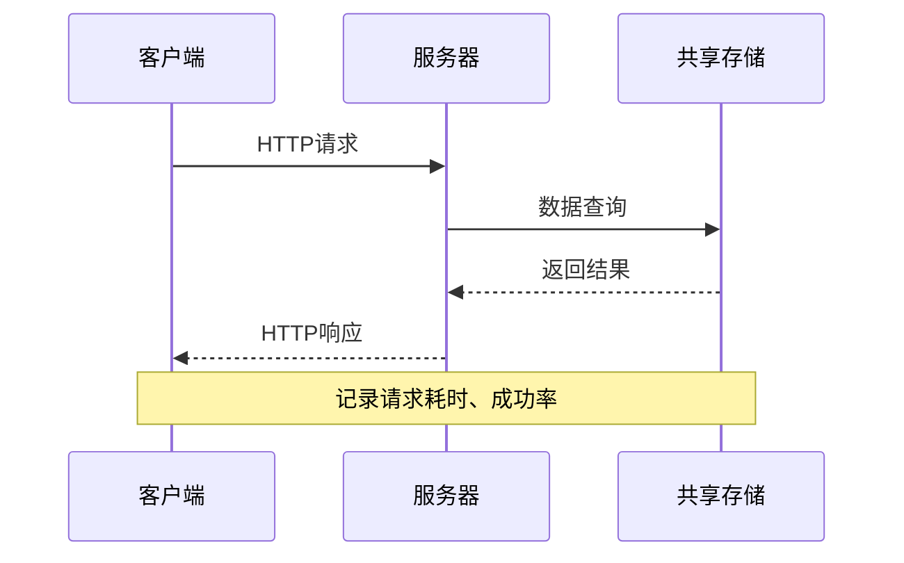

**图表来源**
- [agentlightning/server.py](file://agentlightning/server.py#L200-L300)

### 日志分析技巧

#### 性能瓶颈识别

通过分析日志可以识别常见的性能瓶颈：

1. **进程启动缓慢**: 检查`_spawn_runners`日志
2. **网络超时**: 查找HTTP请求失败记录
3. **内存泄漏**: 监控内存使用趋势
4. **死锁问题**: 分析进程状态变化

#### 关键日志模式

```python
# 进程启动成功
logger.debug("Spawned runner process %s (pid=%s)", process.name, process.pid)

# 网络请求超时
logger.warning("Task %s timed out after %s seconds", task_id, timeout)

# 内存驱逐触发
logger.info("Evicting spans for %s rollouts to free up memory", len(candidates))
```

**章节来源**
- [agentlightning/logging.py](file://agentlightning/logging.py#L1-L55)

## 环境变量配置

### 核心环境变量

Agent Lightning支持通过环境变量进行配置，提供灵活的部署选项：

| 变量名 | 默认值 | 描述 | 性能影响 |
|-------|-------|------|---------|
| AGL_CURRENT_ROLE | both | 当前进程角色 | 决定进程行为模式 |
| AGL_SERVER_HOST | localhost | 服务器绑定地址 | 影响网络性能 |
| AGL_SERVER_PORT | 4747 | 服务器端口号 | 端口冲突风险 |
| AGL_MANAGED_STORE | true | 是否自动管理存储 | 控制存储初始化 |

### 配置优先级

环境变量配置遵循以下优先级：
1. **命令行参数** - 最高优先级
2. **环境变量** - 中等优先级  
3. **默认值** - 最低优先级

### 生产环境配置示例

```bash
# 高性能生产环境配置
export AGL_CURRENT_ROLE="both"
export AGL_SERVER_HOST="0.0.0.0"
export AGL_SERVER_PORT="4747"
export AGL_MANAGED_STORE="true"
export GRACEFUL_TIMEOUT="10.0"
export TERMINATE_TIMEOUT="10.0"
```

**章节来源**
- [agentlightning/config.py](file://agentlightning/config.py#L1-L100)

## 性能基准测试

### 基准测试框架

Agent Lightning包含完整的基准测试套件，覆盖各种性能场景：

#### 进程管理测试

测试涵盖了进程启动、停止、超时等各种边界情况：

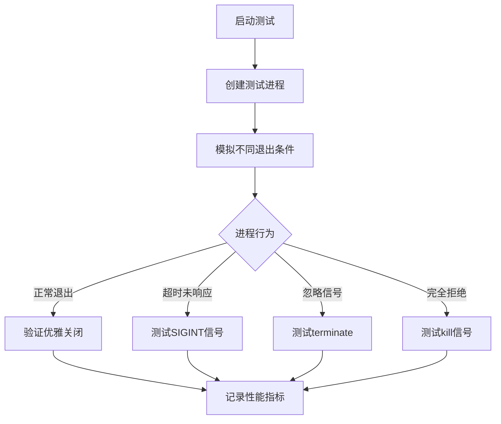

**图表来源**
- [tests/execution/test_client_server.py](file://tests/execution/test_client_server.py#L450-L670)

#### 内存使用测试

内存测试验证了驱逐机制的有效性：

| 测试场景 | 验证内容 | 预期结果 |
|---------|---------|---------|
| 内存阈值检测 | 自动检测系统内存容量 | 准确识别 |
| 驱逐触发点 | 超过70%时启动驱逐 | 正确触发 |
| 安全阈值保证 | 驱逐后保留20%可用内存 | 符合要求 |
| 驱逐效率 | 快速释放足够内存 | 时间合理 |

### 实际测试用例

#### 20 Questions训练性能

基于Q20训练脚本的实际性能数据：

```python
# 典型配置参数
LLM_TIMEOUT = 120.0  # LLM请求超时
GRACEFUL_TIMEOUT = 5.0  # 协作关闭超时
TERMINATE_TIMEOUT = 5.0  # 强制终止超时
```

#### SQL Agent训练性能

Spider SQL Agent的性能配置：

```python
# GPU内存优化配置
gpu_memory_utilization = 0.8  # GPU内存使用率
ppo_micro_batch_size_per_gpu = 4  # 微批次大小
log_prob_micro_batch_size_per_gpu = 4  # 对数概率批次
```

**章节来源**
- [examples/tinker/q20_train.py](file://examples/tinker/q20_train.py#L80-L120)
- [examples/spider/train_sql_agent.py](file://examples/spider/train_sql_agent.py#L40-L80)

## 负载场景优化策略

### 高并发场景

对于高并发训练场景，建议采用以下优化策略：

#### 进程池优化

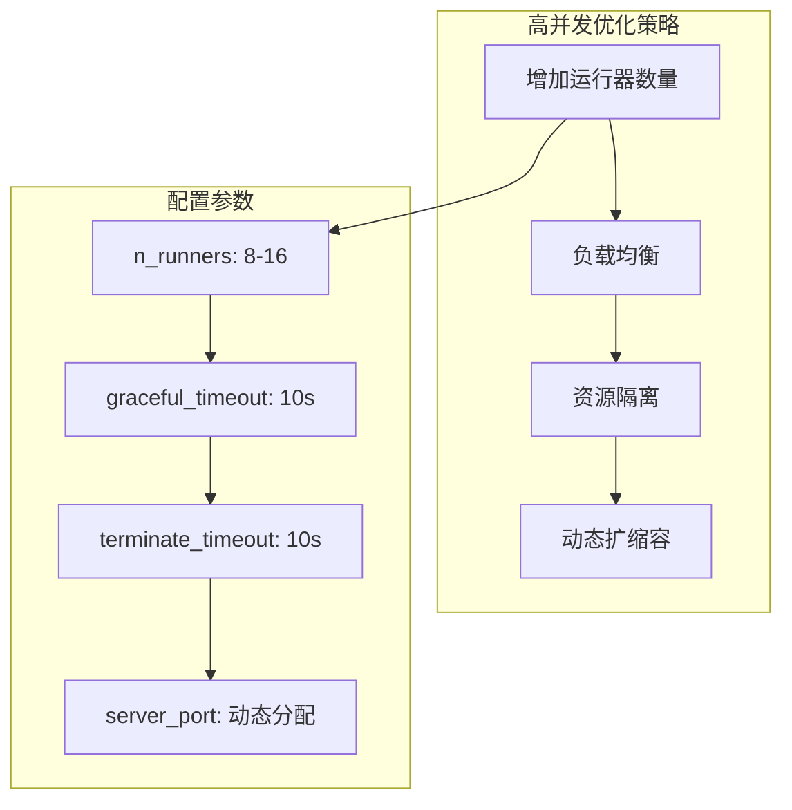

#### 网络优化

- **连接池复用**: 减少HTTP连接开销
- **压缩传输**: 启用gzip压缩
- **批量处理**: 合并小请求

### 大模型训练优化

针对大模型训练的特殊需求：

#### 内存管理

```python
# 大模型内存配置
memory_config = {
    "eviction_memory_threshold": 0.6,  # 提前触发驱逐
    "safe_memory_threshold": 0.4,      # 更保守的安全阈值
    "gpu_memory_utilization": 0.9      # GPU内存充分利用
}
```

#### 并行策略

- **张量并行**: 分布式模型权重
- **流水线并行**: 任务流水线化
- **数据并行**: 批次数据分布

### 低延迟场景

对于实时推理场景的优化：

#### 缓存策略

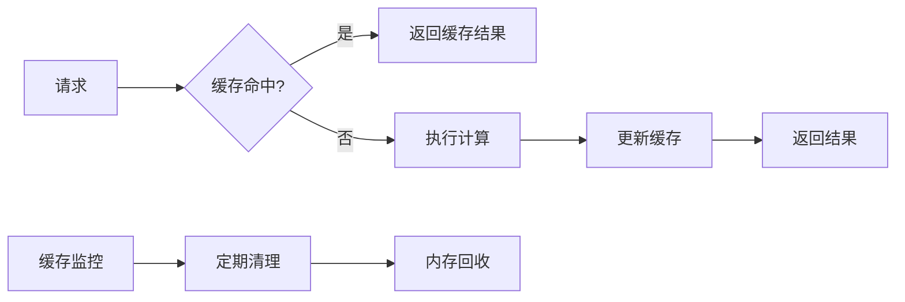

#### 连接优化

- **keep-alive连接**: 维持HTTP连接
- **预热机制**: 预先建立连接
- **快速失败**: 及时检测连接问题

## 故障排除指南

### 常见性能问题

#### 进程启动失败

**症状**: 进程无法启动或立即退出
**排查步骤**:
1. 检查端口是否被占用
2. 验证环境变量配置
3. 查看进程权限设置
4. 检查依赖库版本兼容性

**解决方案**:
```bash
# 检查端口占用
netstat -tulpn | grep :4747

# 验证环境变量
echo $AGL_CURRENT_ROLE
echo $AGL_SERVER_PORT

# 检查进程权限
ls -la /tmp/agentlightning
```

#### 内存泄漏问题

**症状**: 内存使用持续增长
**排查步骤**:
1. 监控内存使用趋势
2. 检查对象引用计数
3. 分析垃圾回收频率
4. 查看驱逐日志

**解决方案**:
```python
# 调整内存阈值
os.environ["MEMORY_THRESHOLD_RATIO"] = "0.8"
```

#### 网络超时问题

**症状**: HTTP请求频繁超时
**排查步骤**:
1. 检查网络连接质量
2. 验证防火墙设置
3. 监控服务器负载
4. 分析请求队列长度

**解决方案**:
```python
# 增加超时时间
graceful_timeout = 10.0
terminate_timeout = 10.0
```

### 性能调优工具

#### 日志分析工具

```python
# 性能日志分析脚本
import re
import json
from collections import defaultdict

def analyze_performance_logs(log_file):
    """分析性能日志文件"""
    patterns = {
        'process_start': r'Spawned runner process \w+ \(pid=(\d+)\)',
        'process_end': r'Runner \w+ completed successfully',
        'timeout': r'Task \w+ timed out',
        'memory': r'Freed up (\d+) bytes of memory'
    }
    
    results = defaultdict(list)
    
    with open(log_file) as f:
        for line in f:
            for key, pattern in patterns.items():
                match = re.search(pattern, line)
                if match:
                    results[key].append(line.strip())
    
    return dict(results)
```

#### 性能监控脚本

```python
# 实时性能监控
import psutil
import time
from datetime import datetime

def monitor_system_performance(interval=5):
    """监控系统性能指标"""
    while True:
        cpu_percent = psutil.cpu_percent()
        memory = psutil.virtual_memory()
        disk_io = psutil.disk_io_counters()
        
        print(f"{datetime.now()} - CPU: {cpu_percent}%, "
              f"Memory: {memory.percent}%, "
              f"Disk Read: {disk_io.read_bytes}, "
              f"Disk Write: {disk_io.write_bytes}")
        
        time.sleep(interval)
```

## 最佳实践建议

### 生产环境部署

#### 硬件配置建议

| 组件 | 推荐配置 | 说明 |
|------|---------|------|
| CPU | 16核以上 | 支持多进程并行 |
| 内存 | 64GB以上 | 满足大模型训练需求 |
| 网络 | 10Gbps | 减少网络延迟 |
| 存储 | SSD | 提高I/O性能 |

#### 软件环境配置

```bash
# 生产环境shell配置
export PYTHONPATH=/opt/agentlightning:$PYTHONPATH
export OMP_NUM_THREADS=4
export MKL_NUM_THREADS=4

# 系统优化
ulimit -n 65536  # 增加文件描述符限制
sysctl vm.swappiness=1  # 减少交换使用
```

### 性能监控配置

#### 关键指标监控

```python
# 性能监控配置
MONITORING_CONFIG = {
    "metrics": [
        "cpu_usage",
        "memory_usage", 
        "network_io",
        "process_count",
        "error_rate"
    ],
    "alerts": {
        "cpu_threshold": 80,
        "memory_threshold": 90,
        "error_threshold": 0.05
    },
    "retention": "30d"
}
```

#### 日志轮转策略

```bash
# 日志轮转配置
LOG_ROTATION = {
    "max_size": "100MB",
    "backup_count": 10,
    "compress": True,
    "encoding": "utf-8"
}
```

### 容量规划

#### 训练负载评估

根据不同的训练场景进行容量规划：

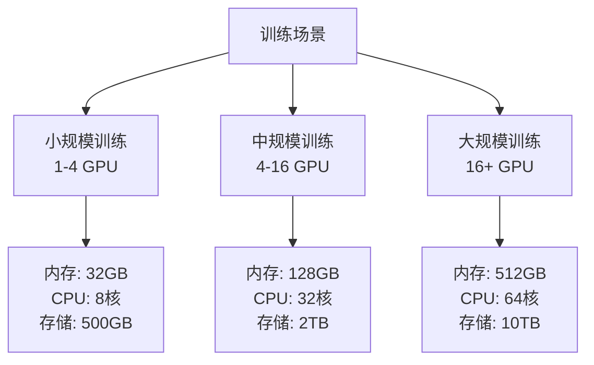

#### 扩展性考虑

- **水平扩展**: 通过增加运行器数量提升吞吐量
- **垂直扩展**: 通过增加单机资源提升性能
- **混合扩展**: 结合水平和垂直扩展策略

### 安全与可靠性

#### 进程隔离

```python
# 进程隔离配置
PROCESS_SECURITY = {
    "user": "agentlightning",
    "group": "agents",
    "umask": "022",
    "limits": {
        "nofile": 65536,
        "nproc": 4096
    }
}
```

#### 数据保护

- **加密存储**: 敏感数据加密保存
- **访问控制**: 基于角色的权限管理
- **审计日志**: 完整的操作记录

通过遵循这些最佳实践，可以确保Agent Lightning在生产环境中稳定高效地运行，同时保持良好的可维护性和可扩展性。