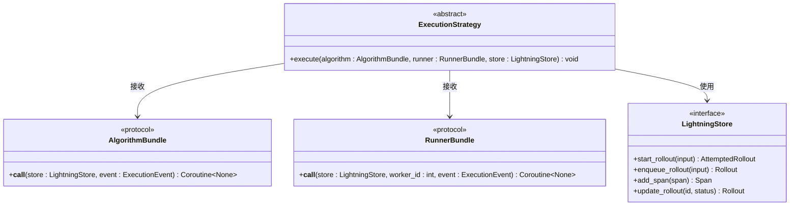

# 自定义扩展开发指南

<cite>
**本文档中引用的文件**
- [agentlightning/execution/base.py](file://agentlightning/execution/base.py)
- [agentlightning/execution/inter_process.py](file://agentlightning/execution/inter_process.py)
- [agentlightning/execution/shared_memory.py](file://agentlightning/execution/shared_memory.py)
- [agentlightning/execution/client_server.py](file://agentlightning/execution/client_server.py)
- [agentlightning/execution/events.py](file://agentlightning/execution/events.py)
- [agentlightning/execution/__init__.py](file://agentlightning/execution/__init__.py)
- [agentlightning/trainer/registry.py](file://agentlightning/trainer/registry.py)
- [agentlightning/trainer/trainer.py](file://agentlightning/trainer/trainer.py)
- [agentlightning/trainer/init_utils.py](file://agentlightning/trainer/init_utils.py)
- [agentlightning/store/base.py](file://agentlightning/store/base.py)
- [examples/calc_x/train_calc_agent.py](file://examples/calc_x/train_calc_agent.py)
</cite>

## 目录
1. [概述](#概述)
2. [扩展架构设计](#扩展架构设计)
3. [ExecutionStrategy基类详解](#executionstrategy基类详解)
4. [扩展点设计原则](#扩展点设计原则)
5. [实现自定义执行策略](#实现自定义执行策略)
6. [注册机制详解](#注册机制详解)
7. [与现有系统的交互契约](#与现有系统的交互契约)
8. [调试和测试技巧](#调试和测试技巧)
9. [最佳实践指南](#最佳实践指南)
10. [故障排除](#故障排除)

## 概述

Agent-Lightning提供了一个灵活的扩展框架，允许开发者基于`ExecutionStrategy`基类实现自定义的执行策略。该框架支持多种执行模式，从单进程共享内存到多进程客户端-服务器架构，并提供了完善的注册机制和生命周期管理。

### 核心概念

- **ExecutionStrategy**: 执行策略基类，定义了算法和运行器的协调接口
- **AlgorithmBundle**: 算法逻辑封装，负责训练和推理任务
- **RunnerBundle**: 运行器逻辑封装，负责代理执行和工作负载管理
- **ExecutionEvent**: 协作式停止事件，用于进程间通信和优雅关闭

## 扩展架构设计

### 整体架构图


**图表来源**
- [agentlightning/trainer/trainer.py](file://agentlightning/trainer/trainer.py#L1-L50)
- [agentlightning/execution/base.py](file://agentlightning/execution/base.py#L1-L50)
- [agentlightning/trainer/registry.py](file://agentlightning/trainer/registry.py#L1-L13)

### 组件关系图


**图表来源**
- [agentlightning/execution/base.py](file://agentlightning/execution/base.py#L50-L107)
- [agentlightning/execution/shared_memory.py](file://agentlightning/execution/shared_memory.py#L15-L50)
- [agentlightning/execution/client_server.py](file://agentlightning/execution/client_server.py#L15-L80)

**章节来源**
- [agentlightning/execution/base.py](file://agentlightning/execution/base.py#L1-L107)
- [agentlightning/execution/shared_memory.py](file://agentlightning/execution/shared_memory.py#L1-L280)
- [agentlightning/execution/client_server.py](file://agentlightning/execution/client_server.py#L1-L434)

## ExecutionStrategy基类详解

### 基类结构

`ExecutionStrategy`是所有执行策略的核心抽象基类，定义了统一的接口契约：



**图表来源**
- [agentlightning/execution/base.py](file://agentlightning/execution/base.py#L50-L107)

### 关键特性

1. **协议设计**: 使用Python协议(`Protocol`)确保类型安全
2. **异步支持**: 支持协程调用，适应现代异步编程模型
3. **事件驱动**: 通过`ExecutionEvent`实现协作式停止
4. **存储共享**: 共享`LightningStore`实例进行状态管理

### 实现要求

每个`ExecutionStrategy`实现必须满足以下要求：

1. **执行契约**: 必须正确传播`KeyboardInterrupt`信号
2. **资源清理**: 在错误发生时确保资源得到释放
3. **事件同步**: 正确处理`stop_evt`事件的设置和等待
4. **异常处理**: 良好地处理和传播异常

**章节来源**
- [agentlightning/execution/base.py](file://agentlightning/execution/base.py#L50-L107)

## 扩展点设计原则

### 设计哲学

Agent-Lightning的扩展设计遵循以下核心原则：

1. **单一职责**: 每个策略专注于特定的执行模式
2. **可插拔性**: 通过注册机制实现策略的动态选择
3. **向后兼容**: 新策略必须兼容现有接口
4. **配置驱动**: 通过配置参数控制策略行为

### 扩展点分类


### 配置机制

系统提供了多层次的配置机制：

1. **字符串别名**: 通过`alias`属性提供简短标识符
2. **字典配置**: 通过配置字典传递复杂参数
3. **环境变量**: 通过环境变量覆盖默认值
4. **直接实例**: 提供完全控制的实例化方式

**章节来源**
- [agentlightning/trainer/init_utils.py](file://agentlightning/trainer/init_utils.py#L137-L263)
- [agentlightning/trainer/registry.py](file://agentlightning/trainer/registry.py#L1-L13)

## 实现自定义执行策略

### 完整实现示例

以下是一个完整的自定义执行策略实现示例：

```python
# 示例：自定义分布式执行策略
class DistributedExecutionStrategy(ExecutionStrategy):
    """分布式执行策略示例"""
    
    alias: str = "dist"
    
    def __init__(
        self,
        cluster_nodes: List[str],
        local_rank: int = 0,
        world_size: int = 1,
        timeout: float = 30.0,
        **kwargs
    ):
        self.cluster_nodes = cluster_nodes
        self.local_rank = local_rank
        self.world_size = world_size
        self.timeout = timeout
        
        # 初始化分布式环境
        self._setup_distributed_environment()
    
    def execute(self, algorithm, runner, store):
        """执行分布式算法和运行器"""
        # 创建分布式事件
        dist_event = self._create_dist_event()
        
        try:
            if self.local_rank == 0:
                # 主节点执行算法
                self._execute_algorithm_distributed(algorithm, store, dist_event)
            else:
                # 工作节点执行运行器
                self._execute_runner_distributed(runner, store, self.local_rank, dist_event)
            
            # 同步所有节点
            self._sync_all_nodes()
            
        finally:
            # 清理分布式资源
            self._cleanup_distributed_resources()
    
    def _setup_distributed_environment(self):
        """设置分布式环境"""
        # 实现分布式初始化逻辑
        pass
    
    def _execute_algorithm_distributed(self, algorithm, store, event):
        """在分布式环境中执行算法"""
        # 实现分布式算法执行逻辑
        pass
    
    def _execute_runner_distributed(self, runner, store, worker_id, event):
        """在分布式环境中执行运行器"""
        # 实现分布式运行器执行逻辑
        pass
    
    def _create_dist_event(self):
        """创建分布式事件"""
        # 实现分布式事件创建逻辑
        pass
    
    def _sync_all_nodes(self):
        """同步所有节点"""
        # 实现节点同步逻辑
        pass
    
    def _cleanup_distributed_resources(self):
        """清理分布式资源"""
        # 实现资源清理逻辑
        pass
```

### 实现步骤详解

#### 第一步：继承基类并定义别名

```python
class CustomExecutionStrategy(ExecutionStrategy):
    """自定义执行策略"""
    
    alias: str = "custom"  # 注册别名
```

#### 第二步：实现构造函数

```python
def __init__(self, param1: str, param2: int = 10, **kwargs):
    """自定义构造函数"""
    self.param1 = param1
    self.param2 = param2
    # 处理其他参数...
```

#### 第三步：实现execute方法

```python
def execute(self, algorithm, runner, store):
    """主要执行逻辑"""
    # 1. 创建事件对象
    stop_evt = self._create_stop_event()
    
    # 2. 启动算法和运行器
    algorithm_task = asyncio.create_task(
        self._run_algorithm(algorithm, store, stop_evt)
    )
    runner_tasks = [
        asyncio.create_task(
            self._run_runner(runner, store, i, stop_evt)
        )
        for i in range(self.n_runners)
    ]
    
    # 3. 等待完成或中断
    try:
        await asyncio.gather(algorithm_task, *runner_tasks)
    except KeyboardInterrupt:
        logger.warning("收到中断信号，启动优雅关闭...")
        stop_evt.set()
        await asyncio.gather(*runner_tasks, return_exceptions=True)
        raise
```

#### 第四步：实现辅助方法

```python
async def _run_algorithm(self, algorithm, store, event):
    """运行算法逻辑"""
    try:
        await algorithm(store, event)
    except Exception as e:
        logger.exception("算法执行失败: %s", e)
        event.set()  # 触发停止事件
        raise

async def _run_runner(self, runner, store, worker_id, event):
    """运行运行器逻辑"""
    try:
        await runner(store, worker_id, event)
    except Exception as e:
        logger.exception("运行器(%d)执行失败: %s", worker_id, e)
        event.set()  # 触发停止事件
        raise
```

### 与现有策略的对比


**图表来源**
- [agentlightning/execution/shared_memory.py](file://agentlightning/execution/shared_memory.py#L15-L50)
- [agentlightning/execution/client_server.py](file://agentlightning/execution/client_server.py#L15-L80)

**章节来源**
- [agentlightning/execution/base.py](file://agentlightning/execution/base.py#L50-L107)
- [agentlightning/execution/shared_memory.py](file://agentlightning/execution/shared_memory.py#L15-L100)

## 注册机制详解

### 注册表结构

系统通过`ExecutionStrategyRegistry`维护策略映射：

```python
ExecutionStrategyRegistry = {
    "shm": "agentlightning.execution.shared_memory.SharedMemoryExecutionStrategy",
    "cs": "agentlightning.execution.client_server.ClientServerExecutionStrategy",
    # "ipc": "agentlightning.execution.inter_process.InterProcessExecutionStrategy",
}
```

### 添加新策略别名

要添加新的执行策略别名，需要修改注册表：

```python
# 修改 agentlightning/trainer/registry.py
ExecutionStrategyRegistry = {
    "shm": "agentlightning.execution.shared_memory.SharedMemoryExecutionStrategy",
    "cs": "agentlightning.execution.client_server.ClientServerExecutionStrategy",
    "dist": "my_package.custom_execution.CustomExecutionStrategy",  # 新增别名
}
```

### 注册机制的工作原理


**图表来源**
- [agentlightning/trainer/registry.py](file://agentlightning/trainer/registry.py#L1-L13)
- [agentlightning/trainer/init_utils.py](file://agentlightning/trainer/init_utils.py#L37-L67)

### 动态注册支持

系统支持运行时动态注册新策略：

```python
# 动态注册新策略
from agentlightning.trainer.registry import ExecutionStrategyRegistry

# 添加新的策略映射
ExecutionStrategyRegistry["new_strategy"] = "my_module.NewExecutionStrategy"

# 使用新策略
trainer = Trainer(
    strategy="new_strategy",  # 字符串别名
    # 或者使用字典配置
    strategy={
        "type": "new_strategy",
        "param1": "value1",
        "param2": 42
    }
)
```

### 配置字典支持

```python
# 字典配置方式
trainer = Trainer(
    strategy={
        "type": "custom",  # 别名
        "cluster_nodes": ["node1", "node2", "node3"],
        "local_rank": 0,
        "world_size": 3,
        "timeout": 60.0
    }
)
```

**章节来源**
- [agentlightning/trainer/registry.py](file://agentlightning/trainer/registry.py#L1-L13)
- [agentlightning/trainer/init_utils.py](file://agentlightning/trainer/init_utils.py#L37-L100)

## 与现有系统的交互契约

### Store交互契约

`LightningStore`是系统的核心数据持久化接口，所有策略都必须正确处理Store的交互：


**图表来源**
- [agentlightning/store/base.py](file://agentlightning/store/base.py#L50-L150)

### 事件同步契约

所有策略必须正确处理`ExecutionEvent`以实现协作式停止：

```python
class CustomExecutionStrategy(ExecutionStrategy):
    def execute(self, algorithm, runner, store):
        # 创建停止事件
        stop_evt = self._create_stop_event()
        
        try:
            # 启动算法和运行器
            algorithm_task = asyncio.create_task(
                self._run_algorithm(algorithm, store, stop_evt)
            )
            runner_tasks = [
                asyncio.create_task(
                    self._run_runner(runner, store, i, stop_evt)
                )
                for i in range(self.n_runners)
            ]
            
            # 等待完成或中断
            await self._wait_for_completion(algorithm_task, runner_tasks, stop_evt)
            
        except KeyboardInterrupt:
            # 处理中断信号
            logger.warning("收到中断信号，启动优雅关闭...")
            stop_evt.set()
            # 等待运行器完成
            await asyncio.gather(*runner_tasks, return_exceptions=True)
            raise
    
    async def _wait_for_completion(self, algorithm_task, runner_tasks, stop_evt):
        """等待完成或中断"""
        while True:
            # 检查是否需要停止
            if stop_evt.is_set():
                break
                
            # 检查任务是否完成
            if algorithm_task.done() and all(task.done() for task in runner_tasks):
                break
                
            # 等待一段时间
            await asyncio.sleep(0.1)
```

### 异常处理契约

```python
async def _run_algorithm(self, algorithm, store, event):
    """运行算法逻辑，包含完整的异常处理"""
    try:
        # 算法执行
        await algorithm(store, event)
        
    except asyncio.CancelledError:
        logger.info("算法被取消")
        raise
        
    except KeyboardInterrupt:
        logger.warning("算法收到中断信号")
        event.set()  # 触发停止事件
        raise
        
    except Exception as e:
        logger.exception("算法执行异常: %s", e)
        event.set()  # 发生错误时触发停止
        # 可以在这里添加错误恢复逻辑
        raise
```

### 资源清理契约

```python
def execute(self, algorithm, runner, store):
    """主执行方法，包含完整的资源清理"""
    stop_evt = None
    cleanup_tasks = []
    
    try:
        stop_evt = self._create_stop_event()
        
        # 启动算法和运行器
        algorithm_task = asyncio.create_task(
            self._run_algorithm(algorithm, store, stop_evt)
        )
        runner_tasks = [
            asyncio.create_task(
                self._run_runner(runner, store, i, stop_evt)
            )
            for i in range(self.n_runners)
        ]
        
        # 等待完成
        await asyncio.gather(algorithm_task, *runner_tasks)
        
    except Exception as e:
        logger.exception("执行过程中发生错误: %s", e)
        if stop_evt:
            stop_evt.set()
        raise
        
    finally:
        # 清理资源
        if stop_evt:
            stop_evt.set()
        
        # 等待所有任务完成
        if 'runner_tasks' in locals():
            await asyncio.gather(*runner_tasks, return_exceptions=True)
        
        # 执行额外的清理工作
        self._perform_cleanup()
```

**章节来源**
- [agentlightning/store/base.py](file://agentlightning/store/base.py#L1-L516)
- [agentlightning/execution/events.py](file://agentlightning/execution/events.py#L1-L70)

## 调试和测试技巧

### 日志注入技巧

```python
import logging
import sys

# 设置详细的日志级别
logging.basicConfig(
    level=logging.DEBUG,
    format='%(asctime)s - %(name)s - %(levelname)s - %(message)s',
    stream=sys.stdout
)

# 为自定义策略添加专门的日志器
logger = logging.getLogger("custom_execution")

class DebuggingExecutionStrategy(ExecutionStrategy):
    def __init__(self, debug_mode: bool = True, **kwargs):
        self.debug_mode = debug_mode
        if debug_mode:
            self.logger = logger
        else:
            self.logger = logging.getLogger("custom_execution.disabled")
    
    def execute(self, algorithm, runner, store):
        self.logger.info("开始执行自定义策略")
        self.logger.debug("算法类型: %s", type(algorithm))
        self.logger.debug("运行器类型: %s", type(runner))
        self.logger.debug("存储类型: %s", type(store))
        
        # 执行逻辑...
```

### 单元测试框架集成

```python
import pytest
import asyncio
from unittest.mock import Mock, AsyncMock

class TestCustomExecutionStrategy:
    @pytest.fixture
    def strategy(self):
        return CustomExecutionStrategy(param1="test")
    
    @pytest.fixture
    def mock_algorithm(self):
        return AsyncMock()
    
    @pytest.fixture
    def mock_runner(self):
        return AsyncMock()
    
    @pytest.fixture
    def mock_store(self):
        return Mock()
    
    async def test_execute_basic_flow(self, strategy, mock_algorithm, mock_runner, mock_store):
        """测试基本执行流程"""
        # 设置模拟行为
        mock_algorithm.return_value = None
        mock_runner.return_value = None
        
        # 执行
        await strategy.execute(mock_algorithm, mock_runner, mock_store)
        
        # 验证调用
        mock_algorithm.assert_called_once()
        mock_runner.assert_called_once()
    
    async def test_keyboard_interrupt_handling(self, strategy, mock_algorithm, mock_runner, mock_store):
        """测试键盘中断处理"""
        # 设置模拟抛出中断
        mock_algorithm.side_effect = KeyboardInterrupt("测试中断")
        
        # 应该传播中断信号
        with pytest.raises(KeyboardInterrupt):
            await strategy.execute(mock_algorithm, mock_runner, mock_store)
        
        # 验证算法被调用但运行器没有
        mock_algorithm.assert_called_once()
        mock_runner.assert_not_called()
```

### 进程间通信验证方法

```python
import multiprocessing
import time
from agentlightning.execution.events import MultiprocessingEvent

class IPCValidationMixin:
    """进程间通信验证混入类"""
    
    def validate_ipc_communication(self, strategy):
        """验证进程间通信"""
        ctx = multiprocessing.get_context()
        event = MultiprocessingEvent(ctx=ctx)
        
        # 测试事件设置
        assert not event.is_set()
        event.set()
        assert event.is_set()
        
        # 测试事件等待
        start_time = time.time()
        event.wait(timeout=0.1)
        wait_time = time.time() - start_time
        assert wait_time < 0.2  # 应该很快返回
        
        # 测试多个进程间的同步
        manager = ctx.Manager()
        shared_flag = manager.Value('b', False)
        
        def worker_process(strategy_instance, event, flag):
            # 工作进程逻辑
            time.sleep(0.1)
            flag.value = True
            event.set()
        
        # 启动工作进程
        process = ctx.Process(
            target=worker_process,
            args=(strategy, event, shared_flag)
        )
        process.start()
        
        # 主进程等待
        event.wait(timeout=1.0)
        
        # 验证同步
        assert shared_flag.value == True
        assert event.is_set()
        
        process.join()
```

### 性能监控集成

```python
import time
import psutil
from contextlib import contextmanager

@contextmanager
def performance_monitoring(label: str):
    """性能监控上下文管理器"""
    start_time = time.time()
    start_memory = psutil.Process().memory_info().rss / 1024 / 1024  # MB
    
    try:
        yield
    finally:
        end_time = time.time()
        end_memory = psutil.Process().memory_info().rss / 1024 / 1024  # MB
        
        duration = end_time - start_time
        memory_delta = end_memory - start_memory
        
        logger.info(
            "%s 完成: 耗时 %.2f秒, 内存变化 %.2fMB",
            label, duration, memory_delta
        )

class MonitoredExecutionStrategy(ExecutionStrategy):
    def execute(self, algorithm, runner, store):
        with performance_monitoring("自定义策略执行"):
            # 执行逻辑
            pass
```

**章节来源**
- [tests/execution/test_client_server.py](file://tests/execution/test_client_server.py#L1-L100)
- [tests/execution/test_shared_memory.py](file://tests/execution/test_shared_memory.py#L1-L100)

## 最佳实践指南

### 设计原则

1. **单一职责**: 每个策略只负责一种执行模式
2. **配置驱动**: 通过参数控制行为，避免硬编码
3. **错误隔离**: 确保单个组件的失败不会影响整个系统
4. **资源管理**: 正确处理资源分配和释放

### 性能优化建议

```python
class OptimizedExecutionStrategy(ExecutionStrategy):
    def __init__(self, 
                 batch_size: int = 32,
                 max_concurrent: int = 10,
                 cache_enabled: bool = True,
                 **kwargs):
        self.batch_size = batch_size
        self.max_concurrent = max_concurrent
        self.cache_enabled = cache_enabled
        
        # 预分配资源池
        self._resource_pool = self._initialize_resource_pool()
    
    def _initialize_resource_pool(self):
        """预分配资源池以提高性能"""
        pool = []
        for i in range(self.max_concurrent):
            pool.append(self._create_resource())
        return pool
    
    async def _acquire_resource(self):
        """从池中获取资源"""
        if self._resource_pool:
            return self._resource_pool.pop()
        # 如果池为空，可以考虑动态创建
        return self._create_resource()
    
    def _release_resource(self, resource):
        """归还资源到池中"""
        if len(self._resource_pool) < self.max_concurrent:
            self._resource_pool.append(resource)
```

### 错误处理最佳实践

```python
class RobustExecutionStrategy(ExecutionStrategy):
    def execute(self, algorithm, runner, store):
        # 1. 参数验证
        self._validate_parameters(algorithm, runner, store)
        
        # 2. 资源检查
        self._check_resources()
        
        # 3. 执行包装
        try:
            return self._safe_execute(algorithm, runner, store)
        except Exception as e:
            self._handle_execution_error(e)
            raise
    
    def _validate_parameters(self, algorithm, runner, store):
        """验证输入参数"""
        if not callable(algorithm):
            raise ValueError("算法必须是可调用对象")
        if not callable(runner):
            raise ValueError("运行器必须是可调用对象")
        if not hasattr(store, 'start_rollout'):
            raise ValueError("存储必须实现LightningStore接口")
    
    def _check_resources(self):
        """检查系统资源"""
        # 检查内存
        mem_info = psutil.virtual_memory()
        if mem_info.percent > 90:
            logger.warning("可用内存不足: %d%%", mem_info.percent)
        
        # 检查CPU
        cpu_percent = psutil.cpu_percent(interval=1)
        if cpu_percent > 95:
            logger.warning("CPU使用率过高: %d%%", cpu_percent)
    
    def _handle_execution_error(self, error):
        """处理执行错误"""
        logger.error("执行策略失败: %s", error)
        # 记录错误详情
        self._log_error_details(error)
        # 清理资源
        self._cleanup_on_error()
```

### 配置管理最佳实践

```python
class ConfigurableExecutionStrategy(ExecutionStrategy):
    def __init__(self, config: Optional[Dict] = None, **kwargs):
        # 默认配置
        self._default_config = {
            "batch_size": 32,
            "timeout": 30.0,
            "retry_count": 3,
            "log_level": "INFO",
            "enable_profiling": False
        }
        
        # 合并配置
        self.config = {**self._default_config, **(config or {}), **kwargs}
        
        # 应用配置
        self._apply_config()
    
    def _apply_config(self):
        """应用配置参数"""
        # 设置日志级别
        logging.getLogger().setLevel(self.config["log_level"])
        
        # 配置超时
        self.timeout = self.config["timeout"]
        
        # 配置批处理大小
        self.batch_size = self.config["batch_size"]
    
    @classmethod
    def from_yaml(cls, yaml_path: str):
        """从YAML文件加载配置"""
        import yaml
        
        with open(yaml_path, 'r') as f:
            config = yaml.safe_load(f)
        
        return cls(config=config)
    
    @classmethod
    def from_env(cls):
        """从环境变量加载配置"""
        import os
        
        config = {}
        env_prefix = "CUSTOM_STRATEGY_"
        
        for key, value in os.environ.items():
            if key.startswith(env_prefix):
                # 移除前缀并转换为小写
                config_key = key[len(env_prefix):].lower()
                # 尝试解析值
                config[config_key] = cls._parse_env_value(value)
        
        return cls(config=config)
    
    @staticmethod
    def _parse_env_value(value: str):
        """解析环境变量值"""
        if value.lower() in ('true', 'yes', '1'):
            return True
        elif value.lower() in ('false', 'no', '0'):
            return False
        elif value.isdigit():
            return int(value)
        elif value.replace('.', '', 1).isdigit():
            return float(value)
        else:
            return value
```

**章节来源**
- [examples/calc_x/train_calc_agent.py](file://examples/calc_x/train_calc_agent.py#L1-L100)

## 故障排除

### 常见问题及解决方案

#### 1. 策略注册失败

**问题**: 策略无法通过别名使用

**诊断步骤**:
```python
# 检查注册表
from agentlightning.trainer.registry import ExecutionStrategyRegistry
print("已注册的策略:", list(ExecutionStrategyRegistry.keys()))

# 检查导入路径
try:
    from my_package.custom_execution import CustomExecutionStrategy
    print("类导入成功")
except ImportError as e:
    print("导入失败:", e)
```

**解决方案**:
```python
# 确保正确的导入路径
ExecutionStrategyRegistry["custom"] = "my_package.custom_execution.CustomExecutionStrategy"

# 或者使用绝对路径
ExecutionStrategyRegistry["custom"] = "absolute.path.to.CustomExecutionStrategy"
```

#### 2. 进程间通信问题

**问题**: 多进程策略中出现通信超时

**诊断方法**:
```python
import socket
import time

def diagnose_network_issues():
    """诊断网络通信问题"""
    # 测试本地连接
    try:
        sock = socket.socket(socket.AF_INET, socket.SOCK_STREAM)
        sock.settimeout(5.0)
        sock.connect(("localhost", 4747))
        print("本地连接正常")
        sock.close()
    except socket.error as e:
        print(f"本地连接失败: {e}")
    
    # 测试防火墙设置
    try:
        sock = socket.socket(socket.AF_INET, socket.SOCK_DGRAM)
        sock.settimeout(5.0)
        sock.sendto(b"test", ("localhost", 4747))
        sock.close()
        print("UDP通信正常")
    except socket.error as e:
        print(f"UDP通信失败: {e}")
```

#### 3. 资源泄漏问题

**问题**: 长时间运行后出现内存泄漏

**诊断工具**:
```python
import gc
import psutil
import tracemalloc

class MemoryProfiler:
    def __init__(self):
        self.process = psutil.Process()
        tracemalloc.start()
    
    def report(self):
        """报告内存使用情况"""
        # 当前内存使用
        memory_mb = self.process.memory_info().rss / 1024 / 1024
        print(f"当前内存使用: {memory_mb:.2f} MB")
        
        # 对象统计
        print(f"活动对象数量: {len(gc.get_objects())}")
        
        # 内存快照
        snapshot = tracemalloc.take_snapshot()
        top_stats = snapshot.statistics('lineno')
        print("\nTop 10 内存消耗:")
        for stat in top_stats[:10]:
            print(stat)
    
    def check_leaks(self):
        """检查潜在的内存泄漏"""
        initial_memory = self.process.memory_info().rss
        time.sleep(10)  # 等待一段时间
        final_memory = self.process.memory_info().rss
        
        if final_memory > initial_memory * 1.1:  # 增长超过10%
            print("警告: 可能存在内存泄漏")
            self.report()
```

#### 4. 异常处理问题

**问题**: 异常没有正确传播

**调试方法**:
```python
import traceback

class DebuggableExecutionStrategy(ExecutionStrategy):
    def execute(self, algorithm, runner, store):
        try:
            return self._execute_with_debug(algorithm, runner, store)
        except Exception as e:
            # 记录完整的堆栈跟踪
            logger.error("执行失败: %s", e)
            logger.error("堆栈跟踪: %s", traceback.format_exc())
            raise
    
    async def _execute_with_debug(self, algorithm, runner, store):
        """带有调试信息的执行"""
        logger.debug("开始执行，算法类型: %s", type(algorithm))
        logger.debug("运行器类型: %s", type(runner))
        logger.debug("存储类型: %s", type(store))
        
        # 执行前的状态
        before_state = self._capture_state()
        
        try:
            result = await self._execute_core(algorithm, runner, store)
            
            # 执行后的状态
            after_state = self._capture_state()
            self._compare_states(before_state, after_state)
            
            return result
            
        except Exception as e:
            logger.error("执行过程中发生异常: %s", e)
            # 记录异常时的状态
            error_state = self._capture_state()
            self._log_error_state(error_state)
            raise
    
    def _capture_state(self):
        """捕获当前状态"""
        return {
            "timestamp": time.time(),
            "memory_usage": psutil.Process().memory_info().rss,
            "active_threads": threading.active_count(),
            "open_files": len(psutil.Process().open_files()),
            "cpu_percent": psutil.cpu_percent()
        }
    
    def _compare_states(self, before, after):
        """比较状态差异"""
        diff = {}
        for key in before:
            if key in after:
                diff[key] = after[key] - before[key]
        
        if any(abs(v) > 0 for v in diff.values()):
            logger.debug("状态变化: %s", diff)
```

### 性能调优指南

#### 1. 并发控制

```python
class TunedExecutionStrategy(ExecutionStrategy):
    def __init__(self, max_workers: int = None, **kwargs):
        super().__init__(**kwargs)
        self.max_workers = max_workers or min(32, (os.cpu_count() or 1) * 2)
        self.semaphore = asyncio.Semaphore(self.max_workers)
    
    async def _limited_concurrent_execute(self, coro_func, *args):
        """限制并发数的执行"""
        async with self.semaphore:
            return await coro_func(*args)
```

#### 2. 缓存策略

```python
from functools import lru_cache
from typing import Dict, Any

class CachedExecutionStrategy(ExecutionStrategy):
    def __init__(self, cache_size: int = 128, **kwargs):
        super().__init__(**kwargs)
        self._cache = {}
        self._cache_hits = 0
        self._cache_misses = 0
    
    @lru_cache(maxsize=1000)
    def _cached_operation(self, key: str, *args):
        """缓存计算密集型操作"""
        # 实现缓存逻辑
        pass
    
    def _track_cache_performance(self):
        """跟踪缓存性能"""
        total = self._cache_hits + self._cache_misses
        if total > 0:
            hit_rate = self._cache_hits / total
            logger.info(f"缓存命中率: {hit_rate:.2%}")
```

**章节来源**
- [agentlightning/trainer/init_utils.py](file://agentlightning/trainer/init_utils.py#L137-L263)
- [tests/execution/test_client_server.py](file://tests/execution/test_client_server.py#L400-L500)

## 结论

Agent-Lightning的自定义扩展开发框架提供了强大而灵活的机制，允许开发者根据具体需求实现定制化的执行策略。通过遵循本指南中的设计原则、最佳实践和故障排除方法，开发者可以构建高质量、高性能的扩展组件。

关键要点总结：

1. **架构清晰**: 基于`ExecutionStrategy`基类的设计确保了良好的抽象层次
2. **扩展性强**: 通过注册机制和配置系统支持灵活的策略选择
3. **集成度高**: 与现有系统无缝集成，保持一致的交互契约
4. **调试友好**: 提供了完善的调试和测试支持

随着Agent-Lightning生态系统的不断发展，这些扩展机制将继续演进，为更复杂的分布式训练场景提供支持。