# 高级主题

<cite>
**本文档中引用的文件**
- [agentlightning/__init__.py](file://agentlightning/__init__.py)
- [agentlightning/execution/base.py](file://agentlightning/execution/base.py)
- [agentlightning/execution/client_server.py](file://agentlightning/execution/client_server.py)
- [agentlightning/execution/shared_memory.py](file://agentlightning/execution/shared_memory.py)
- [agentlightning/execution/inter_process.py](file://agentlightning/execution/inter_process.py)
- [agentlightning/execution/events.py](file://agentlightning/execution/events.py)
- [agentlightning/store/client_server.py](file://agentlightning/store/client_server.py)
- [agentlightning/trainer/trainer.py](file://agentlightning/trainer/trainer.py)
- [agentlightning/trainer/registry.py](file://agentlightning/trainer/registry.py)
- [agentlightning/verl/trainer.py](file://agentlightning/verl/trainer.py)
- [agentlightning/verl/daemon.py](file://agentlightning/verl/daemon.py)
- [agentlightning/types/resources.py](file://agentlightning/types/resources.py)
- [agentlightning/config.py](file://agentlightning/config.py)
- [examples/apo/apo_custom_algorithm.py](file://examples/apo/apo_custom_algorithm.py)
- [examples/calc_x/train_calc_agent.py](file://examples/calc_x/train_calc_agent.py)
</cite>

## 目录
1. [概述](#概述)
2. [多进程执行架构](#多进程执行架构)
3. [客户端-服务器架构](#客户端-服务器架构)
4. [分布式训练与跨节点通信](#分布式训练与跨节点通信)
5. [性能优化策略](#性能优化策略)
6. [可扩展架构设计](#可扩展架构设计)
7. [自定义扩展开发](#自定义扩展开发)
8. [高级调试与诊断](#高级调试与诊断)
9. [资源管理与调度](#资源管理与调度)
10. [最佳实践指南](#最佳实践指南)

## 概述

Agent-Lightning 提供了一个高度可扩展的框架，支持多种执行模式和部署场景。本章深入探讨框架的高级特性，包括多进程执行、分布式训练、自定义扩展开发以及性能优化策略。

## 多进程执行架构

### 执行策略概览

框架提供了三种主要的执行策略，每种都针对不同的使用场景进行了优化：

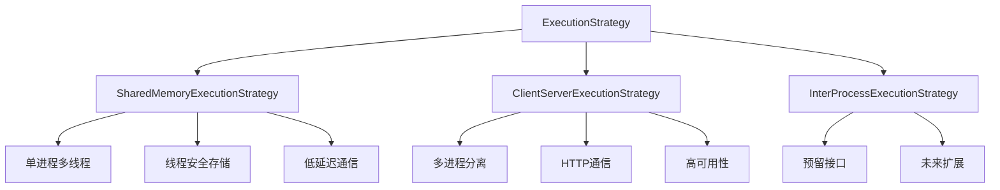

**图表来源**
- [agentlightning/execution/base.py](file://agentlightning/execution/base.py#L60-L107)
- [agentlightning/execution/shared_memory.py](file://agentlightning/execution/shared_memory.py#L15-L50)
- [agentlightning/execution/client_server.py](file://agentlightning/execution/client_server.py#L15-L50)

### 共享内存执行策略

共享内存执行策略在单个进程中运行算法和运行器，通过线程实现并发：

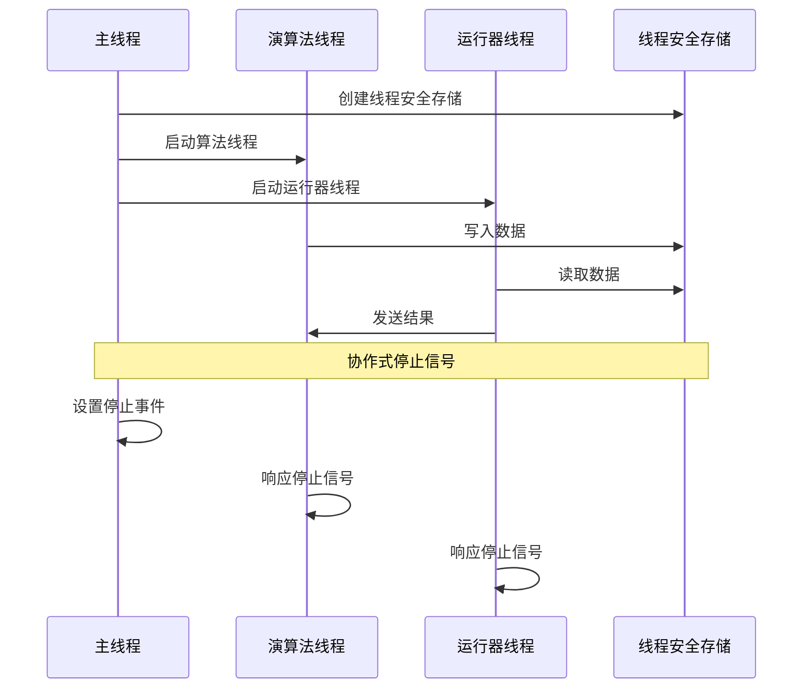

**图表来源**
- [agentlightning/execution/shared_memory.py](file://agentlightning/execution/shared_memory.py#L150-L200)

**节来源**
- [agentlightning/execution/shared_memory.py](file://agentlightning/execution/shared_memory.py#L1-L280)

### 客户端-服务器执行策略

客户端-服务器策略将算法和运行器分离到不同的进程中，通过HTTP进行通信：

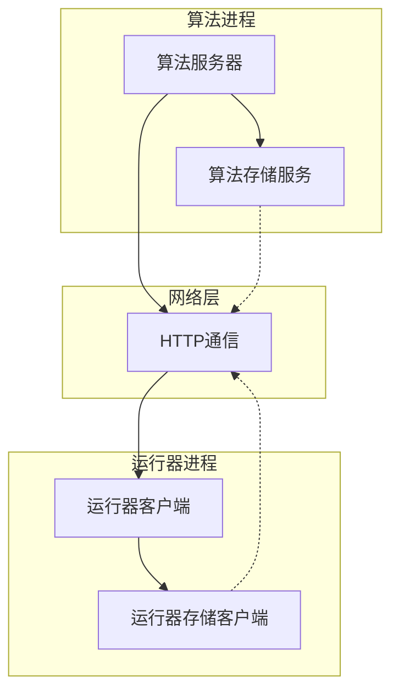

**图表来源**
- [agentlightning/execution/client_server.py](file://agentlightning/execution/client_server.py#L20-L60)
- [agentlightning/store/client_server.py](file://agentlightning/store/client_server.py#L100-L150)

**节来源**
- [agentlightning/execution/client_server.py](file://agentlightning/execution/client_server.py#L1-L434)

## 客户端-服务器架构

### 存储服务器实现

存储服务器提供了完整的REST API，支持远程访问和持久化存储：

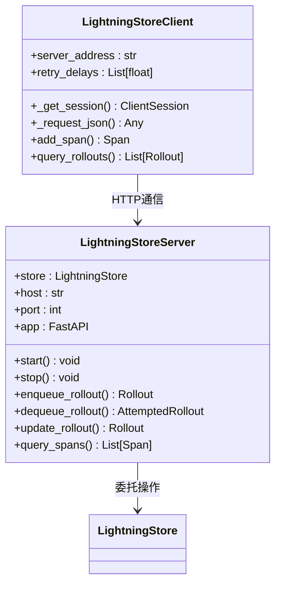

**图表来源**
- [agentlightning/store/client_server.py](file://agentlightning/store/client_server.py#L100-L200)

### HTTP API 设计

存储服务器暴露了完整的API接口，支持所有核心操作：

| 端点 | 方法 | 描述 | 参数 |
|------|------|------|------|
| `/agl/v1/health` | GET | 健康检查 | 无 |
| `/agl/v1/queues/rollouts/enqueue` | POST | 排队任务 | RolloutRequest |
| `/agl/v1/queues/rollouts/dequeue` | POST | 获取任务 | 无 |
| `/agl/v1/rollouts` | POST | 开始尝试 | RolloutRequest |
| `/agl/v1/rollouts/{id}` | GET | 查询任务 | rollout_id |
| `/agl/v1/rollouts/{id}/attempts` | POST | 更新尝试 | UpdateAttemptRequest |

**节来源**
- [agentlightning/store/client_server.py](file://agentlightning/store/client_server.py#L400-L800)

## 分布式训练与跨节点通信

### VERL集成架构

VERL（Vectorized Efficient Reinforcement Learning）提供了分布式强化学习能力：

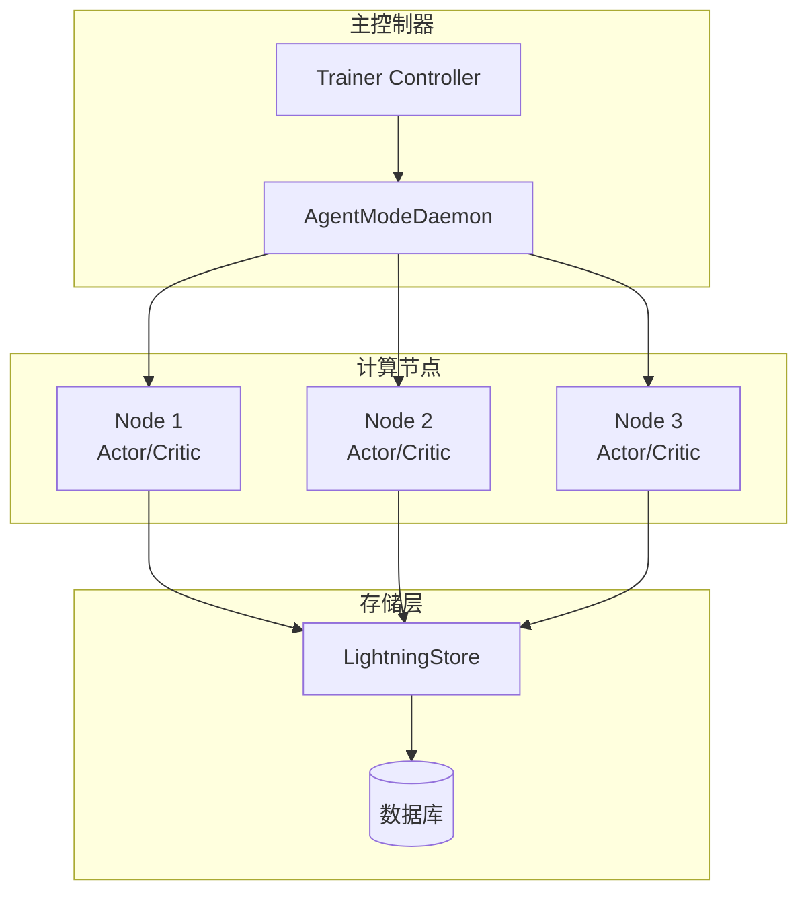

**图表来源**
- [agentlightning/verl/trainer.py](file://agentlightning/verl/trainer.py#L300-L350)
- [agentlightning/verl/daemon.py](file://agentlightning/verl/daemon.py#L150-L200)

### 跨节点通信机制

AgentModeDaemon负责协调多个计算节点之间的通信：

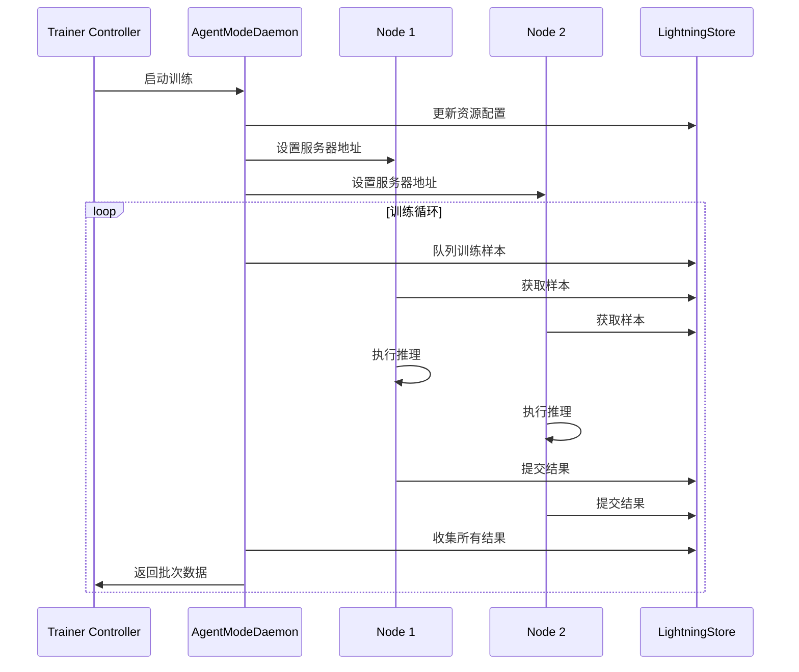

**图表来源**
- [agentlightning/verl/daemon.py](file://agentlightning/verl/daemon.py#L400-L450)

**节来源**
- [agentlightning/verl/trainer.py](file://agentlightning/verl/trainer.py#L1-L388)
- [agentlightning/verl/daemon.py](file://agentlightning/verl/daemon.py#L1-L200)

## 性能优化策略

### 执行策略选择指南

不同执行策略的性能特征对比：

| 特性 | 共享内存 | 客户端-服务器 | IPC |
|------|----------|---------------|-----|
| 吞吐量 | 高 | 中等 | 待实现 |
| 延迟 | 极低 | 低 | 待实现 |
| 可靠性 | 中等 | 高 | 待实现 |
| 资源隔离 | 无 | 强 | 待实现 |
| 调试便利性 | 高 | 中等 | 待实现 |

### 大规模训练优化

对于大规模训练场景，建议采用以下优化策略：

1. **存储优化**：使用外部数据库存储替代内存存储
2. **批处理优化**：调整批次大小以平衡内存使用和吞吐量
3. **并行度控制**：根据硬件资源调整运行器数量
4. **缓存策略**：实现智能缓存减少重复计算

**节来源**
- [agentlightning/trainer/trainer.py](file://agentlightning/trainer/trainer.py#L400-L500)

## 可扩展架构设计

### 组件注册系统

框架提供了灵活的组件注册机制，支持自定义组件的无缝集成：

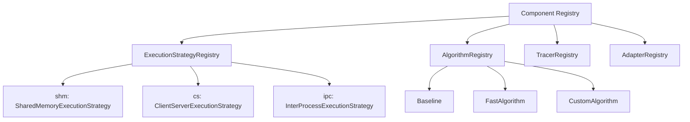

**图表来源**
- [agentlightning/trainer/registry.py](file://agentlightning/trainer/registry.py#L8-L12)

### 配置管理系统

框架提供了强大的命令行配置系统，支持类型安全的参数解析：

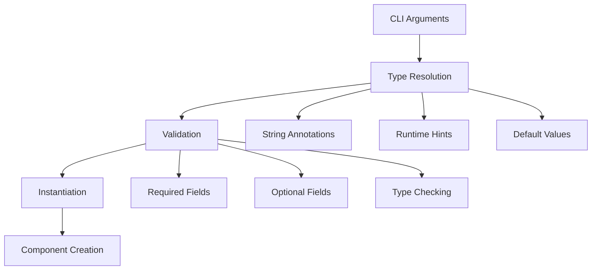

**图表来源**
- [agentlightning/config.py](file://agentlightning/config.py#L100-L200)

**节来源**
- [agentlightning/trainer/registry.py](file://agentlightning/trainer/registry.py#L1-L13)
- [agentlightning/config.py](file://agentlightning/config.py#L1-L349)

## 自定义扩展开发

### 自定义算法开发

开发自定义算法需要继承基础算法类并实现核心方法：

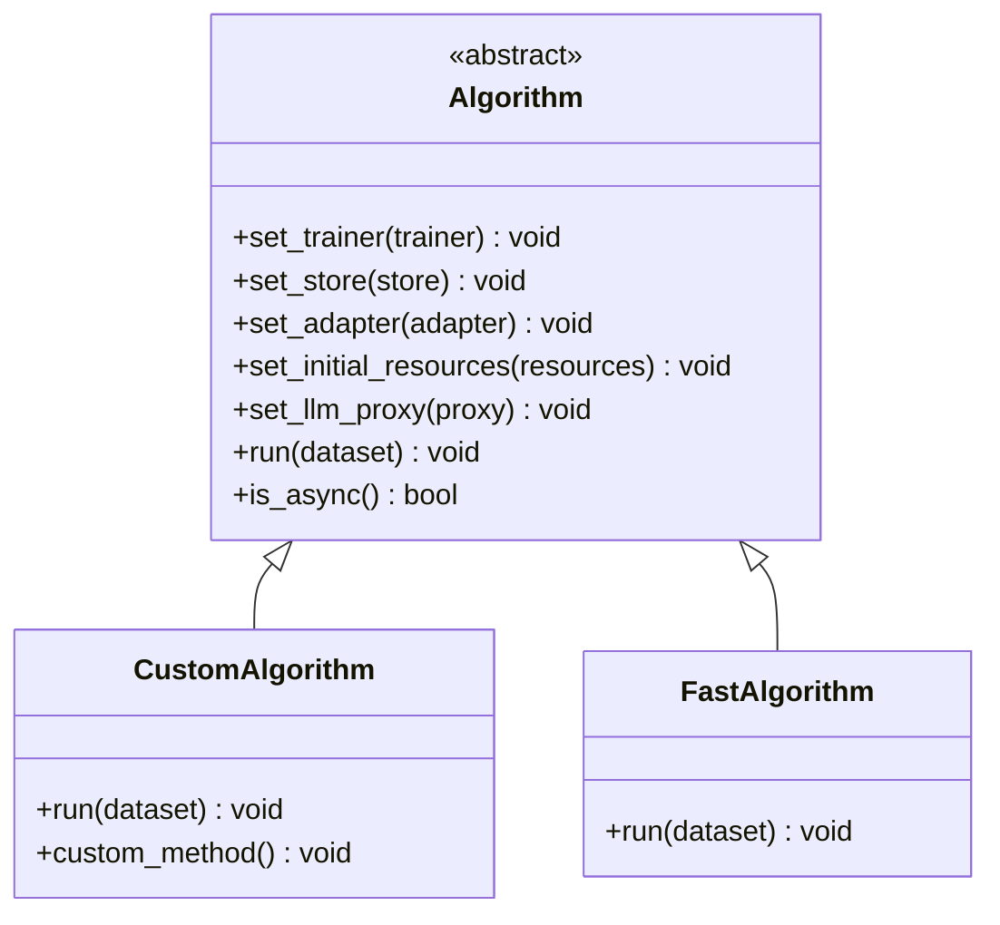

**图表来源**
- [examples/apo/apo_custom_algorithm.py](file://examples/apo/apo_custom_algorithm.py#L20-L50)

### 自定义适配器开发

适配器用于将追踪数据转换为算法可用的格式：

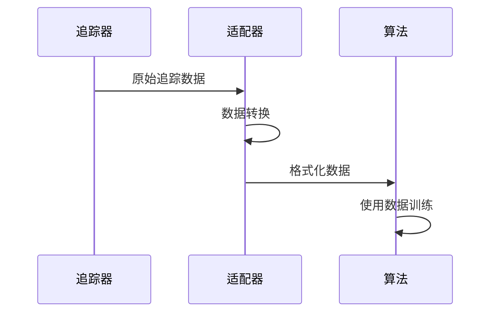

**图表来源**
- [examples/apo/apo_custom_algorithm.py](file://examples/apo/apo_custom_algorithm.py#L100-L150)

### 自定义执行策略

实现自定义执行策略需要遵循统一的接口规范：

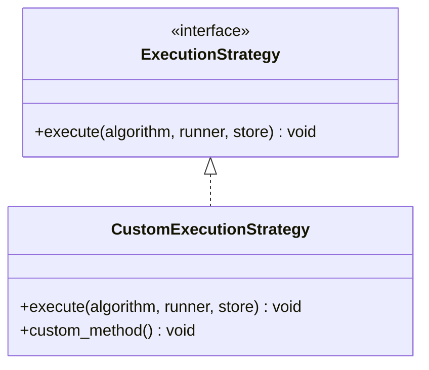

**节来源**
- [examples/apo/apo_custom_algorithm.py](file://examples/apo/apo_custom_algorithm.py#L1-L186)

## 高级调试与诊断

### 事件系统

框架提供了统一的事件系统用于协调多进程操作：

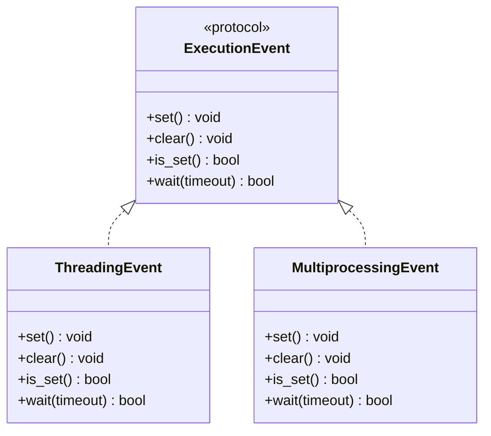

**图表来源**
- [agentlightning/execution/events.py](file://agentlightning/execution/events.py#L10-L70)

### 资源管理系统

框架提供了完善的资源管理机制，支持动态资源配置：

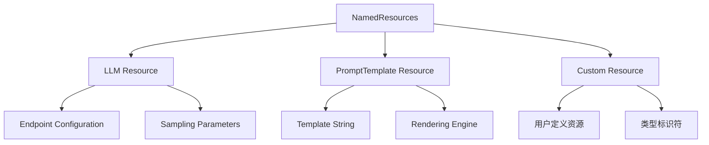

**图表来源**
- [agentlightning/types/resources.py](file://agentlightning/types/resources.py#L50-L150)

**节来源**
- [agentlightning/execution/events.py](file://agentlightning/execution/events.py#L1-L70)
- [agentlightning/types/resources.py](file://agentlightning/types/resources.py#L1-L199)

## 资源管理与调度

### 动态资源分配

框架支持运行时动态更新资源配置，无需重启服务：

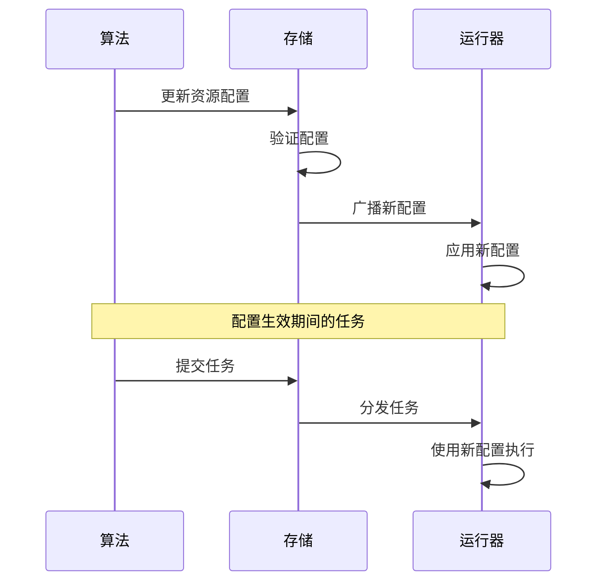

### 负载均衡策略

框架提供了多种负载均衡策略来优化资源利用：

1. **轮询分发**：均匀分配任务到各个运行器
2. **优先级调度**：根据任务重要性分配资源
3. **容量感知**：根据运行器负载动态分配任务

## 最佳实践指南

### 生产环境部署

1. **监控与告警**：建立完善的监控体系
2. **故障恢复**：实现自动故障检测和恢复
3. **版本管理**：确保组件版本兼容性
4. **安全配置**：实施适当的安全措施

### 性能调优建议

1. **合理设置并行度**：根据硬件资源调整运行器数量
2. **优化存储配置**：选择合适的存储后端
3. **网络优化**：减少跨节点通信开销
4. **内存管理**：避免内存泄漏和过度消耗

### 扩展开发指导

1. **遵循接口规范**：确保自定义组件符合框架标准
2. **测试驱动开发**：编写全面的单元测试
3. **文档完善**：提供清晰的使用文档
4. **向后兼容**：保持API的稳定性

通过掌握这些高级主题，开发者可以充分利用Agent-Lightning框架的强大功能，构建高性能、可扩展的智能代理系统。