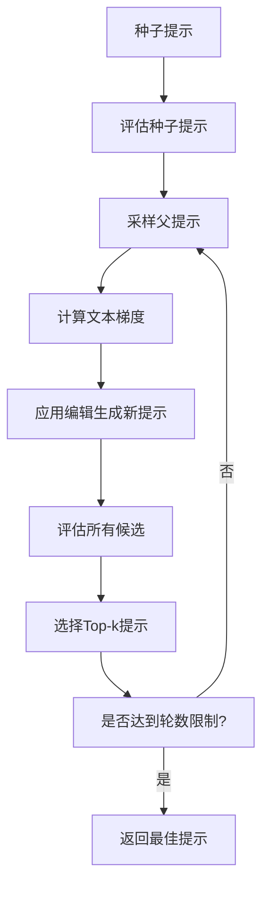

[根目录](../../../CLAUDE.md) > [agentlightning](../../) > [algorithm](../) > **apo**

# APO (Automatic Prompt Optimization) 模块

## 模块职责

APO 模块实现了自动提示优化算法，通过文本梯度和束搜索来改进 LLM 提示模板。该算法基于 ProTeGi 和 TextGrad 的思想，使用 LLM 生成评论（梯度）并应用编辑来优化提示。

## 入口与启动

### 核心文件
```
agentlightning/algorithm/apo/
├── __init__.py           # 导出 APO 类
├── apo.py              # APO 算法主实现
└── prompts/            # 提示模板目录
    ├── text_gradient_variant01.poml
    ├── text_gradient_variant02.poml
    ├── text_gradient_variant03.poml
    ├── apply_edit_variant01.poml
    └── apply_edit_variant02.poml
```

### 主要导出
```python
from .apo import APO
```

## 对外接口

### APO 类

自动提示优化算法的主类，继承自 `Algorithm`。

```python
class APO(Algorithm, Generic[T_task]):
    def __init__(
        self,
        async_openai_client: AsyncOpenAI,
        *,
        gradient_model: str = "gpt-5-mini",
        apply_edit_model: str = "gpt-4.1-mini",
        diversity_temperature: float = 1.0,
        gradient_batch_size: int = 4,
        val_batch_size: int = 16,
        beam_width: int = 4,
        branch_factor: int = 4,
        beam_rounds: int = 3,
        rollout_batch_timeout: float = 3600.0,
        run_initial_validation: bool = True,
    ):
```

#### 主要方法

- `compute_textual_gradient()`: 计算文本梯度（评论）
- `textual_gradient_and_apply_edit()`: 生成改进的提示
- `evaluate_prompt_on_batch()`: 在批次上评估提示
- `run()`: 执行优化算法

## 算法工作流程

### 1. 束搜索优化
APO 使用束搜索进行提示优化：



### 2. 文本梯度计算
- 从 rollout 结果中采样
- 使用 LLM 生成改进建议
- 支持 3 种不同的梯度提示模板

### 3. 编辑应用
- 基于梯度建议改进提示
- 使用 2 种不同的编辑提示模板
- 控制多样性温度参数

## 提示模板系统

### POML 格式
APO 使用 POML（Prompt Object Markup Language）格式定义提示模板：

- `text_gradient_variant*.poml`: 用于生成文本梯度的模板
- `apply_edit_variant*.poml`: 用于应用编辑的模板

### 模板特点
- 支持 JSON 序列化的上下文数据
- 兼容 OpenAI Chat 格式
- 随机选择变体增加多样性

## 关键配置参数

### 模型配置
- `gradient_model`: 用于计算梯度的模型
- `apply_edit_model`: 用于应用编辑的模型
- `diversity_temperature`: 控制输出多样性

### 束搜索配置
- `beam_width`: 每轮保留的提示数量
- `branch_factor`: 每个父提示生成的子提示数量
- `beam_rounds`: 优化轮数

### 批处理配置
- `gradient_batch_size`: 梯度计算的批次大小
- `val_batch_size`: 验证批次大小
- `rollout_batch_timeout`: 批次超时时间

## 数据流程

### RolloutResultForAPO
用于 APO 算法的标准化结果格式：

```python
class RolloutResultForAPO(TypedDict):
    status: RolloutStatus
    final_reward: Optional[float]
    spans: List[Dict[str, Any]]
    messages: List[Any]
```

### VersionedPromptTemplate
版本化的提示模板：

```python
@dataclass
class VersionedPromptTemplate:
    version: str
    prompt_template: PromptTemplate
    score: Optional[float] = None
```

## 使用示例

### 基本用法
```python
import asyncio
from openai import AsyncOpenAI
from agentlightning.algorithm.apo import APO

async def optimize_prompt():
    client = AsyncOpenAI(api_key="your-key")

    apo = APO(
        async_openai_client=client,
        beam_width=4,
        beam_rounds=5
    )

    # 设置初始资源和适配器
    apo.set_initial_resources({"my_prompt": initial_template})
    apo.set_adapter(trace_to_messages_adapter)

    # 运行优化
    await apo.run(train_dataset, val_dataset)

    # 获取最佳提示
    best_prompt = apo.get_best_prompt()
```

## 性能优化

### 批次迭代器
使用 `batch_iter_over_dataset()` 创建高效的批次迭代器：
- 支持无限迭代
- 自动随机打乱
- 处理大小不匹配的情况

### 异步执行
- 所有 LLM 调用都是异步的
- 支持并发评估多个提示
- 超时机制防止阻塞

## 日志和监控

### 结构化日志
APO 提供详细的日志输出：
- 轮次和束状态跟踪
- 梯度计算进度
- 评估结果和分数

### 日志格式
```
[Round 01 | Beam 01 | Branch 01 | Prompt v0] Evaluating prompt...
[Round 01] Top 4 candidates: v1:0.850, v2:0.820, v3:0.790, v4:0.760
```

## 常见问题 (FAQ)

### Q: 如何选择合适的模型？
A:
- `gradient_model`: 需要较强的理解和评论能力
- `apply_edit_model`: 需要较强的文本生成能力
- 可以使用相同的模型，但不同模型可能效果更好

### Q: 束宽和分支因子如何设置？
A:
- `beam_width`: 控制探索vs利用的平衡，通常 4-8
- `branch_factor`: 控制每轮的探索程度，通常 2-6
- 更大的值需要更多计算资源

### Q: 如何处理收敛问题？
A:
- 增加轮数 (`beam_rounds`)
- 调整温度参数 (`diversity_temperature`)
- 检查训练数据的质量

### Q: 提示模板如何自定义？
A:
- 编辑 `prompts/` 目录下的 `.poml` 文件
- 遵循 POML 格式规范
- 确保模板变量与上下文匹配

## 相关文件清单

### 核心实现
- [`apo.py`](apo.py) - APO 算法完整实现
- [`__init__.py`](__init__.py) - 模块导出

### 提示模板
- [`prompts/text_gradient_variant01.poml`](prompts/text_gradient_variant01.poml)
- [`prompts/text_gradient_variant02.poml`](prompts/text_gradient_variant02.poml)
- [`prompts/text_gradient_variant03.poml`](prompts/text_gradient_variant03.poml)
- [`prompts/apply_edit_variant01.poml`](prompts/apply_edit_variant01.poml)
- [`prompts/apply_edit_variant02.poml`](prompts/apply_edit_variant02.poml)

### 依赖模块
- [`../base.py`](../base.py) - 算法基类
- [`../../adapter/messages.py`](../../adapter/messages.py) - 消息适配器
- [`../../types/core.py`](../../types/core.py) - 核心类型定义

## 变更记录 (Changelog)

- **2025-11-20**: 创建模块文档
- 详细描述了 APO 算法的实现和使用
- 添加了配置参数和使用示例

---

*最后更新：2025-11-20 | 模块版本：0.2.2*