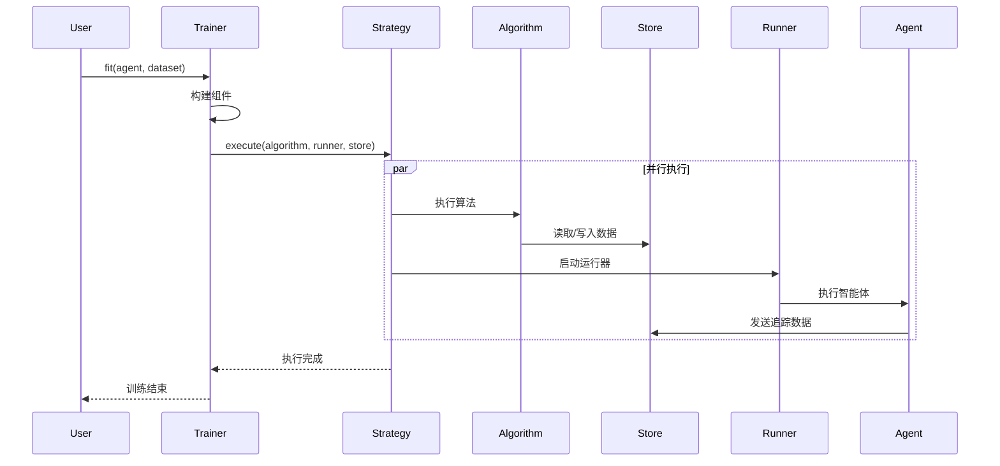

[根目录](../../CLAUDE.md) > [agentlightning](../) > **trainer**

# Trainer 模块

## 模块职责

Trainer 模块是 Agent Lightning 的核心编排组件，负责协调算法（Algorithm）、运行器（Runner）和存储（Store）之间的交互。它提供了高级的训练循环管理，支持同步/异步执行、并行处理、资源管理和生命周期控制。

## 入口与启动

### 核心文件结构
```
agentlightning/trainer/
├── __init__.py           # 模块导出
├── trainer.py           # 主训练器实现
├── init_utils.py        # 组件初始化工具
├── legacy.py           # 遗留训练器兼容
└── registry.py         # 组件注册表
```

### 主要导出
```python
from .trainer import *
# 导出包含：Trainer, TrainerLegacy 等
```

## 对外接口

### Trainer

高级训练器，是 Agent Lightning 的主要入口点。

```python
class Trainer(TrainerLegacy):
    """高级编排层，连接 Algorithm <-> Runner <-> Store。"""

    def fit(
        self,
        agent: LitAgent[T_co],
        train_dataset: Optional[Dataset[T_co]] = None,
        *,
        val_dataset: Optional[Dataset[T_co]] = None,
    ) -> None:
        """执行完整的算法/运行器训练循环。"""

    def dev(
        self,
        agent: LitAgent[T_co],
        train_dataset: Optional[Dataset[T_co]] = None,
        *,
        val_dataset: Optional[Dataset[T_co]] = None,
    ) -> None:
        """使用快速同步算法进行练习。"""
```

### 核心配置参数

```python
trainer = Trainer(
    # 算法配置
    algorithm="APO",                    # 或具体的算法实例

    # 运行配置
    n_runners=4,                        # 并行运行器数量
    max_rollouts=1000,                  # 每个运行器最大rollout数
    strategy="ClientServerExecutionStrategy",  # 执行策略

    # 存储配置
    store="InMemoryLightningStore",     # 或 "SQLiteStore"

    # 追踪配置
    tracer="AgentOpsTracer",            # 或其他追踪器
    adapter="TracerTraceToTriplet",     # 数据适配器

    # 资源配置
    initial_resources=None,             # 初始资源

    # LLM 代理配置
    llm_proxy=None,                     # LLM 代理配置

    # 高级配置
    port=None,                          # 服务端口
    hooks=[],                           # 生命周期钩子
)
```

## 组件系统

### 组件规范 (ComponentSpec)

支持多种组件初始化方式：

```python
# 1. 直接实例
algorithm = APO()

# 2. 类类型
algorithm = APO

# 3. 工厂函数
def create_algorithm():
    return APO()

# 4. 字符串注册名
algorithm = "APO"

# 5. 配置字典
algorithm = {
    "type": "APO",
    "max_iterations": 10,
    "temperature": 0.7
}
```

### 组件构建流程

1. **类型解析**: 识别组件类型（类、字符串、字典等）
2. **实例化**: 根据类型创建组件实例
3. **依赖注入**: 自动注入依赖项（如 store 到 llm_proxy）
4. **配置应用**: 应用默认配置和用户配置
5. **验证**: 验证组件类型和接口

## 执行策略

### ExecutionStrategy

定义算法和运行器的执行方式：

```python
class ExecutionStrategy:
    """执行策略抽象基类。"""

    async def execute(
        self,
        algorithm_bundle: Callable,
        runner_bundle: Callable,
        store: LightningStore
    ) -> None:
        """执行算法和运行器包。"""
```

### 内置策略

#### ClientServerExecutionStrategy
- 默认策略
- 客户端-服务器架构
- 支持跨进程通信

#### 共享内存策略
- 高性能内存共享
- 适用于单机多进程场景

## 生命周期管理

### 训练流程



### 钩子系统

支持生命周期钩子进行扩展：

```python
class MyHook(Hook):
    async def on_rollout_start(self, *, agent, runner, tracer, rollout):
        # Rollout 开始时的处理
        pass

    async def on_rollout_end(self, *, agent, runner, rollout, spans):
        # Rollout 结束时的处理
        pass
```

## 错误处理和恢复

### 异常处理策略
- **算法异常**: 记录错误并继续执行（如果可能）
- **运行器异常**: 自动重启失败的运行器
- **存储异常**: 降级到备用存储或重试
- **网络异常**: 超时重试和连接恢复

### 资源清理
- **进程清理**: 自动终止子进程
- **内存释放**: 清理共享内存和缓存
- **连接关闭**: 关闭数据库和网络连接
- **追踪结束**: 确保所有追踪数据被保存

## 性能优化

### 并行处理
- **多进程**: 通过执行策略支持真正的并行
- **异步 I/O**: 减少等待时间
- **批量处理**: 优化数据传输效率
- **资源池化**: 重用连接和对象

### 内存管理
- **流式处理**: 避免大量数据在内存中累积
- **垃圾回收**: 及时释放不再使用的对象
- **缓存策略**: 智能缓存常用数据

## 测试与质量

### 测试策略
- **单元测试**: 各组件的独立测试
- **集成测试**: 组件间交互测试
- **端到端测试**: 完整训练流程测试
- **性能测试**: 大规模数据和长时间运行测试

### 调试支持
- **详细日志**: 分级日志记录
- **追踪集成**: 与 OpenTelemetry 集成
- **断点支持**: 支持调试器断点
- **状态检查**: 运行时状态检查工具

## 常见问题 (FAQ)

### Q: 如何选择合适的执行策略？
A:
- **ClientServer**: 默认选择，支持分布式
- **SharedMemory**: 单机高性能场景
- **自定义**: 根据特殊需求实现

### Q: 如何处理训练过程中的故障？
A: Trainer 支持自动重试、运行器重启和异常恢复。可以通过配置重试次数和超时时间来控制。

### Q: 如何监控训练进度？
A: 通过钩子系统、AgentOps 集成和 OpenTelemetry 追踪来监控训练状态和性能指标。

### Q: 如何优化训练性能？
A:
- 增加 `n_runners` 提高并行度
- 使用 `SharedMemory` 策略减少通信开销
- 配置合适的 `max_rollouts` 避免内存溢出
- 使用高性能存储后端

## 相关文件清单

### 核心实现文件
- [`trainer.py`](trainer.py) - 主训练器实现
- [`init_utils.py`](init_utils.py) - 组件初始化工具
- [`legacy.py`](legacy.py) - 遗留兼容层
- [`registry.py`](registry.py) - 组件注册表

### 相关模块
- [`../execution/base.py`](../execution/base.py) - 执行策略
- [`../algorithm/base.py`](../algorithm/base.py) - 算法基类
- [`../runner/base.py`](../runner/base.py) - 运行器基类
- [`../store/base.py`](../store/base.py) - 存储接口

## 使用示例

### 基础训练
```python
from agentlightning import Trainer, LitAgent, APO

# 定义智能体
class MyAgent(LitAgent):
    def rollout(self, task, resources, rollout):
        # 智能体实现
        return result

# 配置训练器
trainer = Trainer(
    algorithm=APO(max_iterations=10),
    n_runners=4,
    max_rollouts=1000
)

# 开始训练
trainer.fit(MyAgent(), train_dataset)
```

### 开发模式
```python
# 快速开发调试
trainer = Trainer(dev=True)

# 使用 Baseline 算法进行快速测试
trainer.dev(MyAgent(), small_dataset)
```

### 自定义组件
```python
# 使用自定义配置
trainer = Trainer(
    algorithm={
        "type": "MyAlgorithm",
        "custom_param": "value"
    },
    store={
        "type": "SQLiteStore",
        "database_url": "sqlite:///training.db"
    }
)
```

## 变更记录 (Changelog)

- **2025-11-20**: 初始化模块文档
- 添加了详细的组件系统说明
- 整理了执行策略和生命周期管理
- 补充了性能优化和错误处理指南

---

*最后更新：2025-11-20 | 模块版本：0.2.2*