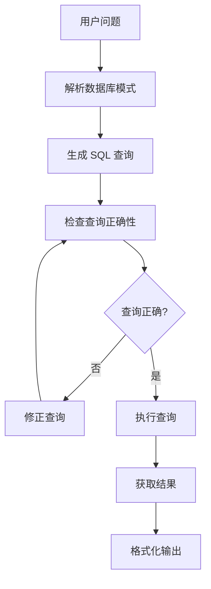

[根目录](../../CLAUDE.md) > **spider**

# Spider 示例

## 项目职责

Spider 示例展示了如何使用 Agent Lightning 框架训练 Text-to-SQL 智能体。该示例基于 LangGraph 和 LangChain，针对 Spider 数据集进行 SQL 查询生成任务的强化学习训练。

## 入口与启动

### 核心文件结构
```
examples/spider/
├── sql_agent.py                # 主要 SQL 智能体定义
├── train_sql_agent.py         # 训练脚本
├── spider_eval/               # 评估工具包
│   ├── __init__.py
│   ├── async_utils.py         # 异步工具函数
│   ├── convert_dataset.py     # 数据集转换
│   ├── evaluation.py          # 主评估逻辑
│   ├── exec_eval.py           # 执行评估
│   ├── parse.py              # 解析工具
│   └── process_sql.py        # SQL 处理
└── README.md                  # 项目说明
```

### 运行方式
```bash
# 设置环境变量
export OPENAI_API_KEY=your_api_key
export OPENAI_BASE_URL=your_base_url

# 运行训练
python train_sql_agent.py
```

## 智能体架构

### LangGraph 状态图
```python
class AgentState(MessagesState):
    """智能体状态，包含消息和数据库连接"""
    messages: List[BaseMessage]
    db_connection: Optional[SQLDatabase]
    current_query: Optional[str]
    execution_result: Optional[str]
```

### SQL 生成流程


## 核心组件

### 1. 提示模板系统

#### 写查询提示
```python
WRITE_QUERY_PROMPT = ChatPromptTemplate([
    ("system", """
    You are an agent designed to interact with a SQL database.
    Given an input question, create a syntactically correct {dialect} query...

    ## Table Schema ##
    Only use the following tables:
    {table_info}

    ## Output Format ##
    ```{dialect}
    GENERATED QUERY
    ```
    """),
    ("user", "Question: {input}"),
])
```

#### 查询检查提示
```python
CHECK_QUERY_PROMPT = ChatPromptTemplate([
    ("system", """
    You are a SQL expert with a strong attention to detail.
    Double check the {dialect} query for common mistakes...

    If mistakes are found: `THE QUERY IS INCORRECT.`
    If no mistakes: `THE QUERY IS CORRECT.`
    """),
])
```

#### 最终回答提示
```python
FINAL_ANSWER_PROMPT = ChatPromptTemplate([
    ("system", """
    You are a helpful assistant. Given the following user question,
    corresponding SQL query, and SQL result, answer the user question.

    Question: {question}
    SQL Query: {query}
    SQL Result: {result}
    """),
])
```

### 2. LangGraph 节点定义

#### write_query 节点
```python
def write_query(state: AgentState) -> AgentState:
    """生成 SQL 查询"""
    prompt = WRITE_QUERY_PROMPT.invoke({
        "input": question,
        "table_info": table_info,
        "dialect": database.dialect
    })

    model = init_chat_model(model_name, base_url=base_url)
    response = model.invoke(prompt)

    # 提取 SQL 查询
    sql_query = extract_sql_from_response(response.content)
    state.current_query = sql_query
    return state
```

#### check_query 节点
```python
def check_query(state: AgentState) -> AgentState:
    """检查 SQL 查询的正确性"""
    prompt = CHECK_QUERY_PROMPT.invoke({
        "query": state.current_query,
        "table_info": table_info,
        "dialect": database.dialect
    })

    response = model.invoke(prompt)
    is_correct = "THE QUERY IS CORRECT." in response.content

    if is_correct:
        return "execute_query"
    else:
        return "regenerate_query"
```

#### execute_query 节点
```python
def execute_query(state: AgentState) -> AgentState:
    """执行 SQL 查询"""
    query_tool = QuerySQLDatabaseTool(db=state.db_connection)

    try:
        result = query_tool.invoke({"query": state.current_query})
        state.execution_result = result
    except Exception as e:
        state.execution_result = f"Error: {str(e)}"

    return state
```

### 3. 数据库集成

#### SQLDatabase 配置
```python
def create_database_connection(db_path: str) -> SQLDatabase:
    """创建数据库连接"""
    db = SQLDatabase.from_uri(f"sqlite:///{db_path}")
    return db

def get_table_info(db: SQLDatabase, table_names: List[str]) -> str:
    """获取表结构信息"""
    return db.get_table_info(table_names)
```

## 评估系统

### Spider 数据集处理

#### 数据转换
```python
def convert_spider_dataset(
    spider_path: str,
    output_path: str,
    split: str = "train"
) -> None:
    """
    将 Spider 数据集转换为 Agent Lightning 格式

    - 处理数据库模式
    - 提取问题和查询
    - 生成训练样本
    """
```

#### 执行评估
```python
def eval_exec_match(
    predicted_query: str,
    gold_query: str,
    db_connection: SQLDatabase
) -> float:
    """
    评估预测查询与黄金查询的执行结果匹配度

    Returns:
        float: 1.0 表示结果匹配，0.0 表示不匹配
    """
```

### 评估指标
- **执行准确率**: 执行结果匹配度
- **查询语法正确性**: SQL 语法检查
- **模式使用正确性**: 表和列的正确使用
- **查询效率**: 执行时间和复杂度

## Rollout 函数

### 核心 Rollout 实现
```python
@agl.rollout
async def sql_agent(task: Dict[str, Any], llm: agl.LLM) -> None:
    """
    Spider 智能体 rollout 函数

    Args:
        task: 包含问题、数据库信息、黄金查询的任务
        llm: LLM 端点配置
    """

    # 创建数据库连接
    db_connection = create_database_connection(task["db_path"])

    # 构建 LangGraph
    graph = build_sql_agent_graph(db_connection, llm)

    # 执行推理
    result = await graph.ainvoke({
        "messages": [HumanMessage(content=task["question"])]
    })

    # 评估结果
    reward = evaluate_sql_result(
        predicted_query=result["current_query"],
        gold_query=task["query"],
        db_connection=db_connection
    )

    agl.emit_reward(reward)
```

## 训练配置

### 数据准备
```python
def prepare_spider_data(
    spider_data_path: str,
    output_path: str,
    num_samples: Optional[int] = None
) -> Dataset[Dict[str, Any]]:
    """
    准备 Spider 训练数据

    - 转换原始数据格式
    - 创建数据库连接配置
    - 分割训练/验证集
    """
```

### 模型配置
```python
trainer = Trainer(
    algorithm=GraphPPOAlgorithm(
        learning_rate=1e-5,
        batch_size=8,
        num_epochs=3
    ),
    execution=AsyncExecutionStrategy(max_workers=4),
    store=SQLiteStore("spider_training.db")
)
```

## 性能优化

### 异步执行
- 使用 LangGraph 的异步功能
- 并行处理多个查询
- 异步数据库操作

### 查询缓存
- 缓存查询执行结果
- 重用数据库连接
- 优化查询计划

### 批处理优化
- 批量 SQL 执行
- 内存管理优化
- I/O 操作批量化

## 测试策略

### 单元测试
- SQL 解析测试
- 查询生成测试
- 数据库连接测试

### 集成测试
- 端到端流程测试
- 性能基准测试
- 错误处理测试

### 评估测试
- 准确率指标测试
- 效率指标测试
- 鲁棒性测试

## 常见问题 (FAQ)

### Q: 如何处理复杂的多表查询？
A:
1. 确保表结构信息完整
2. 调整提示模板强调 JOIN 语法
3. 添加更多样化的训练样本

### Q: 数据库连接失败怎么办？
A:
1. 检查数据库文件路径
2. 确认 SQLite 库版本兼容性
3. 验证权限设置

### Q: 如何提高 SQL 查询准确率？
A:
1. 增加查询检查步骤
2. 使用更强的模型
3. 添加更多训练数据

### Q: 如何处理模糊查询？
A:
1. 改进自然语言理解
2. 添加模糊匹配逻辑
3. 使用多轮对话澄清

## 相关文件清单

### 核心实现
- [`sql_agent.py`](sql_agent.py) - SQL 智能体主要实现
- [`train_sql_agent.py`](train_sql_agent.py) - 训练脚本
- [`spider_eval/evaluation.py`](spider_eval/evaluation.py) - 主评估逻辑

### 评估工具
- [`spider_eval/exec_eval.py`](spider_eval/exec_eval.py) - 执行评估
- [`spider_eval/convert_dataset.py`](spider_eval/convert_dataset.py) - 数据转换
- [`spider_eval/process_sql.py`](spider_eval/process_sql.py) - SQL 处理

### 工具函数
- [`spider_eval/async_utils.py`](spider_eval/async_utils.py) - 异步工具
- [`spider_eval/parse.py`](spider_eval/parse.py) - 解析工具

### 依赖文档
- [`README.md`](README.md) - 项目详细说明
- [Spider Dataset](https://yale-lily.github.io/spider) - 原始数据集

## 变更记录 (Changelog)

- **2025-11-20**: 创建示例文档
- 详细描述了 Spider SQL 智能体的实现
- 添加了 LangGraph 集成指南

---

*最后更新：2025-11-20 | 示例版本：0.2.2*